**Universidad Peruana de Ciencias Aplicadas**

**Carrera**: Ingeniería de Software

**Periodo**: 2025-20

**Curso**: Desarrollo de Aplicaciones Open Source

**NRC**: 7401

**Profesor**: Mori Paiva, Hugo Allan

**Informe de Trabajo Final**

**Startup**: EcatLeasing

**Producto**: PcPedia

**Integrantes**:

Retuerto Rodríguez, Jorge Manuel - u202318612  
Hernández Poma, Sebastián Eduardo - u20231c996  
Condori Lozano, Alessandro Ramiro - u20211a118  
Armestar Heredia, Matias Gabriel - u20221a553  
Bendezu Navarro, Rubens Fitzgerald - u20231d390  

**Diciembre del 2025**  

---

# Registro de Versiones del Informe

<table>
    <tr>
        <th colspan="3">Version</th>
        <th colspan="3">Fecha</th>
        <th colspan="10">Autores</th>
        <th colspan="5">Descripción de Modificaciones</th>
    <tr>
        <td colspan="3">1era</td>
        <td colspan="3">30/08/2025</td>
        <td colspan="10">Retuerto Rodríguez, Jorge Manuel   Hernández Poma, Sebastián Eduardo   Condori Lozano, Alessandro Ramiro   Armestar Heredia, Matias Gabriel   Bendezu Navarro, Rubens Fitzgerald </td>
        <td colspan="5">Revision y entrega de cada punto, cada estudiante se repartio 1 capitulo del informe, luego de haber terminado, fue visto y corregidor por cada integrante, esto ocurrio posterior a la revision del docente, con el proposito de mejorar el informe y poder entregar un informe de acuerdo a la rúbrica</td>
    </tr>
    <tr>
        <td colspan="3">2da</td>
        <td colspan="3">8/10/2025</td>
        <td colspan="10">Retuerto Rodríguez, Jorge Manuel   Hernández Poma, Sebastián Eduardo   Condori Lozano, Alessandro Ramiro   Armestar Heredia, Matias Gabriel   Bendezu Navarro, Rubens Fitzgerald </td>
        <td colspan="5">Revision de los capitulos para lograr una correccion optima, posterior avance del frontend y del Sprint 2</td>
    </tr>
    <tr>
        <td colspan="3">3era</td>
        <td colspan="3">16/11/2025</td>
        <td colspan="10">Retuerto Rodríguez, Jorge Manuel   Hernández Poma, Sebastián Eduardo   Condori Lozano, Alessandro Ramiro   Armestar Heredia, Matias Gabriel   Bendezu Navarro, Rubens Fitzgerald </td>
        <td colspan="5">Revision de los capitulos para lograr una correccion optima, posterior avance del backend y del Sprint 3</td>
    </tr>
</table>

---

# Project Report Collaboration Insights

A continuación, se detalla el proceso de elaboración del informe para cada entrega, junto con capturas de pantalla que muestran los análisis de colaboración y commits en GitHub para el repositorio del informe:

**URL de la Organización:** https://github.com/1ASI0729-7401-2520-EcatLeasing-PcPedia  
**URL del Repositorio del Informe:** https://github.com/1ASI0729-7401-2520-EcatLeasing-PcPedia/Report-PcPedia  

**Entrega N°1: TB1**  

En este primer avance se desarrolló los capítulos I, II, III, IV, así también el capítulo V en su primer sprint, enfocado a la Landing Page.  

Para la creación del informe, se realizaron las siguientes actividades:  

- Cada miembro del equipo redactó y generó gráficos en formato Markdown según los puntos asignados, y luego se hicieron commits para registrar el progreso en el repositorio.  
- Se crearon los artefactos necesarios usando las herramientas recomendadas, y se obtuvieron los enlaces de las imágenes correspondientes a través de la funcionalidad de "Issues" en el repositorio del informe.  
- Se llevaron a cabo reuniones periódicas para coordinar el avance de los puntos del informe. Estas reuniones también se utilizaron para comunicar el progreso alcanzado durante el Sprint 1, enfocado en el desarrollo de la Landing Page del proyecto.
  
**URL del repositorio orientado a la Landing Page:** https://github.com/1ASI0729-7401-2520-EcatLeasing-PcPedia/Landing-Page-PcPedia  

**Report Contributors Insights (TB1)**  

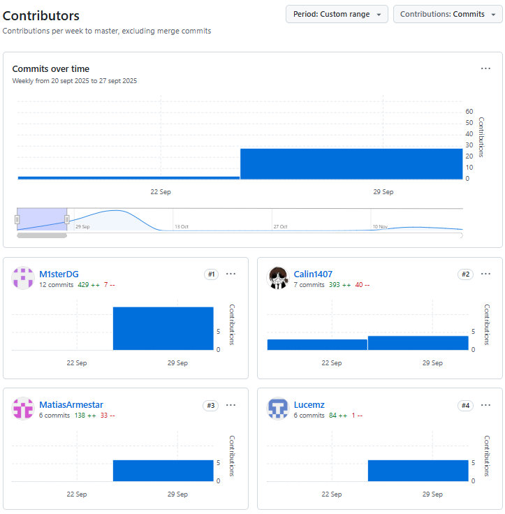  

---

**Entrega N°2: TP1**  

Para este avance se desarrolló el capitulo V en su segundo sprint, enfocado a el Frontend.

**URL del repositorio orientado al Frontend:** https://github.com/1ASI0729-7401-2520-EcatLeasing-PcPedia/Front-end-PcPedia  

**Report Contributors Insights (TP1)**  

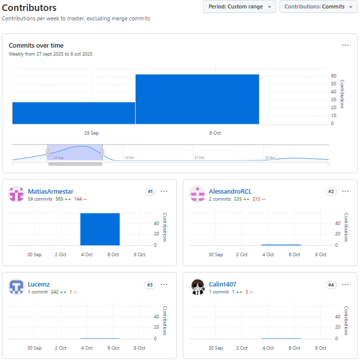  

---

**Entrega N°3: TB2**  

Para este avance se desarrolló el capitulo V en su tercer sprint, enfocado a el Backend.

**URL del repositorio orientado al Backend:**  

**Report Contributors Insights (TB2)**  

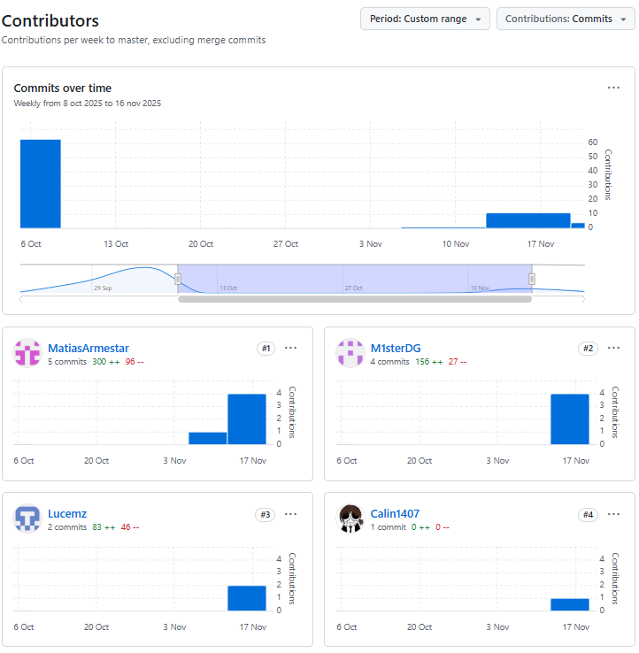  

---

**Entrega N°4: TF**  

Para este avance se desarrolló el capitulo V en su cuerto sprint, enfocado a el Backend, Frontend, Deploy y retoques finales.

**URL del repositorio orientado al FrontEnd:**  https://github.com/1ASI0729-7401-2520-EcatLeasing-PcPedia/Front-end-PcPedia/graphs/contributors?from=8%2F11%2F2025&to=29%2F11%2F2025

**Report Contributors Insights (TF)** 

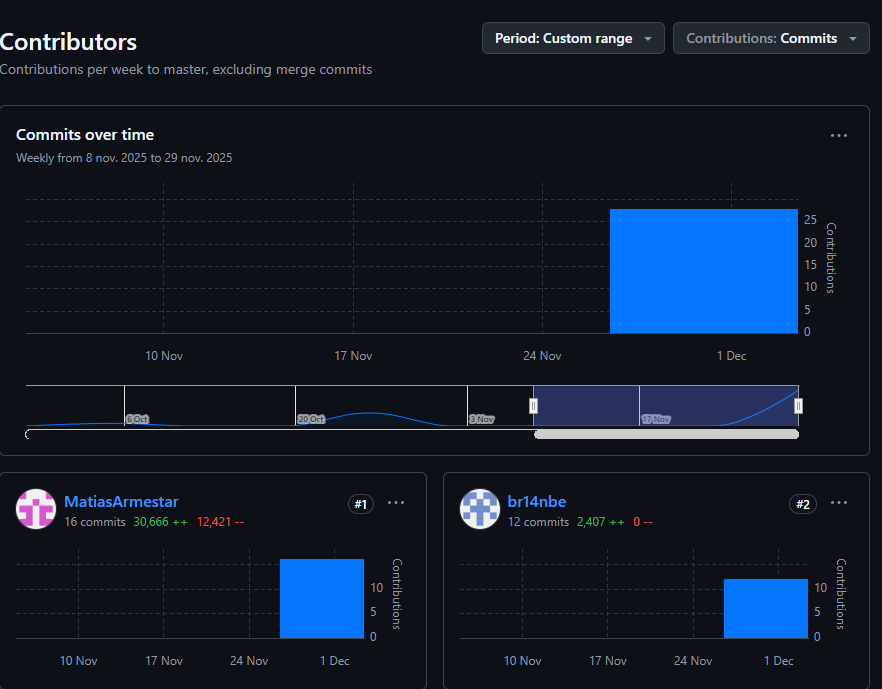  

**URL del repositorio orientado al BackEnd:**  https://github.com/1ASI0729-7401-2520-EcatLeasing-PcPedia/Back-end-PcPedia

**Report Contributors Insights (TF)**  

  

---

# Student Outcome

El curso contribuye al cumplimiento del Student Outcome ABET: **ABET – EAC - Student Outcome 3**   Criterio: _Capacidad de comunicarse efectivamente con un rango de audiencias._

En el siguiente cuadro se describe las acciones realizadas y enunciados de conclusiones por parte del grupo, que permiten sustentar el haber alcanzado el logro del ABET – EAC - Student Outcome 3.

| **Criterio específico** | **Acciones realizadas** | **Conclusiones** |
|-------------------------|-------------------------|------------------|
| **Comunica oralmente sus ideas y/o resultados con objetividad a público de diferentes especialidades y niveles jerárquicos, en el marco del desarrollo de un proyecto en ingeniería.** | **TB1:** • *Retuerto Rodríguez, Jorge Manuel:* Se acordó la partición del trabajo y se desarrolló en conjunto para completar correctamente la entrega. • *Hernández Poma, Sebastián Eduardo:* Se realizó el análisis del proyecto y se avanzó de forma colaborativa manteniendo comunicación constante. • *Condori Lozano, Alessandro Ramiro:* Se decidió avanzar en conjunto para cumplir objetivos del proyecto. • *Armestar Heredia, Matias Gabriel:* Tras reunión grupal se acordó el enfoque de desarrollo del proyecto. • *Bendezu Navarro, Rubens Fitzgerald:* Se definió el plan de desarrollo y se inició el reporte en equipo.  **TP1:** • *Retuerto Rodríguez, Jorge Manuel:* Coordinó corrección del capítulo IV y apoyó en el avance del front-end. • *Hernández Poma, Sebastián Eduardo:* Corrigió el capítulo V y aportó en el desarrollo del front-end. • *Condori Lozano, Alessandro Ramiro:* Corrigió el capítulo III y continuó el desarrollo del front-end. • *Armestar Heredia, Matias Gabriel:* Corrigió el capítulo I y apoyó en la implementación del front-end. • *Bendezu Navarro, Rubens Fitzgerald:* Corrigió el capítulo II y colaboró en el desarrollo del front-end.  **TB2:** • *Retuerto Rodríguez, Jorge Manuel:* Participó en la presentación del despliegue del backend, detallando la arquitectura del sistema y resultados obtenidos. • *Hernández Poma, Sebastián Eduardo:* Explicó la integración entre el front-end y backend, destacando la correcta conexión con la base de datos. • *Condori Lozano, Alessandro Ramiro:* Comunicó los avances en la implementación del backend y su funcionamiento en entorno productivo. • *Armestar Heredia, Matias Gabriel:* Expuso el proceso de validación mediante entrevistas con usuarios reales y recopiló feedback. • *Bendezu Navarro, Rubens Fitzgerald:* Presentó el flujo de despliegue en servidor, asegurando su correcto funcionamiento en línea. | Luego del TB1 se identificaron mejoras necesarias y fueron corregidas en TP1. Para TB2 el equipo logró la **implementación completa del backend, su despliegue funcional y el desarrollo del front-end corregido**, además de la ejecución de entrevistas de validación para obtener retroalimentación real del segmento objetivo. |
| **Comunica en forma escrita ideas y/o resultados con objetividad a público de diferentes especialidades y niveles jerárquicos, en el marco del desarrollo de un proyecto en ingeniería.** | **TB1:** • *Retuerto Rodríguez, Jorge Manuel:* Redactó avances del proyecto con enfoque claro y técnico. • *Hernández Poma, Sebastián Eduardo:* Escribió el análisis del proyecto utilizando lenguaje técnico adecuado. • *Condori Lozano, Alessandro Ramiro:* Redacción colaborativa con precisión y objetividad. • *Armestar Heredia, Matias Gabriel:* Redacción clara de avances con lenguaje técnico. • *Bendezu Navarro, Rubens Fitzgerald:* Redactó manteniendo estilo formal y comprensible.  **TP1:** • *Retuerto Rodríguez, Jorge Manuel:* Escribió capítulo IV con precisión técnica y argumentativa. • *Hernández Poma, Sebastián Eduardo:* Desarrolló el capítulo V con comunicación objetiva de resultados. • *Condori Lozano, Alessandro Ramiro:* Redacción estructurada del capítulo III. • *Armestar Heredia, Matias Gabriel:* Elaboración del capítulo I con objetividad. • *Bendezu Navarro, Rubens Fitzgerald:* Redacción del capítulo II para público técnico diverso.  **TB2:** • *Retuerto Rodríguez, Jorge Manuel:* Documentó la arquitectura del backend y el despliegue del sistema en el informe escrito. • *Hernández Poma, Sebastián Eduardo:* Redactó la sección técnica sobre integración full-stack y funcionamiento en producción. • *Condori Lozano, Alessandro Ramiro:* Describió la implementación del backend y los procesos de conexión con API. • *Armestar Heredia, Matias Gabriel:* Sistematizó los resultados de las entrevistas de validación, presentando conclusiones objetivas. • *Bendezu Navarro, Rubens Fitzgerald:* Redactó el apartado de despliegue, procesos de entorno y pruebas en servidor. | El equipo consolidó un documento completo, técnico y coherente. En TB2 se amplió el informe incluyendo **implementación total del backend, despliegue, validación con usuarios y ajuste del front-end**, garantizando claridad en la comunicación de resultados y un lenguaje comprensible para lectores de distintas especialidades. |

---

# Contenido

## Tabla de contenidos

### [Capítulo I: Introducción](#capítulo-i-introducción)

- [1.1. Startup Profile](#11-startup-profile)
  - [1.1.1 Descripción de la Startup](#111-descripción-de-la-startup)
  - [1.1.2 Perfiles de integrantes del equipo](#112-perfiles-de-integrantes-del-equipo)
- [1.2 Solution Profile](#12-solution-profile)
  - [1.2.1 Antecedentes y problemática](#121-antecedentes-y-problemática)
  - [1.2.2 Lean UX Process](#122-lean-ux-process)
    - [1.2.2.1. Lean UX Problem Statements](#1221-lean-ux-problem-statements)
    - [1.2.2.2. Lean UX Assumptions](#1222-lean-ux-assumptions)
    - [1.2.2.3. Lean UX Hypothesis Statements](#1223-lean-ux-hypothesis-statements)
    - [1.2.2.4. Lean UX Canvas](#1224-lean-ux-canvas)
- [1.3. Segmentos objetivo](#13-segmentos-objetivo)

### [Capítulo II: Requirements Elicitation & Analysis](#capítulo-ii-requirements-elicitation--analysis)

- [2.1. Competidores](#21-competidores)
  - [2.1.1. Análisis competitivo](#211-análisis-competitivo)
  - [2.1.2. Estrategias y tácticas frente a competidores](#212-estrategias-y-tácticas-frente-a-competidores)
- [2.2. Entrevistas](#22-entrevistas)
  - [2.2.1. Diseño de entrevistas](#211-análisis-competitivo)
  - [2.2.2. Registro de entrevistas](#222-registro-de-entrevistas)
  - [2.2.3. Análisis de entrevistas](#223-análisis-de-entrevistas)
- [2.3. Needfinding](#23-needfinding)
  - [2.3.1. User Personas](#231-user-personas)
  - [2.3.2. User Task Matrix](#232-user-task-matrix)
  - [2.3.3. User Journey Mapping](#233-user-journey-mapping)
  - [2.3.4. Empathy Mapping](#234-empathy-mapping)
- [2.4. Big Picture Event Storming](#24-big-picture-event-storming)
- [2.5. Ubiquitous Language](#25-ubiquitous-language)

### [Capítulo III: Requirements Specification](#capítulo-iii-requirements-specification)

- [3.1. User Stories](#31-user-stories)
- [3.2. Impact Mapping](#32-impact-mapping)
- [3.3. Product Backlog](#33-product-backlog)

### [Capítulo IV: Product Design](#capítulo-iv-product-design)

- [4.1. Style Guidelines](#41-style-guidelines)
  - [4.1.1. General Style Guidelines](#411-general-style-guidelines)
  - [4.1.2. Web Style Guidelines](#412-web-style-guidelines)
- [4.2. Information Architecture](#42-information-architecture)
  - [4.2.1. Organization Systems](#421-organization-systems)
  - [4.2.2. Labeling Systems](#422-labeling-systems)
  - [4.2.3. SEO Tags and Meta Tags](#423-seo-tags-and-meta-tags)
  - [4.2.4. Searching Systems](#424-searching-systems)
  - [4.2.5. Navigation Systems](#425-navigation-systems)
- [4.3. Landing Page UI Design](#43-landing-page-ui-design)
  - [4.3.1. Landing Page Wireframe](#431-landing-page-wireframe)
  - [4.3.2. Landing Page Mock-up](#432-landing-page-mock-up)
- [4.4. Web Applications UX/UI Design](#44-web-applications-uxui-design)
  - [4.4.1. Web Applications Wireframes](#441-web-applications-wireframes)
  - [4.4.2. Web Applications Wireflow Diagrams](#442-web-applications-wireflow-diagrams)
  - [4.4.3. Web Applications Mock-ups](#443-web-applications-mock-ups)
  - [4.4.4. Web Applications User Flow Diagrams](#444-web-applications-user-flow-diagrams)
- [4.5. Web Applications Prototyping](#45-web-applications-prototyping)
- [4.6. Domain-Driven Software Architecture](#46-domain-driven-software-architecture)
  - [4.6.1. Design-Level Event Storming](#461-design-level-event-storming)
  - [4.6.2. Software Architecture Context Diagram](#462-software-architecture-context-diagram)
  - [4.6.3. Software Architecture Container Diagrams](#463-software-architecture-container-diagrams)
  - [4.6.4. Software Architecture Components Diagrams](#464-software-architecture-components-diagrams)
- [4.7. Software Object-Oriented Design](#47-software-object-oriented-design)
  - [4.7.1. Class Diagrams](#471-class-diagrams)
- [4.8. Database Design](#48-database-design)
  - [4.8.1. Database Diagram](#481-database-diagram)

### [Capítulo V: Product Implementation, Validation & Deployment](#capítulo-v-product-implementation-validation--deployment)

- [5.1. Software Configuration Management](#51-software-configuration-management)
  - [5.1.1. Software Development Environment Configuration](#511-software-development-environment-configuration)
  - [5.1.2. Source Code Management](#512-source-code-management)
  - [5.1.3. Source Code Style Guide & Conventions](#513-source-code-style-guide--conventions)
  - [5.1.4. Software Deployment Configuration](#514-software-deployment-configuration)
- [5.2. Landing Page, Services & Applications Implementation](#52-landing-page-services--applications-implementation)
    - [5.2.1. Sprint 1](#521-sprint-1)
        - [5.2.1.1. Sprint Planning 1](#5211-sprint-planning-1)
        - [5.2.1.2. Aspect Leaders and Collaborators](#5212-aspect-leaders-and-collaborators)
        - [5.2.1.3. Sprint Backlog 1](#5213-sprint-backlog-1)
        - [5.2.1.4. Development Evidence for Sprint Review](#5214-development-evidence-for-sprint-review)
        - [5.2.1.5. Execution Evidence for Sprint Review](#5215-execution-evidence-for-sprint-review)
        - [5.2.1.6. Services Documentation Evidence for Sprint Review](#5216-services-documentation-evidence-for-sprint-review)
        - [5.2.1.7. Software Deployment Evidence for Sprint Review](#5217-software-deployment-evidence-for-sprint-review)
        - [5.2.1.8. Team Collaboration Insights during Sprint](#5218-team-collaboration-insights-during-sprint)
    - [5.2.2. Sprint 2](#522-sprint-2)
        - [5.2.2.1. Sprint Planning 1](#5221-sprint-planning-2)
        - [5.2.2.2. Aspect Leaders and Collaborators](#5222-aspect-leaders-and-collaborators)
        - [5.2.2.3. Sprint Backlog 1](#5223-sprint-backlog-2)
        - [5.2.2.4. Development Evidence for Sprint Review](#5224-development-evidence-for-sprint-review)
        - [5.2.2.5. Execution Evidence for Sprint Review](#5225-execution-evidence-for-sprint-review)
        - [5.2.2.6. Services Documentation Evidence for Sprint Review](#5226-services-documentation-evidence-for-sprint-review)
        - [5.2.2.7. Software Deployment Evidence for Sprint Review](#5227-software-deployment-evidence-for-sprint-review)
        - [5.2.2.8. Team Collaboration Insights during Sprint](#5228-team-collaboration-insights-during-sprint)
    - [5.2.3. Sprint 3](#523-sprint-3)
        - [5.2.3.1. Sprint Planning 3](#5231-sprint-planning-3)
        - [5.2.3.2. Aspect Leaders and Collaborators](#5232-aspect-leaders-and-collaborators)
        - [5.2.3.3. Sprint Backlog 3](#5233-sprint-backlog-3)
        - [5.2.3.4. Development Evidence for Sprint Review](#5234-development-evidence-for-sprint-review)
        - [5.2.3.5. Execution Evidence for Sprint Review](#5235-execution-evidence-for-sprint-review)
        - [5.2.3.6. Services Documentation Evidence for Sprint Review](#5236-services-documentation-evidence-for-sprint-review)
        - [5.2.3.7. Software Deployment Evidence for Sprint Review](#5237-software-deployment-evidence-for-sprint-review)
        - [5.2.3.8. Team Collaboration Insights during Sprint](#5238-team-collaboration-insights-during-sprint)
- [5.3. Validation Interviews](#53-validation-interviews)
  - [5.3.1. Diseño de Entrevistas](#531-diseño-de-entrevistas)
  - [5.3.2. Registro de Entrevistas](#532-registro-de-entrevistas)
  - [5.3.3. Evaluaciones según heurísticas](#533-evaluaciones-según-heurísticas)
- [5.4. Video About-the-Product](#54-video-about-the-product)

#### [Conclusiones y recomendaciones](#conclusiones-y-recomendaciones)

#### [Video About-the-Team](#video-about-the-team)

### [Biblioteca](#biblioteca)

### [Anexos](#anexos)

---

# Capítulo I: Introducción

## 1.1. Startup Profile

### 1.1.1 Descripción de la Startup

ECAT Leasing es una startup dedicada a transformar la manera en que las organizaciones acceden y gestionan su tecnología. Nuestro producto principal, Smart Leasing, ofrece un modelo de arrendamiento inteligente que garantiza a empresas y al sector educativo contar siempre con equipos actualizados, evitando la carga de la obsolescencia tecnológica. A través de planes flexibles, brindamos no solo el acceso a hardware moderno, sino también un ecosistema de servicios de valor agregado que incluye soporte técnico especializado, mantenimiento preventivo y correctivo, gestión de garantías y atención ágil a incidencias.

Además, comprendemos que cada empresa tiene necesidades y presupuestos distintos. Por ello, incorporamos dentro de Smart Leasing el servicio que evalúa los recursos, procesos y objetivos de cada cliente para recomendar los equipos más eficientes y rentables, asegurando que inviertan solo en lo que realmente necesitan. De esta manera, ECAT Leasing se convierte en un socio estratégico que simplifica la gestión de TI, optimiza los costos y permite que nuestros clientes se concentren en lo más importante: el crecimiento de su negocio.

**Misión**: Facilitar la vida de las empresas haciéndonos cargo de sus activos de TI, brindando equipos siempre actualizados con nuestro servicio de Smart Leasing, junto con soporte, mantenimiento y gestión de garantías, para que nuestros clientes se concentren en crecer sin preocuparse por la tecnología.

**Visión**: Ser la empresa referente en Latinoamérica en servicios de arrendamiento tecnológico inteligente, simplificando la gestión de activos TI y ayudando a las organizaciones a enfocarse en su crecimiento, mientras nosotros garantizamos que su tecnología esté siempre actualizada, optimizada y respaldada.

### 1.1.2 Perfiles de integrantes del equipo

| Foto                                                                     | Apellido y Nombre                               | Carrera                | Acerca de                                                                                                                                                                                                                                                                                                                                                                                                                                                                                                                                           |
| ------------------------------------------------------------------------ | ----------------------------------------------- | ---------------------- | --------------------------------------------------------------------------------------------------------------------------------------------------------------------------------------------------------------------------------------------------------------------------------------------------------------------------------------------------------------------------------------------------------------------------------------------------------------------------------------------------------------------------------------------------- |
|           | Retuerto Rodríguez, Jorge Manuel - u202318612   | Ingeniería de Software | Mi nombre es Jorge Manuel Retuerto Rodríguez, tengo 20 años y estoy cursando el 5to ciclo de la carrera de Ingeniería de Software en la Universidad Peruana de Ciencias Aplicadas. Mi conocimiento y habilidades de programación son intermedias en C++, HTML y CSS. Sin embargo, básicas en Python y Java. Me haré responsable de la comunicación del grupo, planificación y desarrollo junto a mi equipo.                                                                                                                                         |
|  | Hernández Poma, Sebastián Eduardo - u20231c996  | Ingeniería de Software | Tengo 21 años y estoy cursando la carrera de Ingeniería de Software en la Universidad Peruana de Ciencias Aplicadas. Mi objetivo es seguir desarrollando mis competencias en programación y especializarme en el área de desarrollo de software y soluciones tecnológicas innovadoras. Me caracterizo por ser una persona perseverante, con mentalidad de crecimiento y compromiso con el trabajo en equipo, buscando siempre aprender nuevas herramientas que fortalezcan mi futuro profesional y me permitan alcanzar proyectos de mayor impacto. |
|    | Condori Lozano, Alessandro Ramiro - u20211a118  | Ingeniería de Software | Tengo 21 años, actualmente me encuentro matriculado en la carrera de Ingeniería de Software en la Universidad Peruana de Ciencias Aplicadas. Poseo un nivel intermedio de habilidades en programación, con conocimientos adicionales en desarrollo web. Me considero una persona competitiva, responsable y que sabe trabajar en equipo.                                                                                                                                                                                                            |
|       | Armestar Heredia, Matias Gabriel - u20221A553   | Ingeniería de Software | Estudiante de la Universidad Peruana de Ciencias Aplicadas (UPC). Me considero un estudiante capaz de aportar significativamente a un equipo.                                                                                                                                                                                                                                                                                                                                                                                                       |
|               | Bendezu Navarro, Rúbens Fitzgerald - u20231D390 | Ingeniería de Software | Mi nombre es Rúbens Bendezu, soy estudiante de Ingeniería de Software. Me considero una persona motivada por el aprendizaje continuo y el trabajo en equipo, ya que compartir ideas y experiencias enriquece tanto el desarrollo personal como el profesional. Tengo conocimientos en tecnologías de desarrollo web y frameworks modernos, y me interesa especialmente el desarrollo de aplicaciones web que aporten soluciones innovadoras y de impacto.                                                                                           |

## 1.2 Solution Profile

### 1.2.1 Antecedentes y problemática

Para realizar los antecedentes y problemáticas, se realizó con anticipación la técnica 5 ‘W’s & 2 ‘H’s:

**What**: El problema de la rápida obsolescencia tecnológica que enfrentan empresas y organizaciones, obligadas a invertir constantemente en nuevos equipos y a gestionar activos de TI de manera compleja y costosa.

**When**: Actualmente, en un contexto donde los ciclos de actualización tecnológica se reducen a 1–2 años y las aplicaciones requieren hardware cada vez más potente.

**Where**: En empresas de distintos tamaños (pequeñas, medianas y grandes) y en instituciones educativas, especialmente en el Perú y con proyección a Latinoamérica.

**Who**: Los principales afectados son las organizaciones que no cuentan con presupuestos flexibles ni con áreas de TI especializadas para gestionar correctamente la elección, uso y renovación de sus equipos.

**Why**: Porque la constante necesidad de actualización genera altos costos, dificulta la gestión de activos y provoca que muchas empresas gasten de más en equipos que no aprovechan, o compren dispositivos insuficientes para sus necesidades reales.

**How**: Las empresas suelen comprar equipos sin una evaluación estratégica, gestionando por sí mismas la garantía, el mantenimiento y la reposición, lo que aumenta el tiempo y los recursos dedicados a la administración de TI.

**How much**: El impacto se traduce en gastos significativos de capital (CapEx), sobrecostos en soporte y mantenimiento, pérdida de productividad y baja eficiencia en el aprovechamiento de la inversión tecnológica.

### 1.2.2 Lean UX Process

A continuacion se presentara la solucion al Lean UX que usaremos para poder desarrollar adecuadamente nuestro proyecto y ademas poder definir nuestro mercado objetivo.

#### 1.2.2.1. Lean UX Problem Statements

**Problem Statement 1:**

Actualmente las empresas en el Peru y latinoamerica estan enfrentando una alta obsolescencia tecnologica, esto esta obligando a invertir rapidamente en actualizaciones, cambios y compras de nuevos equipos costosos y de mayor gama. Estas situaciones generan gastos altos de capital, reduce la productividad comprometiendo la competitividad, ya que muchas organizaciones adquieren dispositivos baratos sin cubrir verdaderamente sus necesidades actuales y a futuro, sin poder tener una escalabilidad correcta.

**Problem Statement 2:**

Una gran mayoria de organizaciones no ven necesario contar con un area TI especializada y de un modelo estrategico para poder administrar sus equipos. Esto genera a comprar equipos sin realmente cubrir sus necesidades, dificultades en la gestion de garantias y mantenimientos, asi como sobrecostos ocultos en soporte y reposicion de equipos, lo que distra a las empresas de su objetivo principal: crecer.

#### 1.2.2.2. Lean UX Assumptions

**Business Outcomes:**

- **Creemos que mis usuarios necesitan** gestionar correctamente sus activos de TI, contando con equipos actualizados sin hacer grandes inversiones iniciales y optimizar sus presupuestos de tecnolgia.

- **Estas necesidades se pueden resolver** ofreciendo un modelo de servicio Smart Leasing la cual incluye arrendamiento tecnologico inteligente, soportem mantenimiento y gestion de garantias en un solo servicio.

- **Nuestros clientes iniciales son** pequeñas y medianas empresas en Peru, las cuales carecen de n area de TI robusta, ademas de instituciones educativas que requieren actualizar equipos constantemente.

- **El valor #1 que un cliente requiere de nuestro servicio es** reducir cosotos de inversion en tecnologia logrando garantizar que sus equipos esten constantemente actualizados.

- **El cliente también puede obtener estos beneficios adicionales** como ahorro en tiempo y recursos de gestion de TI, soporte especializado, mantemiento preventivo y correctivo, optimizacion de productividad y flexibilidad para escalar su infraestructura tecnologica.

- **Adquiriremos a nuestros clientes a través del** marketing digital (LinkedIn, Google Ads, redes sociales), alianzas con proveedores de software y hardware, networking en eventos empresariales y referencias de clientes actuales.

- **Haremos dinero a través de** contratos de arrendamiento mensual de equipos (modelo SaaS/Leasing), servicios adicionales de soporte premium y acuerdos de mantenimiento extendido.

- **Nuestra competencia de mercado serán** empresas de leasing financiero, distribuidores tradicionales de hardware y proveedores de outsourcing de TI.

- **Los venceremos debido a que** ofreceremos servicios integrales enfocados en un valor estrategico, no solo entregando equipos, sino en la optimizacion de recursos, un soporte continuo y una festion completa del ciclo de vida tecnologico.

- **Nuestros mayores riesgos son**la falta de confianza inicial en el modelo de leasing tecnológico, la resistencia de empresas acostumbradas a comprar equipos, y la competencia de grandes proveedores nacionales e internacionales.

- **Resolveremos esto mediante** campañas educativas, casos de éxito, pruebas piloto con clientes, y diferenciación en servicio al cliente y soporte local personalizado.

- **Sabremos que hemos tenido éxito cuando uno de estos cambios en el comportamiento de nuestro cliente:**

  - Prefiera arrendar equipos en lugar de comprar.
  - Se reduzca sus costos de TI reinvirtiendo en crecimiento de su negocio.
  - Confie en PcPedia como socio estrategico de TI.

- **Qué otras suposiciones tenemos que, de probarse falsas pueden causar que nuestro proyecto fracase:**

  - Las empresas estén dispuestas a migrar de un modelo de compra a uno de leasing.
  - Los beneficios de costo y productividad sean lo suficientemente evidentes.
  - Podamos mantener alianzas sólidas con proveedores de hardware de calidad.

**User Outcomes**

**¿Quiénes serán nuestros usuarios?**

Directores financieros, gerentes de operaciones, responsables de TI, y administradores de instituciones educativas que necesitan equipos actualizados sin grandes desembolsos.

**¿Dónde encaja nuestro producto en su vida o trabajo?**

En la planeación y gestión de su infraestructura tecnológica, ayudándoles a enfocarse en su negocio sin preocuparse por la obsolescencia ni la gestión de equipos.

**¿Qué problemas tiene nuestro producto y cómo se pueden resolver?**

**Problemas:**

- Desconfianza en el modelo de arrendamiento.

- Necesidad de flexibilidad contractual.

- Adaptación a diferentes presupuestos.

**Soluciones:**

- Casos de éxito, contratos transparentes y soporte personalizado.

- Modelos de leasing flexibles según necesidad y tamaño de la empresa.

- Planes escalables y ajustables en el tiempo.

**¿Cómo y cuándo es usado nuestro producto?**

En el ciclo operativo diario de las empresas: al adquirir nuevos equipos, al renovar tecnología obsoleta, y en la gestión continua de TI (mantenimiento, soporte, garantías).

**¿Qué características son importantes?**

- Flexibilidad en planes de arrendamiento.
- Gestión centralizada de soporte y garantías.
- Reportes de costos y eficiencia tecnológica.
- Equipos actualizados según necesidad real.

**¿Cómo debe verse y comportarse nuestro producto?**

Debe transmitir confianza, modernidad y simplicidad, con una interfaz clara (si es digital), y un servicio que se perciba ágil, transparente y estratégico.

**Features**

**_Desde la cuenta de la empresa cliente:_**

- Las empresas deben tener acceso a un panel donde visualicen todos los equipos arrendados, organizados por área o departamento. Esto les permitirá un control ordenado y evitar pérdidas o duplicidades.

- Un historial de mantenimiento y soporte estará disponible para cada equipo, lo que garantiza transparencia en las intervenciones técnicas y ayuda a tomar decisiones futuras.

- Contarán con un sistema de alertas automáticas para notificar cuándo un equipo está próximo a su renovación o si requiere atención especial, evitando interrupciones en su productividad.

- El cliente podrá solicitar upgrades de hardware de forma ágil desde su cuenta, ajustando los recursos a sus necesidades reales en tiempo casi inmediato.

- Un dashboard de costos consolidado permitirá analizar el gasto mensual en TI y medir el ahorro frente a un modelo tradicional de compra.

**_Desde la cuenta de administración de PcPedia:_**

- Los administradores tendrán un sistema centralizado para monitorear en tiempo real todos los equipos en uso por los clientes, junto con su estado de garantía y mantenimientos programados.

- Contarán con herramientas de análisis predictivo para recomendar a cada cliente los equipos más rentables según su patrón de uso.

- Se dispondrá de un módulo para gestionar contratos y facturación de manera automatizada, evitando errores manuales.

- La plataforma permitirá registrar casos de soporte y asignar técnicos rápidamente, reduciendo los tiempos de respuesta.

- Un repositorio de métricas de clientes servirá para identificar patrones, generar reportes y mejorar continuamente el servicio de Smart Leasing.

<!-- 1.2.2.3. Lean UX Hypothesis Statements -->
<section>
  <h3>1.2.2.3. Lean UX Hypothesis Statements</h3>

  <table style="width:100%; border-collapse:collapse; font-family:Arial, Helvetica, sans-serif; font-size:14px;">
    <thead>
      <tr style="background:#0b5fff; color:#fff;">
        <th style="text-align:left; padding:10px; border:1px solid #e5e7eb;">Creemos que</th>
        <th style="text-align:left; padding:10px; border:1px solid #e5e7eb;">Sabremos que</th>
      </tr>
    </thead>
    <tbody>
      <tr style="background:#f8fafc;">
        <td style="vertical-align:top; padding:10px; border:1px solid #e5e7eb;">
          Las empresas y organizaciones que hoy compran equipos estarán dispuestas a migrar a un modelo de
          arrendamiento tecnológico inteligente si les demostramos ahorros en costos, equipos siempre actualizados
          y soporte especializado.
        </td>
        <td style="vertical-align:top; padding:10px; border:1px solid #e5e7eb;">
          Esto es cierto cuando reduzcan compras directas de hardware y firmen contratos de Smart Leasing,
          evidenciando crecimiento sostenido de la base de clientes.
        </td>
      </tr>
      <tr>
        <td style="vertical-align:top; padding:10px; border:1px solid #e5e7eb;">
          Nuestros usuarios valoran más la simplicidad en la gestión de TI: un servicio único que incluya
          arrendamiento, mantenimiento y gestión de garantías.
        </td>
        <td style="vertical-align:top; padding:10px; border:1px solid #e5e7eb;">
          Esto es cierto cuando usen con frecuencia el panel de control, soliciten upgrades desde la plataforma
          y reporten satisfacción por la reducción de tiempo y recursos en gestión de TI.
        </td>
      </tr>
      <tr style="background:#f8fafc;">
        <td style="vertical-align:top; padding:10px; border:1px solid #e5e7eb;">
          La principal barrera de entrada es la desconfianza hacia el leasing tecnológico, pero podremos superarla
          con campañas educativas, casos de éxito y pruebas piloto.
        </td>
        <td style="vertical-align:top; padding:10px; border:1px solid #e5e7eb;">
          Esto es cierto cuando los participantes de pilotos escalen a contratos permanentes, compartan testimonios
          positivos y recomienden el servicio a otras empresas.
        </td>
      </tr>
    </tbody>
  </table>
</section>

#### 1.2.2.4. Lean UX Canvas

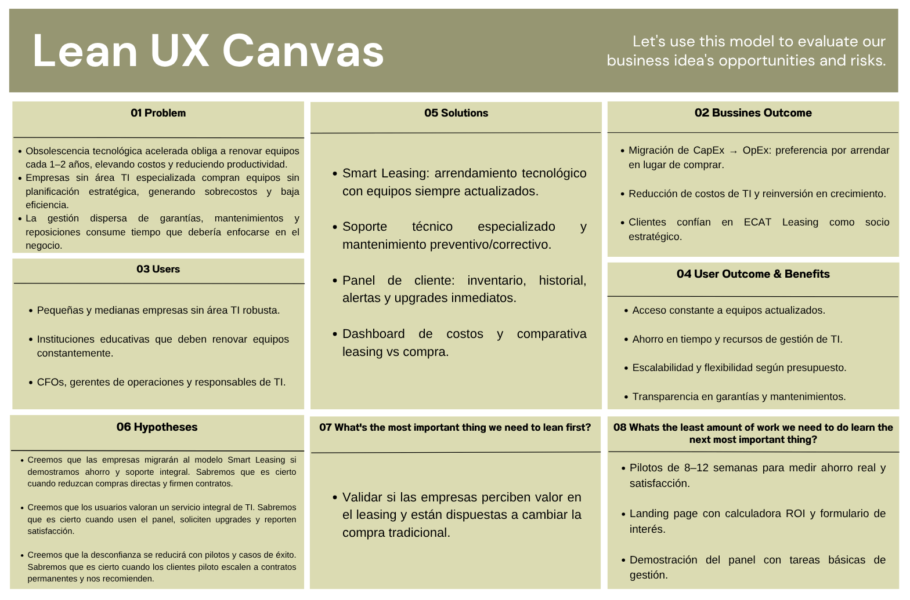

## 1.3. Segmentos objetivo

1. **Empresas (pequeñas, medianas y grandes):** Cualquier organización que dependa de la tecnología para su funcionamiento, sin importar el sector al que pertenezca. Pueden ser entidades financieras, compañías de retail, industrias manufactureras, estudios contables, empresas de servicios o startups. En general, todas aquellas que requieren equipos tecnológicos para operar de forma eficiente en un mercado competitivo.

2. **Instituciones Educativas (universidades, colegios, escuelas, institutos):** Organizaciones dedicadas a la enseñanza, investigación o formación profesional que necesitan equipos tecnológicos para actividades académicas, administrativas y de apoyo a sus estudiantes y docentes. Incluye tanto instituciones de gran escala como universidades, así como colegios e institutos que buscan modernizar sus recursos tecnológicos.

## Capítulo II: Requirements Elicitation & Analysis

## 2.1. Competidores

En esta sección se identifican y describen los principales competidores directos de la startup **Smart Leasing**, cuyo enfoque gira en torno al **arrendamiento inteligente de equipos tecnológicos con soporte y gestión de ciclo de vida**. Se han considerado empresas que ofrecen soluciones similares en el mercado peruano, tanto locales como internacionales.

Los competidores seleccionados son:

### **HardRental Perú**

Empresa peruana especializada en **renting informático** para empresas, con foco en **alquiler de laptops, PCs y periféricos**. Ofrece soporte técnico, _service desk_ y mantenimiento incluidos en los contratos. Su propuesta se centra en brindar flexibilidad a corto y mediano plazo, orientada principalmente a **empresas que buscan evitar la compra de hardware y reducir la inversión inicial**.

### **Thuntech**

Proveedor nacional que ofrece **leasing operativo de tecnología** con plazos que van de 24 a 60 meses. Su servicio incluye **alquiler de laptops, equipos de oficina y dispositivos especializados** para empresas, bajo un modelo de suscripción. Thuntech busca posicionarse como alternativa a la compra tradicional, enfocándose en **contratos a largo plazo y planes corporativos escalables**.

### **CSI Leasing Perú**

Filial de la multinacional **CSI Leasing**, con presencia en más de 30 países. En Perú ofrece **leasing tecnológico** con un fuerte componente de **gestión de activos (Asset Management)** a través de su plataforma _MyCSI_, que permite a las empresas tener trazabilidad completa del ciclo de vida de sus equipos. Su propuesta está orientada a **grandes corporaciones** que buscan eficiencia financiera, seguridad en datos y soporte global.

## 2.1.1. Análisis competitivo

El objetivo del presente análisis competitivo es responder a la pregunta:

**¿Cómo se posiciona Smart Leasing frente a sus principales competidores en términos de funcionalidades, estrategia de mercado y propuesta de valor?**

Para ello, se utiliza el modelo de análisis **Competitive Analysis Landscape**, estructurado en categorías y subcategorías.

<table>
  <tr>
    <th colspan="6">Competitive Analysis Landscape</th>
  </tr>

  <!-- Motivo del análisis -->
  <tr>
    <td><b>¿Por qué llevar a cabo este análisis?</b></td>
    <td colspan="5">
      Identificar fortalezas, debilidades y oportunidades frente a competidores clave en el sector de leasing tecnológico en el Perú.  
      Comparar funcionalidades, posicionamiento y estrategia de Smart Leasing con otras plataformas similares en el mercado local e internacional.
    </td>
  </tr>

  <!-- Fila de nombres (las 2 primeras celdas combinadas y vacías) -->
  <tr>
    <td colspan="2"></td>
    <td><b>Smart Leasing</b></td>
    <td><b>HardRental Perú</b></td>
    <td><b>Thuntech</b></td>
    <td><b>CSI Leasing Perú</b></td>
  </tr>

  <!-- PERFIL -->
  <tr>
    <td rowspan="2"><b>Perfil</b></td>
    <td>Overview</td>
    <td>Startup peruana enfocada en el leasing tecnológico inteligente, que combina arrendamiento de equipos de TI con soporte, mantenimiento y gestión de ciclo de vida.</td>
    <td>Empresa local de renting informático especializada en alquiler de laptops y PCs con soporte incluido.</td>
    <td>Proveedor nacional que ofrece leasing operativo de tecnología con contratos de 24 a 60 meses.</td>
    <td>Filial peruana de la multinacional CSI Leasing, con experiencia en más de 30 países.</td>
  </tr>
  <tr>
    <td>Ventaja competitiva / Valor al cliente</td>
    <td>Flexibilidad en contratos, soporte integral y enfoque estratégico en reducción de costos de TI. Valor: equipos actualizados, menor inversión inicial y gestión centralizada de garantías.</td>
    <td>Rapidez en la entrega y planes flexibles. Valor: acceso inmediato sin compromisos ni inversión inicial.</td>
    <td>Estabilidad contractual y escalabilidad. Valor: acceso a tecnología con planes de leasing a largo plazo.</td>
    <td>Respaldo financiero internacional y plataforma MyCSI. Valor: control de ciclo de vida, seguridad y soporte global.</td>
  </tr>

  <!-- PERFIL DE MARKETING -->
  <tr>
    <td rowspan="2"><b>Perfil de Marketing</b></td>
    <td>Mercado objetivo</td>
    <td>Pymes e instituciones educativas en Perú y Latinoamérica.</td>
    <td>Empresas locales (principalmente en Lima) que requieren equipos temporales o ágiles.</td>
    <td>Empresas medianas y grandes con foco en estabilidad financiera.</td>
    <td>Grandes corporaciones, bancos y multinacionales en Perú.</td>
  </tr>
  <tr>
    <td>Estrategias de marketing</td>
    <td>Marketing digital (LinkedIn, Google Ads, redes sociales), alianzas con proveedores, networking.</td>
    <td>SEO local, catálogo web, captación rápida de clientes.</td>
    <td>Relaciones B2B, convenios corporativos, publicidad en entornos empresariales.</td>
    <td>Marketing corporativo global, relaciones con CIOs y CFOs.</td>
  </tr>

  <!-- PERFIL DE PRODUCTO -->
  <tr>
    <td rowspan="3"><b>Perfil de Producto</b></td>
    <td>Productos & Servicios</td>
    <td>Leasing de laptops, PCs, servidores, upgrades, soporte, mantenimiento y gestión de garantías.</td>
    <td>Alquiler de laptops, PCs y periféricos con soporte básico.</td>
    <td>Leasing operativo de laptops y equipos de oficina, upgrades opcionales.</td>
    <td>Leasing tecnológico con Asset Management, borrado seguro de datos, contratos internacionales.</td>
  </tr>
  <tr>
    <td>Precios & Costos</td>
    <td>Contratos mensuales flexibles tipo SaaS/Leasing, con servicios premium opcionales.</td>
    <td>Pago por equipo alquilado según tiempo de uso.</td>
    <td>Cuotas fijas mensuales de arrendamiento.</td>
    <td>Contratos internacionales con costos altos, orientados a corporativos.</td>
  </tr>
  <tr>
    <td>Canales de distribución (Web/Móvil)</td>
    <td>Plataforma web con panel de clientes y módulo administrativo interno.</td>
    <td>Página web y atención directa a empresas.</td>
    <td>Página web y acuerdos directos con empresas.</td>
    <td>Plataforma MyCSI (web) y acuerdos globales.</td>
  </tr>

  <!-- ANÁLISIS SWOT -->
  <tr>
    <td rowspan="4"><b>Análisis SWOT</b></td>
    <td>Fortalezas</td>
    <td>Flexibilidad, servicio integral, foco en educación y pymes.</td>
    <td>Rapidez de atención y flexibilidad de corto plazo.</td>
    <td>Contratos estables y experiencia en leasing corporativo.</td>
    <td>Respaldo global, gestión avanzada de activos, seguridad de datos.</td>
  </tr>
  <tr>
    <td>Debilidades</td>
    <td>Nueva en el mercado, poco reconocimiento de marca.</td>
    <td>Oferta limitada al simple alquiler de hardware.</td>
    <td>Poca flexibilidad y personalización en los contratos.</td>
    <td>Costos elevados, poco atractivo para pymes locales.</td>
  </tr>
  <tr>
    <td>Oportunidades</td>
    <td>Digitalización creciente en Perú, modernización tecnológica en educación y pymes.</td>
    <td>Ampliar servicios hacia educación y startups.</td>
    <td>Creciente digitalización del mercado peruano.</td>
    <td>Adaptar modelos más flexibles para pymes en Perú.</td>
  </tr>
  <tr>
    <td>Amenazas</td>
    <td>Competencia internacional consolidada, resistencia cultural al leasing.</td>
    <td>Competidores con propuestas más completas.</td>
    <td>Startups ágiles que ofrezcan leasing más flexible.</td>
    <td>Regulaciones locales y percepción de costos excesivos.</td>
  </tr>
</table>

## 2.1.2. Estrategias y tácticas frente a competidores

Para competir de manera efectiva en el mercado de leasing tecnológico en el Perú, Smart Leasing implementará una serie de **estrategias** y **tácticas** orientadas a consolidar su posicionamiento, maximizar su alcance y diferenciarse de sus principales competidores (**HardRental Perú, Thuntech y CSI Leasing Perú**).

### **Estrategias**

1. **Enfoque en Pymes y Educación**  
   Smart Leasing priorizará pequeñas y medianas empresas (Pymes) e instituciones educativas, sectores con alta necesidad de modernización tecnológica pero sin presupuestos robustos.
2. **Modelo Integral de Smart Leasing**  
   Leasing + soporte + mantenimiento + gestión de garantías + upgrades bajo demanda.
3. **Flexibilidad Contractual**  
   Contratos cortos y adaptables (desde 12 meses), frente a los plazos rígidos de otros competidores.
4. **Educación y Confianza en el Leasing**  
   Campañas educativas, webinars y casos de éxito para superar la resistencia cultural al modelo.
5. **Alianzas Estratégicas con Proveedores Locales**  
   Convenios con distribuidores de hardware, software y servicios TI para competir con el alcance internacional de CSI Leasing.

### **Tácticas**

- Pilotos gratuitos o con descuento para empresas interesadas.
- Contratos escalables (ej. empezar con 10 equipos y crecer).
- Panel digital con **dashboard financiero** para mostrar ahorros en tiempo real.
- Soporte técnico diferenciado **24/7**.
- Campañas digitales segmentadas en LinkedIn, Google Ads y redes sociales.
- Casos de éxito documentados en empresas y colegios peruanos.
- Garantía de **renovación tecnológica cada 18–24 meses**.

## 2.2. Entrevistas

### 2.2.1. Diseño de entrevistas

**Segmento objetivo 1: Empresas**

- **Gestión de contrato**

1. ¿Cómo llevan el control de los contratos de los equipos tecnológicos?
2. Actualmente ¿Qué herramientas usan para la gestión de los contratos?
3. ¿Como acceden a dicha información de los contratos? (Excel, docx, papel)

- **Verificación de procesos**

4. ¿Cómo verifican el cumplimiento de los servicios contratados? (Software, mantenimiento, upgrades, etc.)
5. ¿Con qué frecuencia revisa los términos del contrato? ¿Cuánta relevancia le da?
6. ¿Cómo conservan el historial de mantenimiento?
7. ¿Cuál es el proceso para pedir soporte técnico? ¿Cuánto demora?

- **Comunicación y presupuesto**

8. ¿Qué canales de comunicación usa para hacer los contratos y comunicarse con el contratista?
9. ¿Como manejan los presupuestos de sus equipos y servicios de mantenimiento?

- **Satisfacción**

10. ¿Qué tan satisfecho se encuentra con las medidas que actualmente usa para la gestión de los contratos?

**Segmento objetivo 2: Instituciones educativas**

- **Gestión de equipos y contratos**

1. ¿Cómo llevan registro del inventario de los equipos tecnológicos?
2. ¿Qué herramientas usa para controlar los contratos y ver su estado de vigencia?
3. ¿Qué dificultades enfrenta al momento de comprar un equipo?
4. Actualmente ¿Qué problemas presenta al buscar información de los contratos?
5. ¿Qué procesos tienen que pasar para la contratación, renovación o cancelación de los contratos?

- **Soporte y mantenimiento**

6. ¿Con qué frecuencia tienen problemas técnicos?
7. Cuando se presentan dichos problemas ¿Qué procesos suceden para solucionar el problema?
8. ¿Cómo se comunican con su proveedor de TI para coordinar reparaciones o mantenimientos de los equipos?

- **Respecto al presupuesto**

9. Actualmente ¿Qué medios usa para comunicarse y encontrar contratos?
10. ¿Cómo obtiene información sobre los costos de los equipos y servicios TI?
11. ¿Cómo controla las facturas y pagos al proveedor de los equipos de tecnología?

- **Satisfacción**

12. ¿Cuál es su nivel de satisfacción con los procesos actuales, respecto a la gestión de contratos y equipos TI?

### 2.2.2. Registro de entrevistas

Sector 1: Empresas

Entrevista 1: https://upcedupe-my.sharepoint.com/:v:/g/personal/u20231c996_upc_edu_pe/EWyPqHwq8ytFk0N_SQ-fNE4B-alpLDQrpDIi8Ew5h76iLA?e=bGrqa2&nav=eyJyZWZlcnJhbEluZm8iOnsicmVmZXJyYWxBcHAiOiJTdHJlYW1XZWJBcHAiLCJyZWZlcnJhbFZpZXciOiJTaGFyZURpYWxvZy1MaW5rIiwicmVmZXJyYWxBcHBQbGF0Zm9ybSI6IldlYiIsInJlZmVycmFsTW9kZSI6InZpZXcifX0%3D

Entrevista 2: https://upcedupe-my.sharepoint.com/:v:/g/personal/u20231c996_upc_edu_pe/EX6JGgjKVRpDqRnGsSmuHI0BW4YvMS9JmuiqSS9W6gFuoQ?e=7egtCv&nav=eyJyZWZlcnJhbEluZm8iOnsicmVmZXJyYWxBcHAiOiJTdHJlYW1XZWJBcHAiLCJyZWZlcnJhbFZpZXciOiJTaGFyZURpYWxvZy1MaW5rIiwicmVmZXJyYWxBcHBQbGF0Zm9ybSI6IldlYiIsInJlZmVycmFsTW9kZSI6InZpZXcifX0%3D

Entrevista 3: https://upcedupe-my.sharepoint.com/:v:/g/personal/u20231c996_upc_edu_pe/EdfTLQJ-tXxAu4BRPaYVbfQBzbuharjGDN5G7Dy5zj3Yrg?e=mc1hZj&nav=eyJyZWZlcnJhbEluZm8iOnsicmVmZXJyYWxBcHAiOiJTdHJlYW1XZWJBcHAiLCJyZWZlcnJhbFZpZXciOiJTaGFyZURpYWxvZy1MaW5rIiwicmVmZXJyYWxBcHBQbGF0Zm9ybSI6IldlYiIsInJlZmVycmFsTW9kZSI6InZpZXcifX0%3D

Sector 2: Sector Educativo

Entrevista 1: https://upcedupe-my.sharepoint.com/:v:/g/personal/u20231c996_upc_edu_pe/EbhdZiD5MHVKk77PNiA09p4BVqpHBVpNQ2OtCsMNvAgnGw?e=RAMMex&nav=eyJyZWZlcnJhbEluZm8iOnsicmVmZXJyYWxBcHAiOiJTdHJlYW1XZWJBcHAiLCJyZWZlcnJhbFZpZXciOiJTaGFyZURpYWxvZy1MaW5rIiwicmVmZXJyYWxBcHBQbGF0Zm9ybSI6IldlYiIsInJlZmVycmFsTW9kZSI6InZpZXcifX0%3D

Entrevista 2: https://upcedupe-my.sharepoint.com/:v:/g/personal/u20231c996_upc_edu_pe/EQ8j2xFR8R9BivyEeXpBMXEBd_zudM9QoMEzeumBKOX0Kg?e=thpoX3&nav=eyJyZWZlcnJhbEluZm8iOnsicmVmZXJyYWxBcHAiOiJTdHJlYW1XZWJBcHAiLCJyZWZlcnJhbFZpZXciOiJTaGFyZURpYWxvZy1MaW5rIiwicmVmZXJyYWxBcHBQbGF0Zm9ybSI6IldlYiIsInJlZmVycmFsTW9kZSI6InZpZXcifX0%3D

Entrevista 3:https://upcedupe-my.sharepoint.com/:v:/g/personal/u20231c996_upc_edu_pe/EQ8j2xFR8R9BivyEeXpBMXEBd_zudM9QoMEzeumBKOX0Kg?e=thpoX3&nav=eyJyZWZlcnJhbEluZm8iOnsicmVmZXJyYWxBcHAiOiJTdHJlYW1XZWJBcHAiLCJyZWZlcnJhbFZpZXciOiJTaGFyZURpYWxvZy1MaW5rIiwicmVmZXJyYWxBcHBQbGF0Zm9ybSI6IldlYiIsInJlZmVycmFsTW9kZSI6InZpZXcifX0%3D

### 2.2.3. Análisis de entrevistas

<h3>Hallazgos principales</h3>
<ul>
<li><strong>Gestión de contratos y documentación:</strong> uso de OneDrive/Drive; aún se manejan copias físicas. Empresas grandes usan integraciones con SharePoint.</li>
<li><strong>Procesos y dificultades:</strong> microempresas con procesos lentos y desordenados; empresas grandes con procesos ágiles y claros.</li>
<li><strong>Soporte y mantenimiento:</strong> microempresas con demoras y mala comunicación; grandes con soporte interno y escalamiento eficiente.</li>
<li><strong>Comunicación con proveedores:</strong> correo, WhatsApp y llamadas; en microempresas predomina la informalidad.</li>
<li><strong>Nivel de satisfacción:</strong> alto en empresas grandes, bajo en microempresas.</li>
</ul>

<h2>3. Comparativo Educativo vs Empresarial</h2>
<table>
<thead>
<tr>
<th>Aspecto</th>
<th>Sector Educativo</th>
<th>Sector Empresarial</th>
</tr>
</thead>
<tbody>
<tr>
<td>Gestión de contratos</td>
<td>Dispersa (físico + digital). Uso de RPE, SharePoint, OneDrive.</td>
<td>Drive/OneDrive en microempresas; SharePoint en grandes.</td>
</tr>
<tr>
<td>Procesos</td>
<td>Burocráticos, lentos en compras y renovaciones.</td>
<td>Microempresas lentos/desordenados; grandes más ágiles.</td>
</tr>
<tr>
<td>Mantenimiento</td>
<td>Incidencias moderadas, gestionadas con tickets.</td>
<td>Microempresas con problemas de soporte; grandes con control interno.</td>
</tr>
<tr>
<td>Comunicación</td>
<td>Principalmente formal (correo, tickets).</td>
<td>Mixto: correo, WhatsApp, llamadas; informalidad en microempresas.</td>
</tr>
<tr>
<td>Satisfacción</td>
<td>Media: procesos funcionan pero con burocracia.</td>
<td>Alta en grandes, baja en microempresas.</td>
</tr>
</tbody>
</table>

<h3>Conclusiones y Oportunidades</h3>

Existe una necesidad común de <strong>centralizar y digitalizar</strong> los procesos de inventario, contratos y soporte. En el sector educativo, se prioriza reducir la burocracia y agilizar compras. En el sector empresarial, las microempresas requieren soluciones básicas y fáciles de implementar, mientras que las grandes buscan mejorar la integración y eficiencia de sus sistemas ya existentes.

### 2.3. Needfinding

A partir de las entrevistas realizadas en los sectores educativo y empresarial, se identificaron las siguientes necesidades principales:

Centralización de la información
Tanto en instituciones educativas como en empresas, la gestión de inventarios, contratos y mantenimientos se encuentra fragmentada entre documentos físicos, hojas de cálculo y repositorios digitales. Existe la necesidad de una plataforma unificada que integre inventario, contratos y soporte en un solo lugar.

Agilidad en los procesos de compras y renovaciones
El sector educativo resalta la burocracia y las demoras en aprobaciones de compras. Se requiere un sistema que reduzca tiempos de cotización y validación, agilizando las decisiones de adquisición o leasing de equipos.

Gestión más eficiente del mantenimiento
En el sector empresarial, especialmente en microempresas, los procesos de soporte son lentos, desordenados y poco confiables. Se necesita un mecanismo ágil para registrar incidencias, coordinar técnicos y dar seguimiento con trazabilidad clara.

Mejor comunicación con proveedores
Si bien se usan correos y WhatsApp, los entrevistados expresan la necesidad de contar con canales más formales, integrados a los sistemas de gestión, para garantizar rapidez y respaldo en la comunicación.

Optimización del presupuesto y control de gastos
Varias organizaciones reconocen que los imprevistos y la falta de herramientas para planificación generan sobrecostos. Se necesita un módulo de control presupuestal y de facturación que permita prever gastos y registrar pagos de manera ordenada.

Nivel de satisfacción y expectativas

En el sector educativo: satisfacción intermedia; los procesos funcionan, pero se busca mayor agilidad.

En microempresas: insatisfacción por la falta de control y eficiencia.

En empresas grandes: satisfacción alta, aunque esperan mayor integración tecnológica.

Conclusión del Needfinding:
Existe una necesidad transversal de digitalización integral y centralización de procesos, acompañada de funcionalidades que reduzcan burocracia, optimicen la comunicación con proveedores y brinden control financiero. La solución ideal debe adaptarse tanto a microempresas (simplicidad y facilidad de adopción) como a instituciones educativas y empresas grandes (integración avanzada y escalabilidad).

### 2.3.1. User Personas

**Segmento objetivo 1:** Empresas (pequeñas, medianas y grandes)

**Segmento objetivo 2:** Instituciones Educativas (universidades, colegios, escuelas, institutos)

### 2.3.2. User Task Matrix

<table>
  <thead>
    <tr>
      <th rowspan="2">Actividades</th>
      <th colspan="2">Rodrigo Zevallos (Empresas)</th>
      <th colspan="2">Carmen Paredes (Instituciones educativas)</th>
    </tr>
    <tr>
      <th>Frecuencia</th>
      <th>Importancia</th>
      <th>Frecuencia</th>
      <th>Importancia</th>
    </tr>
  </thead>
  <tbody>
    <tr>
      <td>Registrar cuenta en la plataforma</td>
      <td>Una vez</td>
      <td>Muy alta</td>
      <td>Una vez</td>
      <td>Muy alta</td>
    </tr>
    <tr>
      <td>Conocer información de equipos</td>
      <td>Rara vez</td>
      <td>Muy alta</td>
      <td>Usualmente</td>
      <td>Muy alta</td>
    </tr>
    <tr>
      <td>Visualizar la disponibilidad de los equipos</td>
      <td>Rara vez</td>
      <td>Alta</td>
      <td>Rara vez</td>
      <td>Alta</td>
    </tr>
    <tr>
      <td>Aprender del uso de la plataforma</td>
      <td>Rara vez</td>
      <td>Media</td>
      <td>Rara vez</td>
      <td>Media</td>
    </tr>
    <tr>
      <td>Escribir reseñas sobre el servicio</td>
      <td>Rara vez</td>
      <td>Baja</td>
      <td>Rara vez</td>
      <td>Baja</td>
    </tr>
    <tr>
      <td>Reportar inconvenientes con el servicio</td>
      <td>Rara vez</td>
      <td>Alta</td>
      <td>Usualmente</td>
      <td>Alta</td>
    </tr>
    <tr>
      <td>Acordar de auditorías</td>
      <td>Una vez</td>
      <td>Alta</td>
      <td>Una vez</td>
      <td>Muy alta</td>
    </tr>
    <tr>
      <td>Solicitar servicio técnico</td>
      <td>Rara vez</td>
      <td>Alta</td>
      <td>Usualmente</td>
      <td>Alta</td>
    </tr>
    <tr>
      <td>Realizar pago del servicio</td>
      <td>Siempre</td>
      <td>Muy alta</td>
      <td>Siempre</td>
      <td>Muy alta</td>
    </tr>
  </tbody>
</table>

### 2.3.3. User Journey Mapping

**Segmento objetivo 1:** Empresas (pequeñas, medianas y grandes)

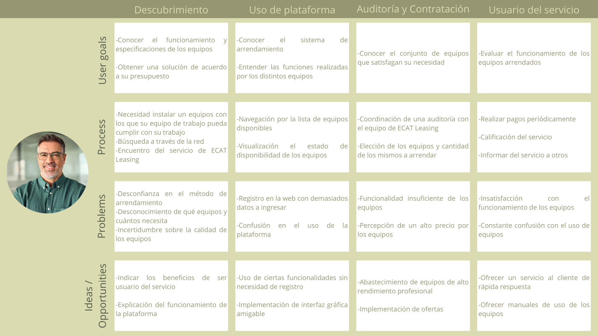

**Segmento objetivo 2:** Instituciones Educativas (universidades, colegios, escuelas, institutos)

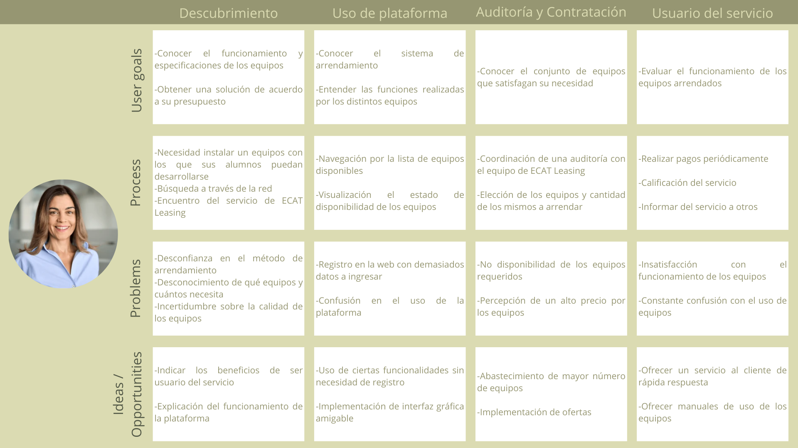

### 2.3.4. Empathy Mapping

**Segmento objetivo 1:** Empresas (pequeñas, medianas y grandes)

**Segmento objetivo 2:** Instituciones Educativas (universidades, colegios, escuelas, institutos)

### 2.4. Big Picture Event Storming

Big Picture Event Storming es una técnica de modelado que busca ofrecer una "visión panorámica" de un software, señalando las piezas claves del negocio, identificar problemas y organizar la estructura básica de la gestión en una cronología. Para llevarlas a cabo, nuestro grupo tuvo reuniones virtuales para diálogar sobre eventos, objetos y la ubicación de estos, con respecto al negocio.

A continuación, presentaremos los pasos que ejecutamos para llevar acabo la técnica Big Picture:

**a. Unstructured Exploration**

La exploración sin estructura consiste en exponer todo lo relacionado al negocio, sin tener una estructura definida. Para este caso, decidimos aceptar toda propuesta lanzada por los miembros del desarrollo, luego de un tiempo, fue actualizado conservando lo que se considero más pertinente.

Dentro podemos ver eventos, acciones del usuario, acciones de los miembros del negocio y sistemas externos como los métodos de pago que se usarían en nuestro negocio.

**b. Cronology**

En la cronología, se ordenaron los elementos del negocio, según la manera que consideramos serían llamados.

**c. Events**

Separamos los eventos de los demás elementos para llevar mejor control en los siguientes pasos.

**d. Pain points**

Añadimos los puntos de dolor que consideramos que el cliente/usuario pueda experimentar con el uso del sistema

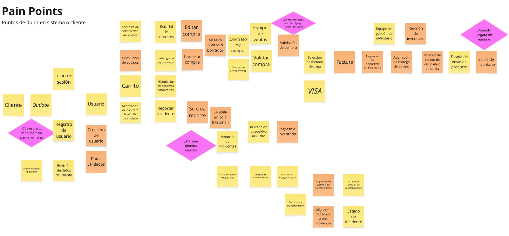

**e. Bounded Context**

Seccionamos los elementos del negocio, en este caso por gestionamientos del negocio.

Una observación que podemos realizar es que los modelos presentados son prototipos planteados usando las técnicas de Big Picture Event Storming. Por ello, son diseños que podrán ser mejorados en los siguientes capítulos.

### 2.5. Ubiquitous Language

- Cliente: persona, empresa o institución que requiere de equipamiento TI.
- Contrato: documento digital que establece condiciones de arrendamiento o de compra.
- Equipo: objeto técnologico (computadora, servidor, IoT, etc.) que forma parte de nuestro inventario y que el cliente requiere
- Inventario: ubicación física donde los equipos son guardados hasta el proceso de venta o arrendamiento.
- Incidencia: problema o requerimiento técnico que tiene el cliente.
- Mantenimiento: acciones preventivas realizadas por el equipo de soporte y solicitada por el cliente.
- Equipo de negocio: grupo encargado de la gestión de negocio, desde administración de usuarios, equipo de ventas, equipo de logística y soporte al cliente.

# Capítulo III: Requirements Specification

## 3.1. User Stories

<h2>Epics</h2>
<table border="1" cellspacing="0" cellpadding="5">
    
<tr><th>ID de Epic</th><th>Título</th><th>Descripción</th></tr>
<tr><td>EP01</td><td>Gestión de cuenta</td><td>Como usuario deseo contar con una cuenta personal con la cual registrarme, iniciar y cerrar sesión en la plataforma.</td></tr>
<tr><td>EP02</td><td>Información del servicio</td><td>Como usuario deseo contar con un apartado en el cual conocer el funcionamiento, antecedentes y costo del servicio.</td></tr>
<tr><td>EP03</td><td>Atención y comunicación</td><td>Como usuario deseo contar con mecanismos de contacto, mensajería y servicio al cliente para resolver mis dudas o inconvenientes.</td></tr>
<tr><td>EP04</td><td>Auditoría y catálogo de equipos</td><td>Como usuario deseo conocer la disponibilidad, características y auditorías de los equipos, para validar si satisfacen mis necesidades.</td></tr>
<tr><td>EP05</td><td>Contratación y gestión del servicio</td><td>Como usuario deseo contar con un apartado para realizar la contratación del servicio y gestionar mis suscripciones.</td></tr>
</table> 

<table border="1" cellspacing="0" cellpadding="5">
<tr><th>ID de HU</th><td>HU01</td><th>ID de Epic</th><td>EP01</td></tr>
<tr><th>Título</th><td>Registro de cuenta</td><th>Prioridad en el negocio</th><td>Alta</td></tr>
<tr><th>Descripción</th><td colspan="3"><b>Como</b> usuario <b>quiero</b> registrarme en la plataforma indicando mis datos <b>para</b> interactuar con los servicios de Smart Leasing.</td></tr>
<tr><th>Criterios de Aceptación</th><td colspan="3">
<b>Escenario:</b> Registro de usuario  
<b>Dado que</b> no poseo cuenta 
<b>Cuando</b> seleccione “Registrarme” e ingrese mis datos 
<b>Entonces</b> la aplicación creará mi cuenta de forma segura.
</td></tr>
</table> 

<table border="1" cellspacing="0" cellpadding="5">
<tr><th>ID de HU</th><td>HU02</td><th>ID de Epic</th><td>EP01</td></tr>
<tr><th>Título</th><td>Inicio de sesión</td><th>Prioridad en el negocio</th><td>Alta</td></tr>
<tr><th>Descripción</th><td colspan="3"><b>Como</b> usuario <b>quiero</b> iniciar sesión con mis credenciales <b>para</b> acceder a mi perfil de forma segura.</td></tr>
<tr><th>Criterios de Aceptación</th><td colspan="3">
<b>Escenario:</b> Inicio de sesión  
<b>Dado que</b> poseo una cuenta 
<b>Cuando</b> ingrese usuario y contraseña válidos 
<b>Entonces</b> accederé a mi panel personal.
</td></tr>
</table> 

<table border="1" cellspacing="0" cellpadding="5">
<tr><th>ID de HU</th><td>HU03</td><th>ID de Epic</th><td>EP01</td></tr>
<tr><th>Título</th><td>Cierre de sesión</td><th>Prioridad en el negocio</th><td>Media</td></tr>
<tr><th>Descripción</th><td colspan="3"><b>Como</b> usuario <b>quiero</b> cerrar sesión <b>para</b> garantizar la privacidad de mi información.</td></tr>
<tr><th>Criterios de Aceptación</th><td colspan="3">
<b>Escenario:</b> Cierre de sesión  
<b>Dado que</b> estoy logueado 
<b>Cuando</b> seleccione “Cerrar sesión” 
<b>Entonces</b> la aplicación finalizará la sesión y volverá al estado “Invitado”.
</td></tr>
</table> 

<table border="1" cellspacing="0" cellpadding="5">
<tr><th>ID de HU</th><td>HU04</td><th>ID de Epic</th><td>EP02</td></tr>
<tr><th>Título</th><td>Descripción del servicio</td><th>Prioridad en el negocio</th><td>Alta</td></tr>
<tr><th>Descripción</th><td colspan="3"><b>Como</b> usuario <b>quiero</b> acceder a la descripción general de Smart Leasing <b>para</b> comprender sus beneficios.</td></tr>
<tr><th>Criterios de Aceptación</th><td colspan="3">
<b>Escenario:</b> Consulta de información  
<b>Dado que</b> accedo a la sección “Servicio” 
<b>Cuando</b> abra el apartado de información 
<b>Entonces</b> visualizaré la descripción general.
</td></tr>
</table> 

<table border="1" cellspacing="0" cellpadding="5">
<tr><th>ID de HU</th><td>HU05</td><th>ID de Epic</th><td>EP02</td></tr>
<tr><th>Título</th><td>Consulta de planes y costos</td><th>Prioridad en el negocio</th><td>Alta</td></tr>
<tr><th>Descripción</th><td colspan="3"><b>Como</b> usuario <b>quiero</b> consultar los planes de arrendamiento y costos <b>para</b> elegir la opción que mejor se adapte a mis necesidades.</td></tr>
<tr><th>Criterios de Aceptación</th><td colspan="3">
<b>Escenario:</b> Visualizar planes  
<b>Dado que</b> accedo a la sección de “Planes” 
<b>Cuando</b> revise las opciones 
<b>Entonces</b> podré ver precios, características y condiciones.
</td></tr>
</table> 

<table border="1" cellspacing="0" cellpadding="5">
<tr><th>ID de HU</th><td>HU06</td><th>ID de Epic</th><td>EP02</td></tr>
<tr><th>Título</th><td>Casos de éxito</td><th>Prioridad en el negocio</th><td>Media</td></tr>
<tr><th>Descripción</th><td colspan="3"><b>Como</b> usuario <b>quiero</b> conocer testimonios y casos de éxito <b>para</b> confiar en la experiencia de ECAT Leasing.</td></tr>
<tr><th>Criterios de Aceptación</th><td colspan="3">
<b>Escenario:</b> Revisión de testimonios  
<b>Dado que</b> estoy evaluando la empresa 
<b>Cuando</b> consulte la sección “Clientes” 
<b>Entonces</b> visualizaré testimonios y referencias.
</td></tr>
</table> 

<table border="1" cellspacing="0" cellpadding="5">
<tr><th>ID de HU</th><td>HU07</td><th>ID de Epic</th><td>EP03</td></tr>
<tr><th>Título</th><td>Formulario de contacto</td><th>Prioridad en el negocio</th><td>Alta</td></tr>
<tr><th>Descripción</th><td colspan="3"><b>Como</b> usuario <b>quiero</b> enviar consultas mediante un formulario <b>para</b> comunicarme con el soporte técnico.</td></tr>
<tr><th>Criterios de Aceptación</th><td colspan="3">
<b>Escenario:</b> Envío de consulta  
<b>Dado que</b> tengo una duda 
<b>Cuando</b> complete y envíe el formulario 
<b>Entonces</b> el sistema registrará mi solicitud y enviaré confirmación.
</td></tr>
</table> 

<table border="1" cellspacing="0" cellpadding="5">
<tr><th>ID de HU</th><td>HU08</td><th>ID de Epic</th><td>EP03</td></tr>
<tr><th>Título</th><td>Chat de mensajería rápida</td><th>Prioridad en el negocio</th><td>Media</td></tr>
<tr><th>Descripción</th><td colspan="3"><b>Como</b> usuario <b>quiero</b> disponer de un chat de mensajería rápida <b>para</b> resolver dudas de manera ágil.</td></tr>
<tr><th>Criterios de Aceptación</th><td colspan="3">
<b>Escenario:</b> Uso de chat  
<b>Dado que</b> necesito asistencia inmediata 
<b>Cuando</b> abra la sección de chat 
<b>Entonces</b> podré enviar y recibir mensajes.
</td></tr>
</table> 

<table border="1" cellspacing="0" cellpadding="5">
<tr><th>ID de HU</th><td>HU09</td><th>ID de Epic</th><td>EP03</td></tr>
<tr><th>Título</th><td>Soporte especializado</td><th>Prioridad en el negocio</th><td>Alta</td></tr>
<tr><th>Descripción</th><td colspan="3"><b>Como</b> usuario <b>quiero</b> acceder a soporte especializado en incidencias técnicas <b>para</b> garantizar continuidad en mis operaciones.</td></tr>
<tr><th>Criterios de Aceptación</th><td colspan="3">
<b>Escenario:</b> Reporte de incidencia  
<b>Dado que</b> tengo un problema técnico 
<b>Cuando</b> reporte la incidencia en el sistema 
<b>Entonces</b> recibiré atención especializada en un tiempo razonable.
</td></tr>
</table> 

<table border="1" cellspacing="0" cellpadding="5">
<tr><th>ID de HU</th><td>HU10</td><th>ID de Epic</th><td>EP04</td></tr>
<tr><th>Título</th><td>Catálogo de equipos</td><th>Prioridad en el negocio</th><td>Alta</td></tr>
<tr><th>Descripción</th><td colspan="3"><b>Como</b> usuario <b>quiero</b> visualizar un catálogo de equipos <b>para</b> elegir el que mejor se ajuste a mi empresa.</td></tr>
<tr><th>Criterios de Aceptación</th><td colspan="3">
<b>Escenario:</b> Consulta de catálogo  
<b>Dado que</b> accedo a la sección de equipos 
<b>Cuando</b> revise el listado 
<b>Entonces</b> visualizaré fotos, fichas técnicas y disponibilidad.
</td></tr>
</table> 

<table border="1" cellspacing="0" cellpadding="5">
<tr><th>ID de HU</th><td>HU11</td><th>ID de Epic</th><td>EP04</td></tr>
<tr><th>Título</th><td>Comparación de equipos</td><th>Prioridad en el negocio</th><td>Media</td></tr>
<tr><th>Descripción</th><td colspan="3"><b>Como</b> usuario <b>quiero</b> filtrar y comparar equipos según criterios <b>para</b> tomar una decisión informada.</td></tr>
<tr><th>Criterios de Aceptación</th><td colspan="3">
<b>Escenario:</b> Comparación  
<b>Dado que</b> consulto el catálogo 
<b>Cuando</b> seleccione dos o más equipos 
<b>Entonces</b> la aplicación mostrará una tabla comparativa.
</td></tr>
</table> 

<table border="1" cellspacing="0" cellpadding="5">
<tr><th>ID de HU</th><td>HU12</td><th>ID de Epic</th><td>EP04</td></tr>
<tr><th>Título</th><td>Historial de auditorías</td><th>Prioridad en el negocio</th><td>Media</td></tr>
<tr><th>Descripción</th><td colspan="3"><b>Como</b> usuario <b>quiero</b> consultar el historial de auditorías y mantenimientos <b>para</b> asegurar la confiabilidad del equipo.</td></tr>
<tr><th>Criterios de Aceptación</th><td colspan="3">
<b>Escenario:</b> Consulta de historial  
<b>Dado que</b> selecciono un equipo 
<b>Cuando</b> abra la ficha técnica 
<b>Entonces</b> visualizaré fechas de auditoría y resultados.
</td></tr>
</table> 

<table border="1" cellspacing="0" cellpadding="5">
<tr><th>ID de HU</th><td>HU13</td><th>ID de Epic</th><td>EP05</td></tr>
<tr><th>Título</th><td>Contratación de plan</td><th>Prioridad en el negocio</th><td>Alta</td></tr>
<tr><th>Descripción</th><td colspan="3"><b>Como</b> usuario <b>quiero</b> contratar un plan de leasing en línea <b>para</b> evitar procesos manuales.</td></tr>
<tr><th>Criterios de Aceptación</th><td colspan="3">
<b>Escenario:</b> Contratación  
<b>Dado que</b> poseo una cuenta 
<b>Cuando</b> seleccione un plan 
<b>Entonces</b> podré confirmar la contratación con comprobante generado.
</td></tr>
</table> 

<table border="1" cellspacing="0" cellpadding="5">
<tr><th>ID de HU</th><td>HU14</td><th>ID de Epic</th><td>EP05</td></tr>
<tr><th>Título</th><td>Gestión de servicios contratados</td><th>Prioridad en el negocio</th><td>Alta</td></tr>
<tr><th>Descripción</th><td colspan="3"><b>Como</b> usuario <b>quiero</b> renovar, modificar o cancelar mis servicios <b>para</b> tener control sobre mis suscripciones.</td></tr>
<tr><th>Criterios de Aceptación</th><td colspan="3">
<b>Escenario:</b> Gestión de plan  
<b>Dado que</b> tengo servicios activos 
<b>Cuando</b> acceda a la sección de gestión 
<b>Entonces</b> podré realizar cambios o cancelaciones.
</td></tr>
</table> 

<table border="1" cellspacing="0" cellpadding="5">
<tr><th>ID de HU</th><td>HU15</td><th>ID de Epic</th><td>EP05</td></tr>
<tr><th>Título</th><td>Descarga de comprobantes</td><th>Prioridad en el negocio</th><td>Media</td></tr>
<tr><th>Descripción</th><td colspan="3"><b>Como</b> usuario <b>quiero</b> descargar comprobantes y contratos <b>para</b> llevar un registro formal de mis operaciones.</td></tr>
<tr><th>Criterios de Aceptación</th><td colspan="3">
<b>Escenario:</b> Descarga de documento  
<b>Dado que</b> contraté un servicio 
<b>Cuando</b> acceda a mis comprobantes 
<b>Entonces</b> podré descargar archivos en PDF.
</td></tr>
</table> 

## 3.2. Impact Mapping

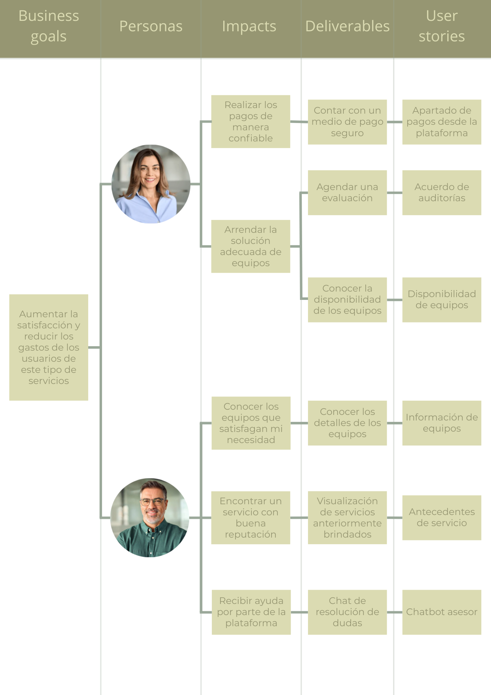

## 3.3. Product Backlog

<table>
  <thead>
    <tr>
      <th># Orden</th>
      <th>ID de HU</th>
      <th>Título</th>
      <th>Descripción</th>
      <th>Story Points (1 / 2 / 3 / 5 / 8) </th>
    </tr>
  </thead>
  <tbody>
    <tr>
      <td>1</td>
      <td>HU01</td>
      <td>Registro de cuenta</td>
      <td><b>Como</b> usuario <b>quiero</b>  registrarme en la plataforma indicando mis datos <b>para</b> interactuar con las funciones de la misma.</td>
      <td>1</td>
    </tr>
    <tr>
      <td>2</td>
      <td>HU02</td>
      <td>Inicio y cierre de sesión</td>
      <td><b>Como</b> usuario <b>quiero</b> ser capaz ingresar y salir de mi cuenta <b>para</b> mantener la privacidad de los datos de la misma.</td>
      <td>1</td>
    </tr>
    <tr>
      <td>3</td>
      <td>HU03</td>
      <td>Descripción de la empresa</td>
      <td><b>Como</b> usuario <b>quiero</b> conocer más a detalle la misión y visión de la empresa <b>para</b> saber si satisface mi necesidad.</td>
      <td>1</td>
    </tr>
    <tr>
      <td>4</td>
      <td>HU04</td>
      <td>Modalidad de cobro</td>
      <td><b>Como</b> usuario <b>quiero</b> ser capaz de informarme del cómo se calcula el monto a pagar <b>para</b> corroborarlo con mi presupuesto.</td>
      <td>3</td>
    </tr>
    <tr>
      <td>5</td>
      <td>HU05</td>
      <td>Antecedentes de servicio</td>
      <td><b>Como</b> usuario <b>quiero</b> conocer el trabajo ya realizado por la empresa <b>para</b> que mi nivel de confianza en ella incremente.</td>
      <td>2</td>
    </tr>
    <tr>
      <td>6</td>
      <td>HU06</td>
      <td>Ubicación y número telefónico</td>
      <td><b>Como</b> usuario <b>quiero</b> conocer dónde se ubican las oficinas y cómo puedo contactar con ellas <b>para</b> contactar al personal.</td>
      <td>1</td>
    </tr>
    <tr>
      <td>7</td>
      <td>HU07</td>
      <td>Chatbot asesor</td>
      <td><b>Como</b> usuario <b>quiero</b> poder acceder a una chat de respuesta rápida <b>para</b> aclarar mis dudas.</td>
      <td>5</td>
    </tr>
    <tr>
      <td>8</td>
      <td>HU08</td>
      <td>Formulario de quejas</td>
      <td><b>Como</b> usuario <b>quiero</b> poder presentar una queja <b>para</b> hacer llegar mi malestar a la empresa.</td>
      <td>3</td>
    </tr>
    <tr>
      <td>9</td>
      <td>HU09</td>
      <td>Servicio al cliente</td>
      <td><b>Como</b> usuario <b>quiero</b> contar con un medio por el cual tener contacto con el personal <b>para</b> recibir ayuda.</td>
      <td>3</td>
    </tr>
    <tr>
      <td>10</td>
      <td>HU10</td>
      <td>Información de equipos</td>
      <td><b>Como</b> usuario <b>quiero</b> poder conocer la función de los equipos <b>para</b> conocer cómo satisfacer mis necesidades.</td>
      <td>2</td>
    </tr>
    <tr>
      <td>11</td>
      <td>HU11</td>
      <td>Disponibilidad de equipos</td>
      <td><b>Como</b> usuario <b>quiero</b> poder conocer la disponibilidad de un equipo <b>para</b> consultar por el mismo u otro.</td>
      <td>2</td>
    </tr>
    <tr>
      <td>12</td>
      <td>HU12</td>
      <td>Acuerdo de auditorías</td>
      <td><b>Como</b> usuario <b>quiero</b> poder recibir una auditoría personalizada en el área correspondiente <b>para</b> recibir ayuda de acuerdo a mis necesidades y presupuesto.</td>
      <td>8</td>
    </tr>
    <tr>
      <td>13</td>
      <td>HU13</td>
      <td>Modalidades de pago</td>
      <td><b>Como</b> usuario <b>quiero</b> conocer las modalidades de pago disponibles <b>para</b> decidir cuál es la de mi conveniencia.</td>
      <td>1</td>
    </tr>
    <tr>
      <td>14</td>
      <td>HU14</td>
      <td>Apartado de pago desde la plataforma</td>
      <td><b>Como</b> usuario <b>quiero</b> contar con un apartado de pagos desde la misma plataforma <b>para</b> una mayor comodidad.</td>
      <td>3</td>
    </tr>
  </tbody>
</table>

=======

# Capítulo IV: Product Design

## 4.1. Style Guidelines

### 4.1.1. General Style Guidelines

**Tipografía**

| Uso                  | Fuente                 | Ejemplo visual            |
| -------------------- | ---------------------- | ------------------------- |
| Encabezados (H1, H2) | **Anton**              | TÍTULO PRINCIPAL          |
| Subtítulos / Botones | **Antonio**            | Subtítulo / Acción        |
| Texto general        | Sans Serif del sistema | Texto de párrafo estándar |

**Paleta de Colores**

| Color            | Hex                   | Uso                                             |
| ---------------- | --------------------- | ----------------------------------------------- |
| Azul principal   | `#1A3458`             | Headers, barra de navegación, botones primarios |
| Azul base claro  | `#F2F6FF`             | Fondos generales, secciones amplias, cards      |
| Negro            | `#000000`             | Texto sobre fondos claros                       |
| Blanco           | `#FFFFFF`             | Texto sobre fondos oscuros, íconos              |
| Escala de grises | `#333333` ‒ `#DDDDDD` | Wireframes, bordes, placeholders                |

**Espaciado y consistencia**

- Márgenes y paddings en múltiplos de 8 px.
- Bordes redondeados de 8 px para botones y tarjetas.
- Sombras suaves (“box-shadow” ligero) para elementos elevados como cards o modales.

---

### 4.1.2. Web Style Guidelines

**Componentes principales**

| Componente          | Estilo visual                                                       |
| ------------------- | ------------------------------------------------------------------- |
| Botón primario      | Fondo `#1A3458`, texto `#FFFFFF`, borde redondeado 8 px             |
| Botón secundario    | Fondo `#F2F6FF`, texto `#1A3458`                                    |
| Enlace              | Texto `#1A3458`, subrayado al pasar el cursor                       |
| Tarjeta (Card)      | Fondo `#F2F6FF`, título en Anton, contenido en negro, sombra ligera |
| Barra de navegación | Fondo `#1A3458`, texto y logo en blanco                             |
| Footer              | Fondo gris oscuro (`#333333`), texto en blanco                      |

**Accesibilidad**

- Contraste de al menos **4.5:1** entre texto y fondo.
- Tipografía legible, tamaño mínimo 16px para textos largos.
- Asegurar buen contraste también en estados hover/focus.

---

## 4.2. Information Architecture

### 4.2.1. Organization Systems

En esta sección se definen los sistemas de organización que permitirán estructurar y etiquetar el contenido de manera que resulte comprensible y fácil de encontrar para los usuarios. La organización de la información en _PcPedia_ busca adaptarse a las necesidades tanto de estudiantes de ingeniería, técnicos de soporte como de usuarios entusiastas de hardware.

**Jerarquía de contenido:**  
Se aplica una jerarquía visual que da prioridad a los componentes principales que los usuarios buscan con mayor frecuencia. Las secciones destacadas en la interfaz incluyen categorías como Procesadores, Tarjetas Gráficas, Memorias RAM, Almacenamiento, Placas Base y Periféricos. Cada categoría cuenta con subcategorías; por ejemplo, dentro de Procesadores, se diferencian líneas como Intel Core i3, i5, i7 e i9, así como AMD Ryzen 5, 7 y 9. Esta jerarquía ayuda al usuario a identificar rápidamente dónde debe dirigirse según su necesidad.

**Organización secuencial:**  
El flujo de interacción acompaña al usuario en pasos lógicos: buscar un componente, revisar sus especificaciones técnicas, compararlo con otro producto y finalmente visualizar recomendaciones relacionadas. Este proceso está diseñado para ser intuitivo, de manera que los usuarios puedan tomar decisiones rápidas sin perderse entre pantallas o exceso de información.

**Organización matricial:**  
Se complementa con un menú y estructura de navegación que permiten combinar distintas dimensiones de filtrado. Por ejemplo, un usuario puede entrar a la categoría “Laptops”, aplicar un filtro por marca “ASUS” y luego ajustar por rango de precio. De esta forma, un mismo producto puede encontrarse a través de múltiples caminos, garantizando accesibilidad para diferentes perfiles de usuario.

---

### 4.2.2. Labeling Systems

En _PcPedia_, los sistemas de etiquetado son fundamentales para asegurar claridad y consistencia en la experiencia de navegación. Todas las secciones utilizan labels simples y familiares para la audiencia: “Procesadores”, “Tarjetas Gráficas”, “Almacenamiento” y “Comparador” se ubican en el menú superior, evitando términos técnicos confusos o redundantes.

Cada ficha de producto incluye etiquetas técnicas claras como “Frecuencia (GHz)”, “Número de núcleos”, “VRAM” o “Tipo de memoria”. Estas etiquetas permiten que tanto un usuario novato como un experto comprendan la información sin ambigüedades. Asimismo, los botones de acción presentan mensajes directos como “Comparar”, “Ver más” o “Agregar a favoritos”, reforzando la orientación en cada paso.

Gracias a este sistema, el usuario puede navegar de manera fluida y sin necesidad de decodificar terminología compleja.

---

### 4.2.3. SEO Tags and Meta Tags

La plataforma _PcPedia_ incorpora metaetiquetas que mejoran su posicionamiento en motores de búsqueda y aseguran que la información se interprete correctamente en navegadores.

- **Title:** cada página cuenta con un título descriptivo, por ejemplo: _“PcPedia – Comparador de Procesadores y Hardware de PC”_.
- **Codificación de caracteres:** se utiliza UTF-8 para mostrar adecuadamente caracteres especiales y símbolos técnicos.
- **Description:** cada página integra un resumen breve y atractivo, como _“Encuentra y compara procesadores Intel y AMD con especificaciones actualizadas y comparaciones en tiempo real”_.
- **Keywords:** se incluyen términos clave como “procesadores”, “tarjetas gráficas”, “comparador de hardware” para mejorar la indexación.
- **Author y Copyright:** detallan el equipo desarrollador y derechos reservados.

Estas prácticas garantizan que _PcPedia_ sea visible en búsquedas relevantes y transmita confianza a sus usuarios desde el primer contacto.

---

### 4.2.4. Searching Systems

Uno de los aspectos más relevantes de _PcPedia_ es la capacidad de localizar rápidamente componentes específicos dentro de un catálogo amplio. Para ello, se ha diseñado un sistema de búsqueda con varias funcionalidades:

- **Barra de búsqueda global:** permite ingresar directamente el nombre del componente (ej. “Ryzen 7 5800X”).
- **Autocompletado con sugerencias:** mientras el usuario escribe, se despliegan coincidencias relevantes como modelos y marcas.
- **Filtros dinámicos:** posibilitan refinar los resultados por precio, fabricante, fecha de lanzamiento o nivel de rendimiento.
- **Historial de búsqueda:** los usuarios registrados pueden guardar búsquedas previas y repetirlas con un solo clic.
- **Comparación directa:** desde la búsqueda, los resultados pueden enviarse al comparador sin necesidad de pasos adicionales.

Este sistema asegura que los usuarios no pierdan tiempo navegando por múltiples menús y puedan acceder a la información que necesitan de forma inmediata.

---

### 4.2.5. Navigation Systems

La navegación en _PcPedia_ está diseñada para ser clara, responsiva y adaptada a distintos dispositivos. El menú principal superior incluye accesos a las secciones más relevantes: Inicio, Categorías, Comparador, Noticias y Ayuda. Esta estructura permite un acceso rápido a las funciones esenciales sin saturar al usuario.

En categorías extensas, se incluyen **submenús desplegables** y **breadcrumbs (migas de pan)** que indican la ruta actual del usuario (ej. Inicio > Tarjetas Gráficas > NVIDIA). Esto ayuda a que siempre sepan dónde se encuentran dentro de la jerarquía.

Para dispositivos móviles se implementa un **menú hamburguesa**, donde las opciones aparecen en un panel lateral optimizado para pantallas pequeñas. En el footer se añaden accesos a contacto, políticas de privacidad, redes sociales y mapa del sitio, lo que refuerza la usabilidad.

Finalmente, los botones de acción (ej. “Comparar ahora”, “Agregar a favoritos”) se distribuyen en posiciones estratégicas para que la navegación no solo sea informativa, sino también orientada a la interacción constante del usuario.

---

## 4.3. Landing Page UI Design

### 4.3.1. Landing Page Wireframe

Los wireframes son representaciones de baja fidelidad que muestran la estructura y disposición de los elementos principales de la aplicación web.

A continuación, presentaremos los wireframe de nuestra Landing Page como guía del diseño que haremos en los siguientes paso:

- Captura 1

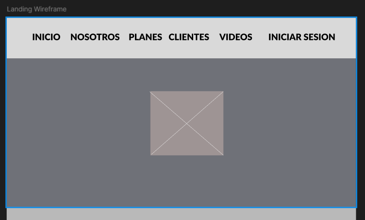

- Captura 2

- Captura 3

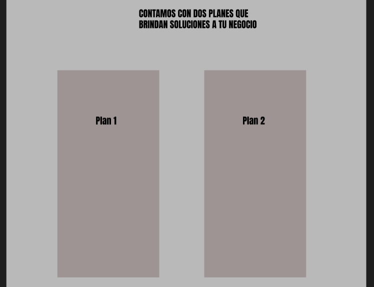

- Captura 4

- Captura 5

Para más detalle, revisar el anexo 1.

### 4.3.2. Landing Page Mock-up.

El Mock-up de la Landing Page es una representación de alta fidelidad de la página de inicio, donde se aplican colores, tipografía, iconografía y estilos que transmiten la identidad visual corporativa. Este mock-up permite visualizar cómo se verán realmente los componentes descritos en el wireframe.

Este mock-up refleja la versión estilizada que un usuario final verá al ingresar, integrando la experiencia visual con la navegación lateral.

- Captura 1

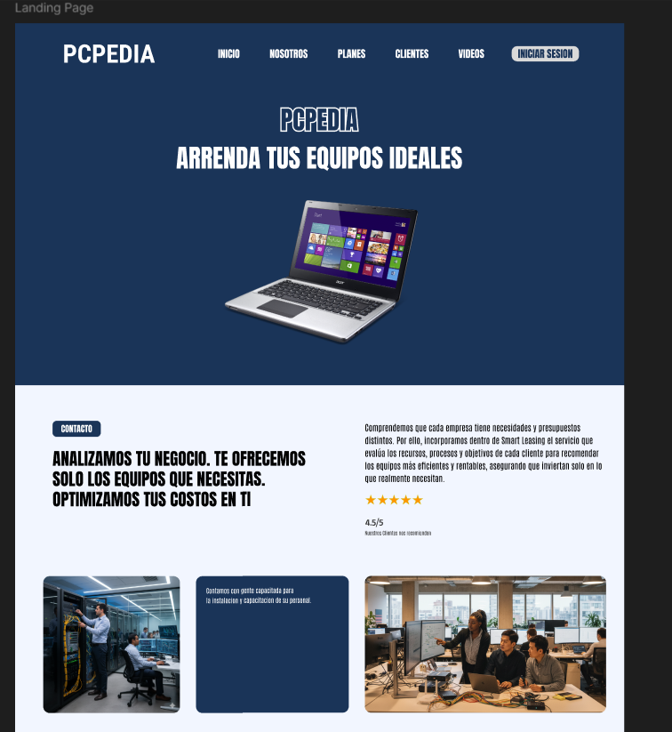

- Captura 2

- Captura 3

- Captura 4

Para más detalle, revisar el anexo 1.

## 4.4. Web Applications UX/UI Design

### 4.4.1. Web Applications Wireframes

Anteriormente se mostraron los wireframes de la Landing Page del proyecto, ahora mostraremos el diseño de bajo nivel de fidelidad de la web de nuestro proyecto.

En primer lugar, mostraremos los elementos que se podran encontrar en nuestra web.

- Login, Usuario, Contraseña y Botón de acceso
- Pantalla de inicio de sesión con campos básicos de autenticación.
- Inicio Bienvenida Historia Servicios
- Landing de bienvenida con mensaje principal, historia y servicios.
- Dashboard Gráfico por modelo Gráfico por marca Exportar
- Panel de control con métricas de activos y opción de exportar.
- Contratos Tarjetas Estados
- Vista de contratos listados como tarjetas.
- Perfil Avatar Datos Configuración
- Página de perfil con información y opciones de configuración.
- Partners Novedades
- Sección de socios y novedades corporativas.

**Vista 1**

**Vista 2**

**Vista 3**

**Vista 4**

**Vista 5**

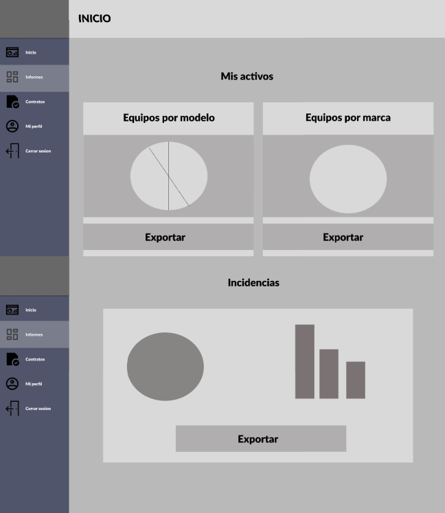

**Vista 6**

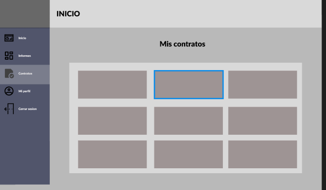

Para más detalle, revisar el anexo 1.

### 4.4.2. Web Applications Wireflow Diagrams

### 4.4.3. Web Applications Mock-ups

Finalmente, presentamos el modelo de alta fidelidad de nuestra pagina web:

**Vista 1**

**Vista 2**

**Vista 3**

**Vista 4**

**Vista 5**

**Vista 6**

**Vista 7**

### 4.4.4. Web Applications User Flow Diagrams

## 4.5. Web Applications Prototyping

El prototipo de la aplicación web adjunta la representación visual anteriomente mostrada y la vuelve interactiva, pero sin tener código real detrás.

Para este proyecto, usamos figma para hacer el prototipo de la aplicación web. Véase el anexo 2 para mayor información.

## 4.6. Domain-Driven Software Architecture

### 4.6.1. Design-Level Event Storming

El diseño por niveles del Event Storming es una técnica colaborativa, similar al Big Picture, pero más profunda que busca especificar los Bounded Context pertenecientes al negocio. En otras palabras, DLES es una técnica perteneciente al Domain Driven Design que nos permitirá entender los microservicios de nuestro negocio a un nivel mucho más específico que en un Big Picture.

A continuación, presentaremos los pasos a seguir para ejecutar la técnica:

En los primeros pasos, reutilizamos lo planteado en el Big Picture Event Storming.

**a. Unstructured Exploration**

**b. Chronology**

**c. Pain Points**

Para los siguientes pasos, nos tuvimos que reunir nuevamente para asignar roles a los elementos del negocio.

**d. Commands**

Los comandos son acciones que nosotros o el usuario podría hacer dentro del sistema, en su mayoría, resultando en eventos. Siguiendo las técnicas su color es "azul".

Los comandos más importante en nuestro negocio serán la generación de incidentes, devoluciones y compras que desencadenan la mayoría de eventos y relaciones en nuestro sistema.

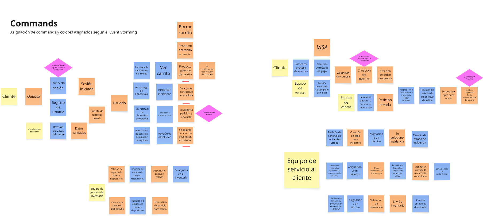

**e. Pivotal**

Pivotal es un término usado para denotar los eventos importantes sucedidos en el negocio. Siguiendo la técnica su color es "rojo" y se denota con una línea en el evento designado.

En nuestro sistema, notamos momentos Pivotal en los eventos de creación de usuario, la validación de compra, cuando se solucionan incidentes y cuando finalizan los procesos de devolución o mantenimiento. Debido a que se relacionan con la validación de datos, finanzas y experiencia del cliente.

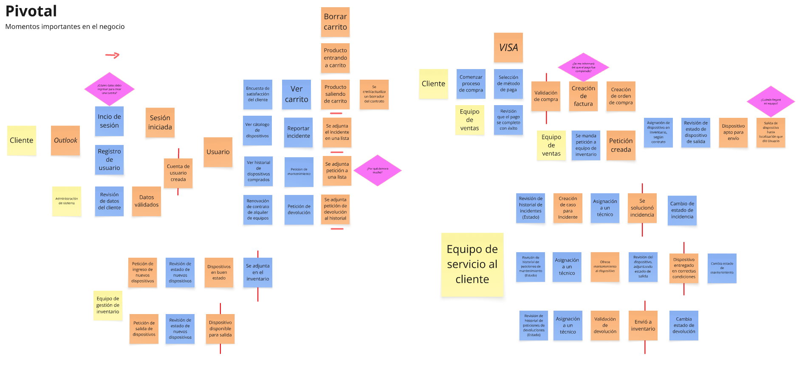

**f. Policies**

Policies se refiere a las políticas de nuestro sistema, en que cosas estaremos obligados a hacer. Siguiendo la técnica su color es "morado".

En nuestro sistema, la manera en la que hemos hecho las políticas son siguiendo un orden causal: si sucede "x", entonces debemos hacer "y". Por ejemplo, si se inicializa una compra, debemos informar a nuestro usuario mediante los canales prestados: SMS o correoeléctronico, la razón de esta politica sería para ofrecer un método de seguridad y protección a la cuenta de nuestro usuario y sus finanzas.

**g. Read Models**

Read Models, en sí, no tienen lógica dentro del negocio, sino que son etiquetas que buscan apoyar la descripción de datos del sistema. Siguiendo la técnica son de color "verde".

En nuestro sistema, usamos este tipo de etiquetas para funciones sencillas como describir datos que ingresa el usuario, como interactua un comando y descripciones de eventos más detallada.

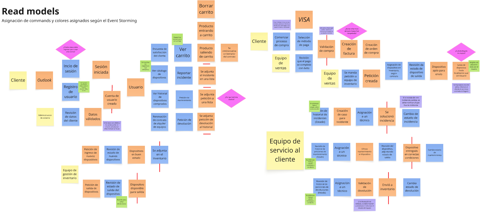

**h. External System**

External System, como su nombre dice, son sistemas externos de los cuales nuestra aplicación se podrá apoyar. Siguiendo la técnica su color es "rojo pálido".

En nuestro sistema, usaremos Outlook y Visa como sistemas externos como medio de comunicación y método de pago respectivamente.

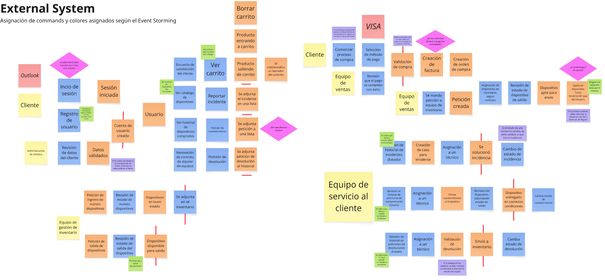

**i. Aggregates**

Aggregates es una etiqueta muy especial, pues es una de las más importantes dentro del DDD y Event Storming. Representa a un objeto el cual podrá hacer los comandos, pero se diferencia de una entidad, debidoa a que estará compuestos de otros elemetos. Siguiendo la técnica su color es "amarillo" y tiene una forma alargada.

Dentro del sistema, podemos denotar aggregates como Usuario, Incidente, Mantenimiento, Devolución y Orden de compra. Todos son aggregates, debido a que están compuestos de elementos anteriores a su existencia como información de usuario, incidente, mantenimiento, devolución y compra respectivamente.

**j. Bounded Context**

Finalmente, Bounded Context es el décimo y último paso de este tipo de diseño, se encargará de seccionar los elementos y crear un contexto en el que cada uno pueda desarrollarse.

Dentro de nuestro sistema, encontramos 4 bounded context que son los siguientes:

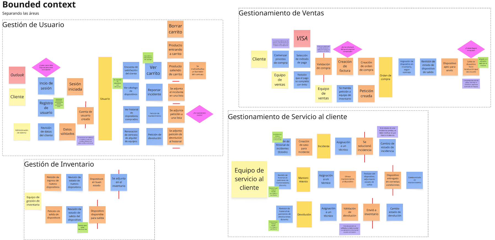

- **Bounded Context: Gestión de Usuario**

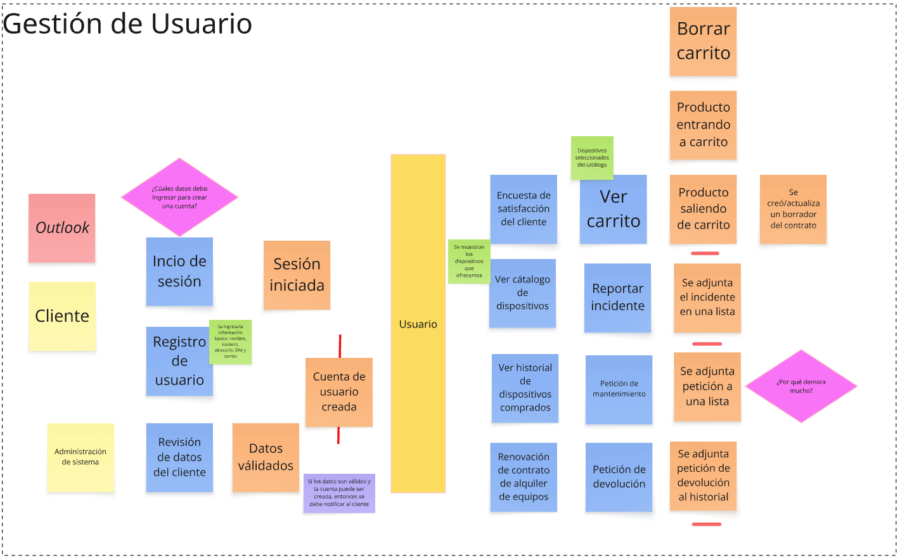

- **Bounded Context: Gestión de Inventario**

- **Bounded Context: Gestión de Ventas**

- **Bounded Context: Gestión de Servicio al cliente**

### 4.6.2. Software Architecture Context Diagram

El diagrama de contexto es uno que trata en alto nivel, o sea de manera superficial el negocio. Por ejemplo, en nuestro caso, podemos ver las personas que interactuaran con nuestro sistema, el sistema y los sistemas externos que nos ayudaran a conseguir los objetivos del negocio.

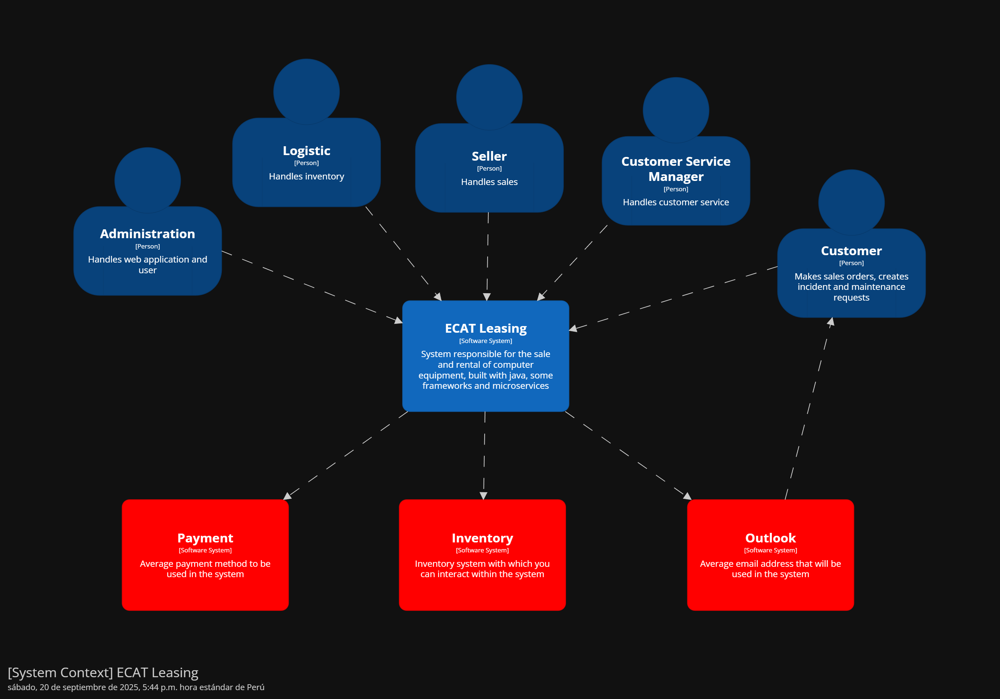

### 4.6.3. Software Architecture Container Diagrams

El diagrama de contenedores es similar al de contexto, pero descomponiendo nuestro sistema en los servicios que lo compondran. En este caso, nuestro sistema estara compuesto por 2 páginas web: Customer y Staff, separamos a los clientes de la web en la que se trabajará en el negocio.

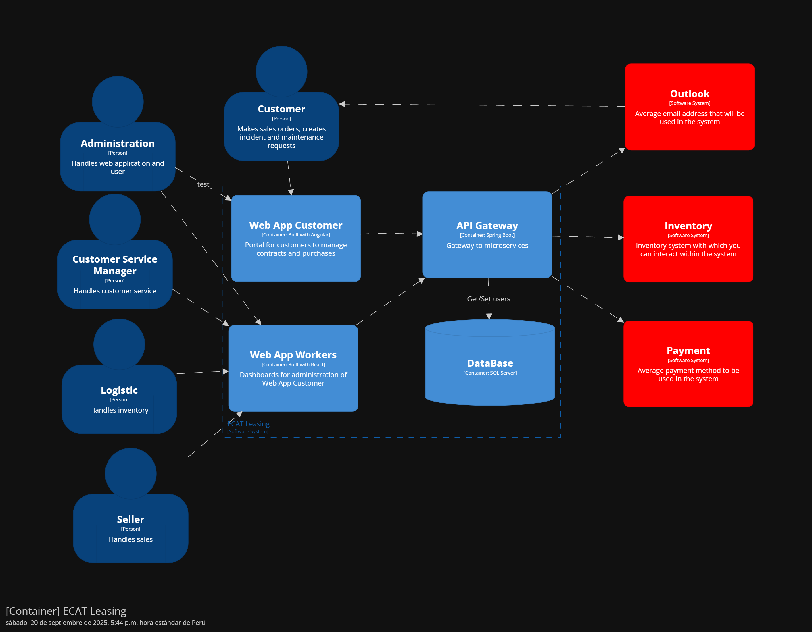

### 4.6.4. Software Architecture Components Diagrams

Finalmente, el diagrama de componentes nos ayuda a describir a los componentes internos, siendo el que decidimos elegir como el más importante el API.

Dentro podemos ver modulos o, interpretandolo con el DDD, bounded context donde se seguiria la misma logica mostrada en el Event Storming.

## 4.7. Software Object-Oriented Design

### 4.7.1. Class Diagrams

Aquí se visualiza el diagrama de clases de ECAT Leasing. Este diagrama es una representación gráfica estática que muestra la estructura de un sistema de software, detallando las clases, sus atributos, operaciones y las relaciones existentes entre ellas.

## 4.8. Database Design

### 4.8.1. Database Diagram

Aquí se visualiza el diagrama de base de datos de ECAT Leasing. Este diagrama es una representación visual que muestra la estructura, las tablas, columnas y las relaciones entre ellos dentro de un sistema de base de datos, también se le conoce como esquema de base de datos.

# Capítulo V: Product Implementation, Validation & Deployment

## 5.1. Software Configuration Management

En esta sección se describen las herramientas y configuraciones utilizadas para gestionar el desarrollo del software, incluyendo el entorno de desarrollo, el control de versiones, las convenciones de estilo de código y la configuración del despliegue.

### 5.1.1. Software Development Environment Configuration

En esta sección, se incluirá los productos de software que se usaron en el proyecto. Los enlaces a cada una de las herramientas se encuentran disponibles en los anexos.

#### Product UX/UI Design:

- Figma: Herramienta de diseño colaborativo para crear prototipos, wireframes y diseños de interfaces de usuario.
- Canva: Plataforma de diseño colaborativo de funcion múltiple.
- Visual Paradigm: Herramienta de modelado UML y diseño de software.
- PlantText: Herramienta de modela UML.

#### Software Development:

- WebStorm: IDE para desarrollo web, soporta HTML, CSS, JavaScript y frameworks modernos.
- GitHub: Plataforma de alojamiento de código fuente y control de versiones utilizando Git.
- Visual Studio Code: Editor utilizado únicamente para la exportación del reporte de formato markdown a PDF.

#### Software Deployment:

- GitHub Pages: Servicio de alojamiento web estático proporcionado por GitHub, ideal para desplegar sitios web y documentación.

### 5.1.2. Source Code Management

Para la gestion del código fuente se utilizó GitHub, una plataforma de alojamiento de código fuente y control de versiones utilizando Git. Se creó un repositorio en la organización de GitHub, donde se almacenó todo el código fuente del proyecto.

El repositorio se estructuró de la siguiente manera:

- Organización en Github: https://github.com/1ASI0729-7401-2520-EcatLeasing-PcPedia
- Repositorio del informe final: https://github.com/1ASI0729-7401-2520-EcatLeasing-PcPedia/Report-PcPedia
- Repositorio de la Landing Page: https://github.com/1ASI0729-7401-2520-EcatLeasing-PcPedia/Landing-Page-PcPedia

#### Conventional Commits

- `feat`: Para nuevas características o funcionalidades.
- `fix`: Para correcciones de errores.
- `docs`: Para cambios en la documentación.
- `refactor`: Para cambios en el código que no agregan ni corrigen funcionalidades.
- `add`: Para la adición de archivos, recursos o contenido nuevo (ej. imágenes, configs, assets).
- `update`: Para modificaciones o mejoras sobre algo ya existente (ej. actualizar imágenes, texto, librerías, dependencias).
- `chore`: Estructuración de contenido

### 5.1.3. Source Code Style Guide & Conventions

Se optó por seguir las siguientes guías y convenciones de estilo de código para asegurar la calidad y consistencia del código fuente, priorizando el uso del **inglés** cómo una buena práctica.

#### HTML:

- Archivos HTML deben tener la extensión `.html`.
- Se incluye `alt` en todas las imágenes.
- Usar comillas dobles para atributos.
- Usar etiquetas semánticas (`<header>`, `<nav>`, `<main>`, `<footer>`, etc.).
- Indentación de 2 espacios.

#### CSS:

- Archivos CSS deben tener la extensión `.css`.
- Usar guiones para nombres de clases y IDs (e.g., `.main-header`).
- Se agrupan estilos relacionados y se separan con comentarios.

#### JavaScript y TypeScript:

- Archivos JS deben tener la extensión `.js` y TS `.ts`.
- Usar camelCase para nombres de variables y funciones.
- Usar `PascalCase` para nombres de clases y componentes: `MyComponent`, `UserProfile`.
- Usar `const` y `let` en lugar de `var`.
- Usar funciones flecha y nombres explícitos.
- Los archivos deben tener una unica responsabilidad (Single Responsibility Principle).

### 5.1.4. Software Deployment Configuration

En esta sección se describen las configuraciones y herramientas utilizadas para el despliegue del software desarrollado. El objetivo es asegurar que el proceso de despliegue sea eficiente, automatizado y confiable.

#### Despliegue de la Landing Page:

La **Landing Page** fue desarrollada utilizando tecnologías web estándar como HTML, CSS y JavaScript. Y fue desplegada utilizando **GitHub Pages**, un servicio de alojamiento web estático proporcionado por GitHub.

**Repositorio de la Landing Page**: https://github.com/1ASI0729-7401-2520-EcatLeasing-PcPedia/Landing-Page-PcPedia

**Landing Page desplegada**: https://1asi0729-7401-2520-ecatleasing-pcpedia.github.io/Landing-Page-PcPedia/

## 5.2. Landing Page, Services & Applications Implementation

### 5.2.1. Sprint 1

#### 5.2.1.1. Sprint Planning 1

<strong>Fecha:</strong> 10 de septiembre de 2025

<strong>Hora:</strong> 3:30 PM

<strong>Ubicación:</strong> Modalidad remota

<strong>Preparado por:</strong> Sebastián Hernández

<strong>Asistentes:</strong> Rubens Bendezu, Alessandro Ramiro, Jorge Retuerto, Matías Armestar, Sebastián Hernández

<strong>Objetivo del Sprint:</strong> 
El objetivo principal de este sprint es desarrollar la Landing Page (versión 1) con HTML y CSS, a partir del diseño preliminar realizado en Figma. Esta página servirá como el punto de entrada principal para la presentación de la startup. Además, se desarrollarán los wireframes de la app web y la landing page.

<strong>Sprint Velocity:</strong> 15

<strong>Sumatoria de Story Points:</strong> 15

#### 5.2.1.2. Aspect Leaders and Collaborators

<table>
  <thead>
    <tr>
      <th>Integrante</th>
      <th>Tareas Principales Realizadas</th>
    </tr>
  </thead>
  <tbody>
    <tr>
      <td><strong>Rubens Bendezu Navarro</strong></td>
      <td>Punto 4.1-4.2 (Style Guidelines & Information Architecture), Análisis de Competidores, Plan de Estrategia</td>
    </tr>
    <tr>
      <td><strong>Alessandro Ramiro</strong></td>
      <td>Mockup de la Landing Page, Desarrollo de la Landing Page Versión 1</td>
    </tr>
    <tr>
      <td><strong>Sebastián Hernández </strong></td>
      <td>Wireframes de la Landing Page y App Web, Mockup de la App Web (Versión 1), Introducción sobre el negocio, Entrevistas</td>
    </tr>
    <tr>
      <td><strong>Jorge Retuerto Rodríguez</strong></td>
      <td>Punto 2.4, 4.6.1 - 4.6.4 (Domain-Driven Design), Punto 4.7 (Software Object-Oriented Design)</td>
    </tr>
    <tr>
      <td><strong>Matías Armestar</strong></td>
      <td>Historias de Usuario (User Stories), User Personas, User Journey, Empathy Mapping</td>
    </tr>
  </tbody>
</table>

<section id="sprint1-aspect-leaders">
  
  
Distribución de responsabilidades durante el Sprint 1, indicando líderes de aspecto y sus colaboradores según las tareas asignadas:

  
  <table>
    <thead>
      <tr>
        <th>Miembro del Equipo</th>
        <th>Rol / Aspecto</th>
        <th>Responsabilidades</th>
      </tr>
    </thead>
    <tbody>
      <tr>
        <td>Rubens Fitzgerald Bendezu Navarro</td>
        <td>Aspect Leader</td>
        <td>Style Guidelines, Information Architecture, Análisis de Competidores y Plan de Estrategia. Definición de estándares visuales, estructuración de información y evaluación de competencia.</td>
      </tr>
      <tr>
        <td>Alessandro Ramiro Condori Lozano</td>
        <td>Aspect Leader</td>
        <td>Mock-up y Landing Page versión 1. Diseño visual de la Landing Page, asegurando coherencia con la identidad del proyecto.</td>
      </tr>
      <tr>
        <td>Sebastián Eduardo Hernández Poma</td>
        <td>Aspect Leader</td>
        <td>Wireframes de Landing y App Web, Mock-up versión 1 de la App Web, Entrevistas y Introducción del Negocio. Documentación y diseño de la interfaz de usuario y estructura inicial del proyecto.</td>
      </tr>
      <tr>
        <td>Jorge Manuel Retuerto Rodríguez</td>
        <td>Aspect Leader</td>
        <td>Design-Level Event Storming, Diagramas de Arquitectura (Context, Container, Component), Software Object-Oriented Design. Modelado del sistema y documentación técnica de arquitectura y diseño orientado a objetos.</td>
      </tr>
      <tr>
        <td>Matías Gabriel Armestar Heredia</td>
        <td>Aspect Leader</td>
        <td>Historias de Usuario y Product Backlog. Definición, documentación y organización de las historias de usuario para planificación y trazabilidad del proyecto.</td>
      </tr>
    </tbody>
  </table>
</section>

<section id="sprint1-aspect-leaders">
  
Distribución de responsabilidades durante el Sprint 1 según las tareas asignadas:

  <table>
    <thead>
      <tr>
        <th>Integrante</th>
        <th>GitHub</th>
        <th>UX/UI</th>
        <th>Landing Page</th>
        <th>Deploy</th>
        <th>Documentación</th>
      </tr>
    </thead>
    <tbody>
      <tr>
        <td>Sebastián Eduardo Hernández Poma</td>
        <td>C</td>
        <td>C</td>
        <td>C</td>
        <td>-</td>
        <td>C</td>
      </tr>
      <tr>
        <td>Rubens Fitzgerald Bendezu Navarro</td>
        <td>C</td>
        <td>-</td>
        <td>-</td>
        <td>-</td>
        <td>C</td>
      </tr>
      <tr>
        <td>Alessandro Ramiro Condori Lozano</td>
        <td>C</td>
        <td>-</td>
        <td>C</td>
        <td>C</td>
        <td>-</td>
      </tr>
      <tr>
        <td>Jorge Manuel Retuerto Rodríguez</td>
        <td>C</td>
        <td>-</td>
        <td>-</td>
        <td>-</td>
        <td>C</td>
      </tr>
      <tr>
        <td>Matías Gabriel Armestar Heredia</td>
        <td>C</td>
        <td>C</td>
        <td>-</td>
        <td>-</td>
        <td>C</td>
      </tr>
    </tbody>
  </table>
</section>

#### 5.2.1.3. Sprint Backlog 1

<table>
  <thead>
    <tr>
      <th>Tarea ID</th>
      <th>Título</th>
      <th>Estimación (Horas)</th>
      <th>Asignado a</th>
      <th>Estado</th>
    </tr>
  </thead>
  <tbody>
    <tr>
      <td>UT01</td>
      <td>Crear wireframes de la Landing Page</td>
      <td>4</td>
      <td>Sebastián Hernández</td>
      <td>Done</td>
    </tr>
    <tr>
      <td>UT02</td>
      <td>Crear wireframes de la App Web</td>
      <td>6</td>
      <td>Sebastián Hernández</td>
      <td>Done</td>
    </tr>
    <tr>
      <td>UT03</td>
      <td>Crear mockup de la App Web (Versión 1)</td>
      <td>5</td>
      <td>Sebastián Hernández</td>
      <td>Done</td>
    </tr>
    <tr>
      <td>UT04</td>
      <td>Crear mockup de la Landing Page (Versión 1)</td>
      <td>4</td>
      <td>Alessandro Ramiro</td>
      <td>Done</td>
    </tr>
    <tr>
      <td>UT05</td>
      <td>Desarrollo de la Landing Page (HTML/CSS)</td>
      <td>8</td>
      <td>Alessandro Ramiro</td>
      <td>Done</td>
    </tr>
    <tr>
      <td>UT06</td>
      <td>Análisis de Competidores y Plan de Estrategia</td>
      <td>6</td>
      <td>Rubens Bendezu</td>
      <td>Done</td>
    </tr>
    <tr>
      <td>UT07</td>
      <td>Redacción de Introducción sobre el negocio</td>
      <td>3</td>
      <td>Sebastián Hernández</td>
      <td>Done</td>
    </tr>
    <tr>
      <td>UT08</td>
      <td>Realizar entrevistas</td>
      <td>7</td>
      <td>Sebastián Hernández</td>
      <td>Done</td>
    </tr>
    <tr>
      <td>UT09</td>
      <td>Desarrollo del punto 4.1 (Style Guidelines)</td>
      <td>5</td>
      <td>Rubens Bendezu</td>
      <td>Done</td>
    </tr>
    <tr>
      <td>UT10</td>
      <td>Desarrollo del punto 4.2 (Information Architecture)</td>
      <td>5</td>
      <td>Rubens Bendezu</td>
      <td>Done</td>
    </tr>
    <tr>
      <td>UT11</td>
      <td>Desarrollo del punto 2.4 (Big Picture Event Storming)</td>
      <td>5</td>
      <td>Jorge Retuerto</td>
      <td>Done</td>
    </tr>
  </tbody>
</table>

#### 5.2.1.4. Development Evidence for Sprint Review

<strong>Repositorio:</strong> GitHub - EcatLeasing/PcPedia

<strong>Rama:</strong> develop

<section>
  <h2>Elaboración de Landing Page</h2>
  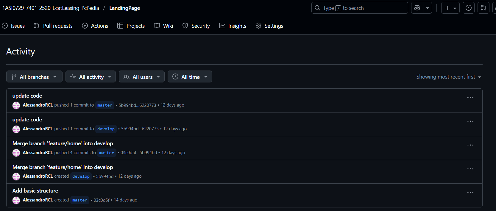
</section>

<section>
  <h2>Reportes</h2>
  

    
    
    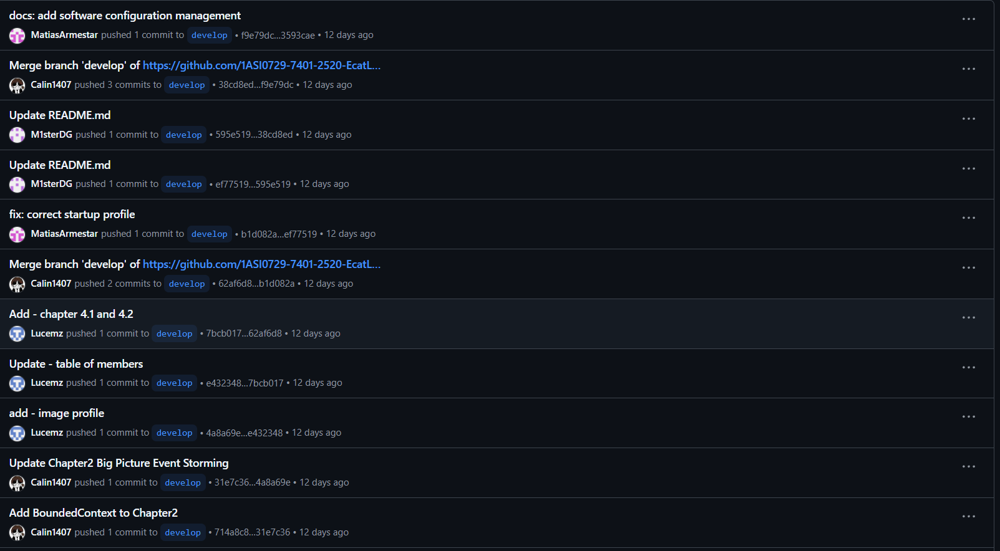
    
    
    
    
  

</section>

#### 5.2.1.5. Execution Evidence for Sprint Review

El avance del sprint se evidencia en el repositorio de GitHub donde se subieron los siguientes archivos:

<ul>
  <li><strong>Landing Page (Versión 1)</strong>: HTML y CSS desplegados en <a href="https://1asi0729-7401-2520-ecatleasing-pcpedia.github.io/Landing-Page-PcPedia/">GitHub Pages</a>.</li>
  <li><strong>Wireframes y Mockups</strong>: Los wireframes de la Landing Page y la app web, junto con los mockups, están documentados en el repositorio.</li>
</ul>

<section>
  <h2>Demostración de ejecución de la Landing Page</h2>
  

    
    
    
    
  

</section>

#### 5.2.1.6. Services Documentation Evidence for Sprint Review

No se implementaron servicios backend en este sprint, ya que el enfoque estuvo en el desarrollo de la interfaz visual.

#### 5.2.1.7. Software Deployment Evidence for Sprint Review

La Landing Page fue desplegada en GitHub Pages, y está accesible a través del siguiente enlace: <a href="https://1asi0729-7401-2520-ecatleasing-pcpedia.github.io/Landing-Page-PcPedia/">Enlace a la Landing Page</a>

#### 5.2.1.8. Team Collaboration Insights during Sprint

Durante este sprint, se mantuvo una comunicación constante entre los miembros del equipo mediante reuniones semanales. Se utilizó <strong>GitHub</strong> para la gestión del código fuente y el seguimiento de tareas, y <strong>Trello</strong> para organizar el avance del sprint. Las tareas fueron gestionadas y completadas según las estimaciones, y la colaboración entre los miembros del equipo fue eficiente.

### 5.2.2. Sprint 2

#### 5.2.2.1. Sprint Planning 2

<table align="center"  border="1" width="90%" style="text-align:center;">
    <tr align="left">
        <td>
            <b>Sprint #</b>
        </td>
        <td>
            <b>Sprint 2</b>           
        </td>
    </tr>
    <tr align="left">
        <td colspan="2">
            <b>Sprint Planning Background</b>
        </td>
    </tr>
    <tr align="left">
        <td>
            <b>Date</b>
        </td>
        <td>
            9/10/2025
        </td>
    </tr>
       <tr align="left">
        <td>
            <b>Time</b>
        </td>
        <td>
            10:00 PM
        </td>
    </tr>
       <tr align="left">
        <td>
            <b>Location</b>
        </td>
        <td>
            Modalidad virtual por Discord
        </td>
    </tr>
     </tr>
       <tr align="left">
        <td>
            <b>Prepared By</b>
        </td>
        <td>
            Integrantes de EcatLeasing
        </td>
    </tr>
    </tr>
       <tr align="left">
        <td>
            <b>Attendees (to planning meeting)</b>
        </td>
        <td>
            - Retuerto Rodríguez, Jorge Manuel  
            - Hernández Poma, Sebastián Eduardo  
            - Condori Lozano, Alessandro Ramiro  
            - Armestar Heredia, Matias Gabriel      
            - Bendezu Navarro, Rubens Fitzgerald  
        </td>
    </tr>
      </tr>
       <tr align="left">
        <td>
            <b>Sprint n - 2</b>
            <b>Review Summary</b>
        </td>
        <td>
            Se implementó la primera parte del frontend, la visualización de las ventanas en la aplicación.
        </td>
    </tr>
    <tr align="left">
        <td>
            <b>Sprint n - 2</b>
            <b>Retrospective Summary</b>
        </td>
        <td>
Se aseguró de que los estudiantes sepan sus partes a resolver.
        </td>
    </tr>
     <tr align="left">
        <td colspan="2">
            <b>Sprint Goal & User Stories</b>
        </td>
    </tr>
      <tr align="left">
        <td>
            <b>Sprint 3 Goal</b>
        </td>
        <td>
En este sprint se tiene como objetivo desarrollar el frontend de PcPedia porque creemos que permitirá al usuario sentirse confiado al momento de usarla debido a la facilidad de uso, se estructuró de una forma en que la navegación dentro sea entendible. Esto será confirmado cuando los usuarios ingresen a la aplicación web y puedan visualizar sus dispositivos disponibles.
        </td>
      <tr align="left">
        <td>
            <b>Sprint 2 Velocity</b>
        </td>
        <td>
            5
        </td>
    </tr>
       <tr align="left">
        <td>
            <b>Sum of Story Points</b>
        </td>
        <td>
            5
        </td>
    </tr>
</table>

#### 5.2.2.2. Aspect Leaders and Collaborators

<table>
  <thead>
    <tr>
      <th>Integrante</th>
      <th>Tareas Principales Realizadas</th>
    </tr>
  </thead>
  <tbody>
    <tr>
      <td><strong>Rúbens Bendezu Navarro</strong></td>
      <td>Desarrollo del apartado de Contratos</td>
    </tr>
    <tr>
      <td><strong>Alessandro Condori</strong></td>
      <td>Mockup de la Landing Page, Desarrollo de la Landing Page Versión 1</td>
    </tr>
    <tr>
      <td><strong>Sebastián Hernández </strong></td>
      <td>Desarrollo del apartado de Login e Inicio (vista principal)</td>
    </tr>
    <tr>
      <td><strong>Jorge Retuerto Rodríguez</strong></td>
      <td>Desarrollo del apartado de Informes</td>
    </tr>
    <tr>
      <td><strong>Matias Armestar</strong></td>
      <td>Desarrollo del apartado de Perfil e implementación de Language Switcher</td>
    </tr>
  </tbody>
</table>

<section id="sprint2-aspect-leaders">
  
Distribución de responsabilidades durante el Sprint 1 según las tareas asignadas:

  <table>
    <thead>
      <tr>
        <th>Integrante</th>
        <th>GitHub</th>
        <th>UI Design</th>
        <th>Front-end</th>
        <th>Deployment</th>
        <th>Documentación</th>
      </tr>
    </thead>
    <tbody>
      <tr>
        <td>Sebastián Eduardo Hernández Poma</td>
        <td>C</td>
        <td>L</td>
        <td>C</td>
        <td>-</td>
        <td>C</td>
      </tr>
      <tr>
        <td>Rubens Fitzgerald Bendezu Navarro</td>
        <td>C</td>
        <td>-</td>
        <td>C</td>
        <td>-</td>
        <td>C</td>
      </tr>
      <tr>
        <td>Alessandro Ramiro Condori Lozano</td>
        <td>C</td>
        <td>-</td>
        <td>C</td>
        <td>-</td>
        <td>C</td>
      </tr>
      <tr>
        <td>Jorge Manuel Retuerto Rodríguez</td>
        <td>C</td>
        <td>L</td>
        <td>C</td>
        <td>L</td>
        <td>C</td>
      </tr>
      <tr>
        <td>Matías Gabriel Armestar Heredia</td>
        <td>C</td>
        <td>-</td>
        <td>C</td>
        <td>-</td>
        <td>C</td>
      </tr>
    </tbody>
  </table>
</section>

#### 5.2.2.3. Sprint Backlog 2

<table border="1" cellspacing="0" cellpadding="6">
  <tr>
    <th><strong>User Story</strong></th>
    <th><strong>Work-item/Task</strong></th>
    <th><strong>Description</strong></th>
    <th><strong>Estimation (Hours)</strong></th>
    <th><strong>Assigned To</strong></th>
    <th><strong>Status</strong></th>
  </tr>
  <tr>
    <td><strong>HU01 - Autenticación de Usuario</strong></td>
    <td>W01 - Login functionality and validation</td>
    <td>Implementar el formulario de inicio de sesión con validación de credenciales generadas por la empresa.</td>
    <td align="center">3</td>
    <td>Sebastian</td>
    <td>Done</td>
  </tr>
  <tr>
    <td><strong>HU02 - Pantalla de Inicio Informativa</strong></td>
    <td>W02 - Home view and service overview</td>
    <td>Desarrollar la vista de inicio que muestre información sobre el servicio “Conoce Smart Leasing” y los beneficios del arrendamiento.</td>
    <td align="center">4</td>
    <td>Rubens</td>
    <td>Done</td>
  </tr>
  <tr>
    <td><strong>HU03 - Visualización de Activos del Cliente</strong></td>
    <td>W03 - Active assets dashboard</td>
    <td>Crear la sección “Mis Activos” donde se listan los equipos por modelo y marca, junto con su estado actual.</td>
    <td align="center">4</td>
    <td>Jorge</td>
    <td>Done</td>
  </tr>
  <tr>
    <td><strong>HU04 - Gestión de Incidencias</strong></td>
    <td>W04 - Incidents management module</td>
    <td>Permitir visualizar y registrar incidencias asociadas a los equipos arrendados, mostrando su estado de atención.</td>
    <td align="center">3</td>
    <td>Matias</td>
    <td>Done</td>
  </tr>
  <tr>
    <td><strong>HU05 - Consulta de Contratos Activos</strong></td>
    <td>W05 - Contracts listing and detail view</td>
    <td>Implementar la vista “Contratos” donde se muestren los contratos activos de cada cliente, con su respectiva información.</td>
    <td align="center">3</td>
    <td>Alessandro</td>
    <td>Done</td>
  </tr>
  <tr>
    <td><strong>HU06 - Detalle de Contrato Seleccionado</strong></td>
    <td>W06 - Contract detail modal</td>
    <td>Mostrar información detallada del contrato seleccionado, incluyendo fecha, duración y tipo de equipo arrendado.</td>
    <td align="center">2.5</td>
    <td>Sebastian</td>
    <td>Done</td>
  </tr>
  <tr>
    <td><strong>HU07 - Edición de Información Personal</strong></td>
    <td>W07 - User profile management</td>
    <td>Crear la sección “Mi Perfil” para que el usuario pueda visualizar y actualizar su información personal básica.</td>
    <td align="center">3</td>
    <td>jorge</td>
    <td>Done</td>
  </tr>
  <tr>
    <td><strong>HU08 - Gestión de Sesión</strong></td>
    <td>W08 - Logout and session persistence</td>
    <td>Implementar la funcionalidad para cerrar sesión y mantener persistencia de usuario autenticado.</td>
    <td align="center">2</td>
    <td>Alessandro</td>
    <td>Done</td>
  </tr>
  <tr>
    <td><strong>HU09 - Notificaciones de Incidencias y Contratos</strong></td>
    <td>W09 - Notification center</td>
    <td>Incorporar un módulo de notificaciones que informe sobre incidencias actualizadas o contratos próximos a vencer.</td>
    <td align="center">2</td>
    <td>Matias</td>
    <td>Done</td>
  </tr>
  <tr>
    <td><strong>HU10 - Panel Administrativo (Interno)</strong></td>
    <td>W10 - Admin credentials and asset setup</td>
    <td>Permitir al personal de ECAT gestionar credenciales de clientes y registrar nuevos equipos dentro del sistema.</td>
    <td align="center">4</td>
    <td>Sebastian</td>
    <td>Done</td>
  </tr>
</table>

#### 5.2.2.4. Development Evidence for Sprint Review

Enlace al repositorio de el Frontend: https://github.com/1ASI0729-7401-2520-EcatLeasing-PcPedia/Front-end-PcPedia

| Repository           | Branch | Commit Id | Commit Message                      | Commit Message Body | Commited on (Date) |
|----------------------|--------|-----------|-------------------------------------|---------------------|--------------------|
| 1ASI0729-7401-2520-EcatLeasing-PcPedia/Front-end-PcPedia | feature/sprint2-alessandro | dd436b1 | update: add complete app | | 9/10/2025 |
| 1ASI0729-7401-2520-EcatLeasing-PcPedia/Front-end-PcPedia | feature/sprint2-jorge | f4abc07 | feature(assets) | | 9/10/2025 |
| 1ASI0729-7401-2520-EcatLeasing-PcPedia/Front-end-PcPedia | feature/sprint2-matias | b0d3ab2 | feat: add profile component | | 8/10/2025 |
| 1ASI0729-7401-2520-EcatLeasing-PcPedia/Front-end-PcPedia | feature/sprint2-rubens | a16af88 | Feat - reports |  | 8/10/2025 |
| 1ASI0729-7401-2520-EcatLeasing-PcPedia/Front-end-PcPedia | feature/sprint2-sebastian | 52d97f6 | feat: agrega login, home dinámico y estructura de vistas principales | | 9/10/2025 |

#### 5.2.2.5. Execution Evidence for Sprint Review

En este sprint, correspondiente a la segunda fase de nuestro producto final, se logró desarrollar la aplicación web utilizando Angular y Angular Material, lo que permitió implementar una interfaz moderna y funcional. Además, se empleó JSON Server para simular una API que facilitó la gestión y visualización de datos durante el desarrollo del frontend.

 

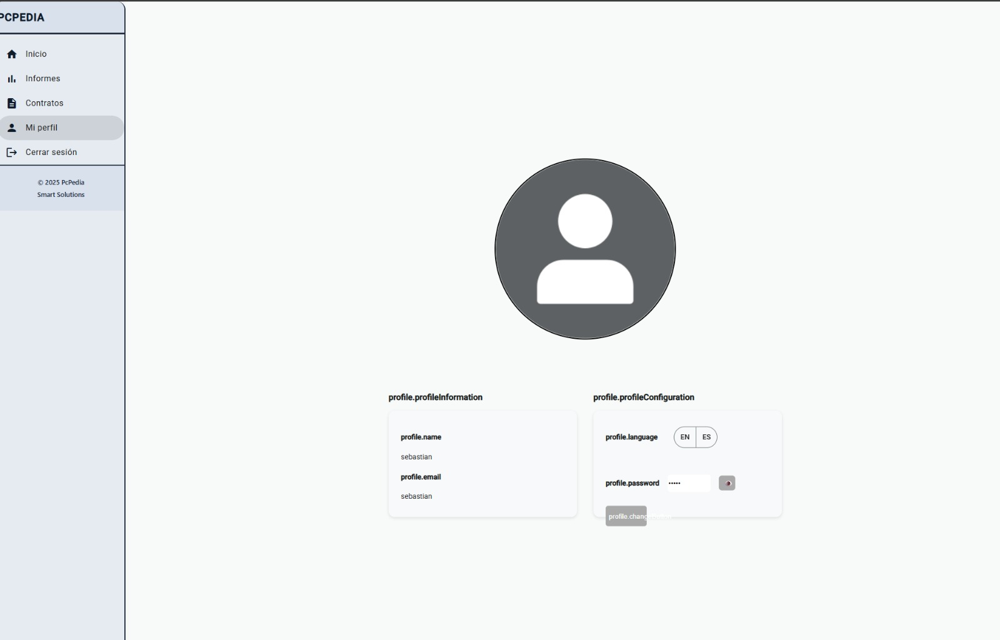 

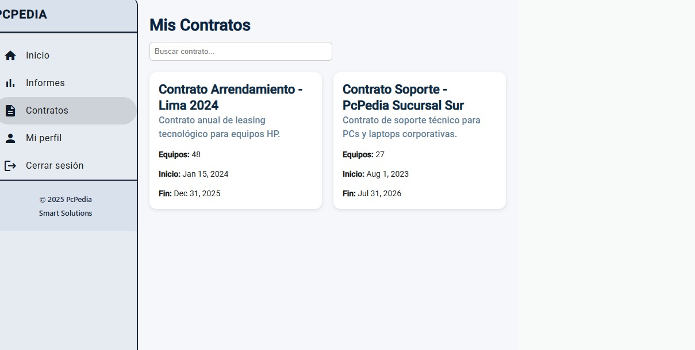 

 

 

#### 5.2.2.6. Services Documentation Evidence for Sprint Review

Para el desarrollo del Frontend en nuestra plataforma, utilizamos lo siguiente:

- Angular: Este framework fue empleado para implementar el desarrollo del frontend de la aplicación web, permitiendo una estructura organizada y modular.

- GitHub: Se utilizó como plataforma para almacenar y gestionar los avances del proyecto en un repositorio dedicado exclusivamente al frontend, lo que facilitó el seguimiento de los progresos y la identificación de los aportes de cada integrante del equipo.

- WebStorm: Este IDE fue la herramienta principal utilizada para la creación y desarrollo del proyecto, ofreciendo un entorno eficiente y adaptado al trabajo con tecnologías web modernas.

- Git: Se empleó como sistema de control de versiones, garantizando un registro ordenado de cada avance y permitiendo rastrear los cambios realizados a lo largo del desarrollo.

#### 5.2.2.7. Software Deployment Evidence for Sprint Review

El frontend de PcPedia fue desplegado utilizando Netlify, una plataforma de despliegue optimizada para aplicaciones frontend.

**URL desplegada:** [PcPedia Front-end](https://dreamy-sunshine-e3be2b.netlify.app/)

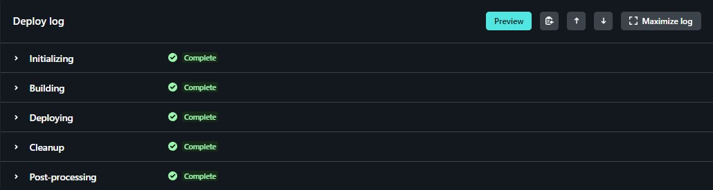
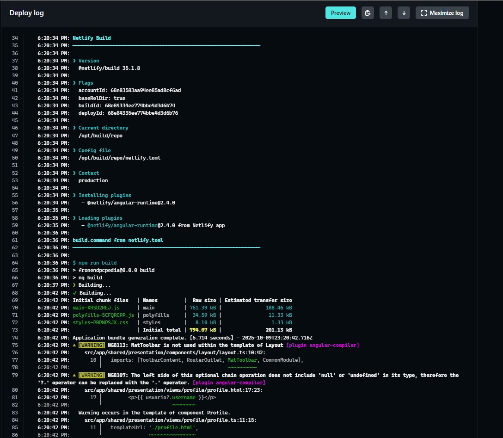
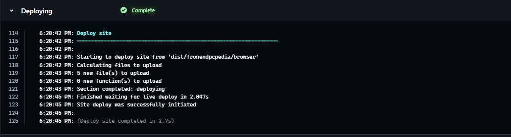
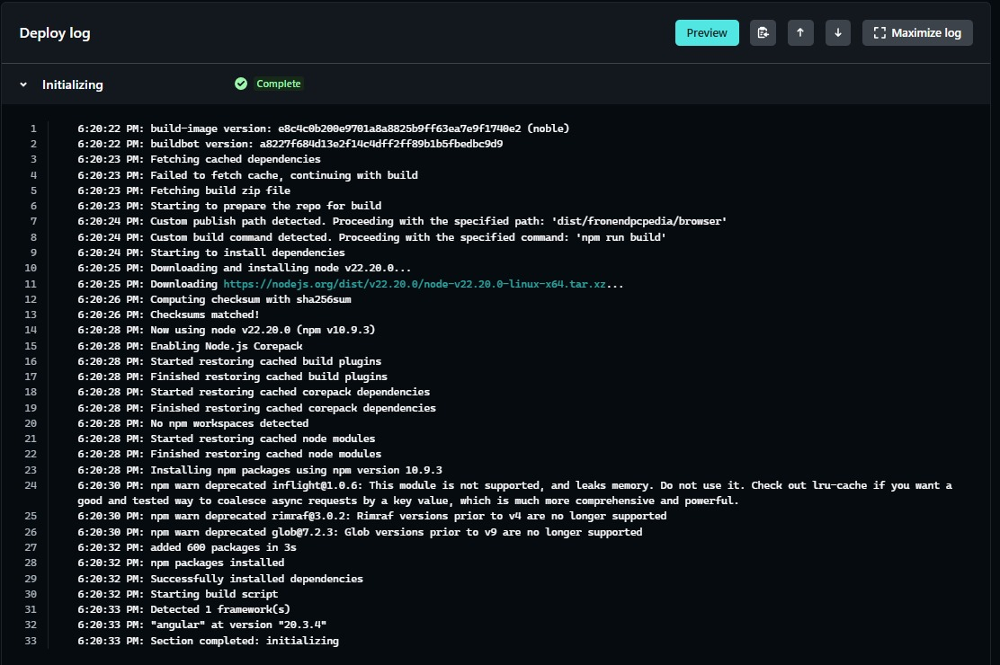

#### 5.2.2.8. Team Collaboration Insights during Sprint

A continuación, se presenta una descripción detallada del trabajo colaborativo realizado por el equipo durante este sprint. En esta etapa, se priorizó la comunicación constante, la organización de tareas y la cooperación en un entorno remoto. Se utilizaron diversas herramientas que facilitaron la coordinación, el seguimiento del progreso y la resolución oportuna de problemas, garantizando que todos los integrantes se mantuvieran alineados con los objetivos establecidos y comprometidos con la calidad del resultado final.

Distribución de aportes en el informe:
En esta sección se especifican las contribuciones individuales de cada miembro del equipo, destacando las responsabilidades asumidas y las tareas desarrolladas por cada uno durante el sprint.

URL del repositorio para el Project Report:
[1ASI0729-7401-2520-EcatLeasing-PcPedia/Report-PcPedia/tree/master](https://github.com/1ASI0729-7401-2520-EcatLeasing-PcPedia/Report-PcPedia/tree/master)

¿Cómo se han desarrollado las actividades de elaboración del informe?

Para el desarrollo del sprint, se tuvo una reunion el cual el equipo decidio avanzar distintos puntos a la vez logrando maximixar el tiempo, posterior a eso se tuvo una reunion para poder observar los cambios y asi estar todos de acuerdo en la entrega del trabajo parcial.

<table border="1" cellspacing="0" cellpadding="0">
  <tr>
    <th><strong>Integrante</strong></th>
    <th><strong>Aporte en el informe</strong></th>
  </tr>
  <tr>
    <td><strong>Jorge</strong></td>
    <td>Revision y correccion del Capitulo IV y demas capitulos</td>
  </tr>
  <tr>
    <td><strong>Sebastian</strong></td>
    <td>Revision y correccion del Capitulo V y demas capitulos</td>
  </tr>
  <tr>
    <td><strong>Alessandro</strong></td>
    <td>Revision y correccion del Capitulo III y demas capitulos</td>
  </tr>
  <tr>
    <td><strong>Matias</strong></td>
    <td>Revision y correccion del Capitulo I y demas capitulos</td>
  </tr>
  <tr>
    <td><strong>Rubens</strong></td>
    <td>Revision y correccion del Capitulo II y demas capitulos</td>
  </tr>
</table>

### 5.2.3. Sprint 3

#### 5.2.3.1. Sprint Planning 3.

<table align="center"  border="1" width="90%" style="text-align:center;">
    <tr align="left">
        <td>
            <b>Sprint #</b>
        </td>
        <td>
            <b>Sprint 3</b>           
        </td>
    </tr>
    <tr align="left">
        <td colspan="2">
            <b>Sprint Planning Background</b>
        </td>
    </tr>
    <tr align="left">
        <td>
            <b>Date</b>
        </td>
        <td>
            5/11/2025
        </td>
    </tr>
       <tr align="left">
        <td>
            <b>Time</b>
        </td>
        <td>
            10:00 PM
        </td>
    </tr>
       <tr align="left">
        <td>
            <b>Location</b>
        </td>
        <td>
            Modalidad virtual por Discord
        </td>
    </tr>
     </tr>
       <tr align="left">
        <td>
            <b>Prepared By</b>
        </td>
        <td>
            Integrantes de EcatLeasing
        </td>
    </tr>
    </tr>
       <tr align="left">
        <td>
            <b>Attendees (to planning meeting)</b>
        </td>
        <td>
            - Retuerto Rodríguez, Jorge Manuel  
            - Hernández Poma, Sebastián Eduardo  
            - Condori Lozano, Alessandro Ramiro  
            - Armestar Heredia, Matias Gabriel      
            - Bendezu Navarro, Rubens Fitzgerald  
        </td>
    </tr>
      </tr>
       <tr align="left">
        <td>
            <b>Sprint n - 3</b>
            <b>Review Summary</b>
        </td>
        <td>
            Se complementó el desarrollo el frontend, así también se desarrolló el backend.
        </td>
    </tr>
    <tr align="left">
        <td>
            <b>Sprint n - 3</b>
            <b>Retrospective Summary</b>
        </td>
        <td>
            Se aseguró de que los estudiantes conozcan sus respectivas tareas a desarrollar.
        </td>
    </tr>
     <tr align="left">
        <td colspan="2">
            <b>Sprint Goal & User Stories</b>
        </td>
    </tr>
      <tr align="left">
        <td>
            <b>Sprint 3 Goal</b>
        </td>
        <td>
            Nuestro objetivo en esta tercera entrega es la optimización del frontend anteriormente desarrollado y la creación del apartado backend. Durante este sprint, desplegaremos este último apartado aspirando a integrarlo con el frontend para así finalmente lograr una solución consistente. 
        </td>
      <tr align="left">
        <td>
            <b>Sprint 3 Velocity</b>
        </td>
        <td>
            5
        </td>
    </tr>
       <tr align="left">
        <td>
            <b>Sum of Story Points</b>
        </td>
        <td>
            5
        </td>
    </tr>
</table>

#### 5.2.3.2. Aspect Leaders and Collaborators.

<section id="sprint2-aspect-leaders">
  
Distribución de responsabilidades durante el Sprint 1 según las tareas asignadas:

  <table>
    <thead>
      <tr>
        <th>Integrante</th>
        <th>Frontend</th>
        <th>Backend</th>
        <th>Deployment</th>
        <th>Documentación</th>
      </tr>
    </thead>
    <tbody>
      <tr>
        <td>Sebastián Eduardo Hernández Poma</td>
        <td>L</td>
        <td>-</td>
        <td>C</td>
        <td>C</td>
      </tr>
      <tr>
        <td>Rubens Fitzgerald Bendezu Navarro</td>
        <td>C</td>
        <td>C</td>
        <td>-</td>
        <td>L</td>
      </tr>
      <tr>
        <td>Alessandro Ramiro Condori Lozano</td>
        <td>C</td>
        <td>C</td>
        <td>-</td>
        <td>L</td>
      </tr>
      <tr>
        <td>Jorge Manuel Retuerto Rodríguez</td>
        <td>-</td>
        <td>L</td>
        <td>L</td>
        <td>C</td>
      </tr>
      <tr>
        <td>Matías Gabriel Armestar Heredia</td>
        <td>L</td>
        <td>C</td>
        <td>-</td>
        <td>C</td>
      </tr>
    </tbody>
  </table>
</section>

<h2>5.2.3.3. Sprint Backlog 3</h2>

Durante el Sprint Backlog 3 el objetivo principal fue diseñar e implementar el backend del
sistema <strong>ECAT Leasing / PcPedia</strong> siguiendo una arquitectura basada en 
<strong>Domain-Driven Design (DDD)</strong> sobre <strong>Spring Boot + JPA</strong>.

<ul>
  <li>Definir el modelo de dominio para los agregados: <em>Users, Articles, Orders, Leases, Complaints, Payments</em>.</li>
  <li>Implementación de capas DDD:
    <ul>
      <li>domain.model: aggregates, entities, valueobject, commands, queries, services</li>
      <li>application.dto para Requests/Responses</li>
      <li>interfaces.rest como capa REST</li>
      <li>infrastructure.persistence.jpa para repositorios</li>
    </ul>
  </li>
  <li>Implementación de casos de uso principales para registro, actualización, pagos y consultas.</li>
  <li>Configuración de persistencia en MySQL con nombres <em>snake_case</em>.</li>
  <li>Exposición de API documentada con OpenAPI/Swagger.</li>
  <li>Creación de Dockerfile y despliegue en Render:
     URL: <strong>https://backendpcpedia.onrender.com/swagger-ui/index.html</strong>
  </li>
</ul>

<h2>5.2.3.4. Development Evidence for Sprint Review</h2>

Evidencias de desarrollo durante el sprint:

<ul>
  <li><strong>Modelo de dominio DDD implementado:</strong>
    <ul>
      <li>Agregados en <code>domain.model.aggregates</code> y <code>entities</code>.</li>
      <li>Comandos como: <code>RegisterUserCommand</code>, <code>RegisterArticleCommand</code>,
      <code>RegisteredOrderCommand</code>, <code>RegisteredLeaseCommand</code>,
      <code>UpdateComplaintStatusCommand</code>, <code>UpdateOrdersStatusCommand</code>, etc.</li>
      <li>Consultas como: <code>GetUserByIdQuery</code>, <code>GetListUsersQuery</code>,
      <code>GetOrderByIdQuery</code>, <code>GetListOrdersQuery</code>, etc.</li>
    </ul>
  </li>

  <li><strong>Servicios de dominio (handlers):</strong>
    <ul>
      <li>Handlers de registro: <code>RegisterUserHandler</code>, <code>RegisterArticleHandler</code>,
      <code>RegisteredLeaseHandler</code>, <code>RegisteredComplaintHandler</code>, etc.</li>
      <li>Handlers de actualización: <code>UpdateLeaseStatusHandler</code>,
      <code>UpdateOrdersStatusHandler</code>, <code>UpdateUserPasswordHandler</code>.</li>
      <li>Handlers de lectura: <code>GetUserByIdHandler</code>, <code>GetListOrderHandler</code>,
      <code>GetComplaintByIdHandler</code>, etc.</li>
    </ul>
  </li>

  <li><strong>DTOs implementados:</strong> 
    <em>UsersRequest/Response, ArticlesRequest/Response, OrdersRequest/Response,
    LeasesRequest/Response, ComplaintsRequest/Response, LeasePaymentRequest, ErrorResponse</em>.</li>

  <li><strong>Controladores REST:</strong>
    <code>UsersController</code>, <code>ArticlesController</code>, 
    <code>OrdersController</code>, <code>LeasesController</code>, <code>ComplaintsController</code>.
  </li>
</ul>

<h2>5.2.3.5. Execution Evidence for Sprint Review</h2>

Evidencia de ejecución durante el Sprint:

<ul>
  <li>API ejecutada localmente y luego desplegada en Render.</li>
  <li>Pruebas reales usando Postman y navegador:
    <ul>
      <li><code>POST /api/users</code>, <code>GET /api/users</code></li>
      <li><code>POST /api/articles</code>, <code>PUT /api/articles/{id}</code>, <code>GET /api/articles</code></li>
      <li><code>POST /api/orders</code>, <code>GET /api/orders</code></li>
      <li><code>POST /api/leases</code>, <code>GET /api/leases</code></li>
      <li><code>POST /api/payments</code> para pagos de arrendamiento</li>
      <li><code>POST /api/complaints</code>, <code>GET /api/complaints</code></li>
    </ul>
  </li>
  <li>Validación con respuestas HTTP 200/201 y errores gestionados por <code>ErrorResponse</code>.</li>
</ul>

<h2>5.2.3.6. Services Documentation Evidence for Sprint Review</h2>

<ul>
  <li>Swagger/OpenAPI habilitado mediante <code>ApiConfiguration</code>.</li>
  <li>Documentación disponible en:
    <ul>
      <li><code>/v3/api-docs</code></li>
      <li><code>/swagger-ui.html</code> o <code>/swagger-ui/index.html</code></li>
    </ul>
  </li>
  <li>Propiedades configuradas en <code>application.properties</code> para versión, descripción y licencia.</li>
  <li><code>SecurityConfig</code> permite acceso público a la documentación.</li>
</ul>

<h2>5.2.3.7. Software Deployment Evidence for Sprint Review</h2>

Evidencias del despliegue:

<ul>
  <li><strong>Dockerfile implementado (multi-stage):</strong>
    <ul>
      <li>Stage builder basado en <code>eclipse-temurin:21-jdk</code></li>
      <li>Compilación con <code>./mvnw -q -B package -DskipTests</code></li>
      <li>Stage runtime con <code>eclipse-temurin:21-jre</code></li>
    </ul>
  </li>
  <li><strong>Despliegue en Render.com:</strong></li>
  <ul>
    <li>Aplicación corriendo en contenedor Docker.</li>
    <li>URL pública: <strong>https://backendpcpedia.onrender.com</strong></li>
    <li>Acceso validado a rutas REST y Swagger durante el Sprint Review.</li>
  </ul>
</ul>

<h2>5.2.3.8. Team Collaboration Insights during Sprint</h2>

<ul>
  <li><strong>Alineamiento del modelo de dominio:</strong> 
  Se definieron agregados clave para soportar flujos de leasing.</li>

  <li><strong>División del trabajo por capas:</strong> 
    <ul>
      <li>Un grupo desarrolló comandos/queries/handlers.</li>
      <li>Otro grupo trabajó controladores y DTOs.</li>
      <li>Otro grupo configuró JPA, repositorios y Docker.</li>
    </ul>
  </li>

  <li><strong>Integración continua con Git:</strong> uso de ramas de feature y merges controlados.</li>

  <li><strong>Coordinación con frontend:</strong> 
  definición de rutas, DTOs y validación conjunta del flujo <em>Catálogo → Pedido → Contrato → Pago</em>.</li>

  <li><strong>Revisión colaborativa:</strong> pruebas, validaciones y ajustes según retroalimentación del equipo.</li>
</ul>

## 5.3. Validation Interviews

---

### 5.3.1. Diseño de Entrevistas

**Objetivo:** Validar la usabilidad, percepción y aceptación del aplicativo por parte del segmento objetivo.

**Guion de Entrevista**

1. **Datos generales**
   - ¿Cuál es tu nombre?
   - ¿Qué edad tienes?
   - ¿Dónde vives actualmente?
   - ¿A qué te dedicas?

2. **Percepción del aplicativo**
   - ¿Qué característica te llama más la atención del aplicativo? ¿Por qué?
   - ¿Qué opinas sobre el diseño de nuestro panel de control y las múltiples herramientas que ofrece?
   - ¿Qué funcionalidades le agregarías a la aplicación?
   - ¿Hay alguna cosa que le quitarías a la aplicación?
   - Como (segmento objetivo), ¿tienes alguna recomendación que ayude a mejorar la experiencia de uso?

---

### 5.3.2. Registro de Entrevistas

**Entrevista 1 – Juan Diego Carranza (26 años)**  
📍Edad: 26 años  
💼 Ocupación: Dueño de una empresa de tecnologia
 Comentarios principales:  
- Le agrada la interfaz visual y considera que la plataforma tiene buena estructura.  
- Considera positivo que las herramientas estén agrupadas en un panel de control.  
- Sugiere añadir más opciones de personalización del usuario.  
- No quitaría nada por ahora, pero recomienda simplificar algunos botones para hacerlo más intuitivo.  
🎥 Video: https://youtu.be/bIFjkc5LXRU

---

**Entrevista 2 – Ingrid Ysa (21 años)**  
📍Edad: 21 años  
💼 Ocupación: Project manager de una startup
 Comentarios principales:  
- Encuentra la plataforma moderna y amigable.  
- Le gusta que se pueda navegar fácilmente entre opciones.  
- Agregaría tutoriales o mensajes explicativos para nuevos usuarios.  
- Recomienda incluir un modo oscuro.  
🎥 Video: https://youtu.be/yxxVXOc1Xos

---

**Entrevista 3 – Jimmy Sandoval (28 años)**  
📍Edad: 28 años  
💼 Ocupación: Dueño de una agencia de diseño web
 Comentarios principales:  
- Considera que la plataforma es funcional y cumple con lo prometido.  
- Destaca la variedad de herramientas en un solo lugar.  
- Sugiere mejorar la velocidad de carga de algunas secciones.  
- Recomienda integrar funciones de automatización.  
🎥 Video: https://youtu.be/smTyQuUE534

---

### 5.3.3. Evaluaciones Según Heurísticas

> **¿Qué son las heurísticas?**  
> Son un conjunto de principios utilizados para evaluar la usabilidad de una interfaz. Las más conocidas son las **10 heurísticas de Jakob Nielsen**, aplicadas en diseño UX.

**Resumen aplicado a nuestro proyecto**

| Heurística | Evaluación |
|------------|------------|
| **Visibilidad del estado del sistema** | La plataforma muestra estados claros durante navegación. Se recomienda añadir indicadores de carga. |
| **Correspondencia entre el sistema y el mundo real** | El lenguaje es comprensible y cercano. Puede mejorar mediante íconos más representativos. |
| **Control y libertad del usuario** | El usuario puede retroceder fácilmente. Sugerencia: añadir botón de “deshacer”. |
| **Consistencia y estándares** | Los estilos son coherentes. Debe unificarse el tamaño de botones. |
| **Prevención de errores** | Aún no existen alertas preventivas. Sugerencia: mensajes de confirmación antes de eliminar datos. |
| **Reconocimiento antes que recuerdo** | La navegación es intuitiva. Se podrían incorporar etiquetas explicativas. |
| **Flexibilidad y eficiencia de uso** | Usuarios avanzados podrían aprovechar atajos, pero aún no existen. |
| **Diseño estético y minimalista** | La interfaz es limpia. Se sugiere minimizar texto en algunas pantallas. |
| **Ayuda a los usuarios a reconocer errores** | No hay mensajes claros de error. Recomendación: incluir alertas descriptivas. |
| **Ayuda y documentación** | No cuenta con tutoriales. Se sugiere un onboarding inicial.|

---

## 5.4. Video About-the-Product

# Bibliografia

<ul>
  <li>Driessen, V. (2010). <em>A successful Git branching model</em>. Disponible en: <a href="https://nvie.com/posts/a-successful-git-branching-model/" target="_blank">https://nvie.com/posts/a-successful-git-branching-model/</a></li>
  <li>Cucumber. (s.f.). <em>Gherkin Reference</em>. Recuperado de: <a href="https://cucumber.io/docs/gherkin/" target="_blank">https://cucumber.io/docs/gherkin/</a></li>
  <li>Figma. (s.f.). <em>Figma: Collaborative Interface Design Tool</em>. Recuperado de: <a href="https://www.figma.com/" target="_blank">https://www.figma.com/</a></li>
  <li>Lucidchart. (s.f.). <em>Lucidchart: Diagramming & Visualization Software</em>. Recuperado de: <a href="https://www.lucidchart.com/" target="_blank">https://www.lucidchart.com/</a></li>
  <li>Mozilla Developer Network. (s.f.). <em>HTML, CSS y JavaScript</em>. Recuperado de: <a href="https://developer.mozilla.org/es/docs/Web" target="_blank">https://developer.mozilla.org/es/docs/Web</a></li>
  <li>GitHub. (s.f.). <em>GitHub: Where the world builds software</em>. Recuperado de: <a href="https://github.com/" target="_blank">https://github.com/</a></li>
  <li>Microsoft. (s.f.). <em>Visual Studio Code</em>. Recuperado de: <a href="https://code.visualstudio.com/" target="_blank">https://code.visualstudio.com/</a></li>
  <li>W3Schools. (s.f.). <em>HTML5 Syntax</em>. Recuperado de: <a href="https://www.w3schools.com/html/html5_syntax.asp" target="_blank">https://www.w3schools.com/html/html5_syntax.asp</a></li>
</ul>

# Anexos

<section id="anexos">
  <h3>1. Organización y Repositorios en GitHub</h3>
  
El proyecto PcPedia se encuentra alojado bajo la organización de GitHub del curso 1ASI0729-7401-2520-EcatLeasing-PcPedia. A continuación se detallan los repositorios principales utilizados:

  <ul>
    <li><strong>Repositorio de la Organización:</strong> 
      <a href="https://github.com/1ASI0729-7401-2520-EcatLeasing-PcPedia" target="_blank">
        https://github.com/1ASI0729-7401-2520-EcatLeasing-PcPedia
      </a>
    </li>
    <li><strong>Repositorio del Informe Final:</strong> 
      <a href="https://github.com/1ASI0729-7401-2520-EcatLeasing-PcPedia/Report-PcPedia" target="_blank">
        https://github.com/1ASI0729-7401-2520-EcatLeasing-PcPedia/Report-PcPedia
      </a>
    </li>
    <li><strong>Repositorio de la Landing Page:</strong> 
      <a href="https://github.com/1ASI0729-7401-2520-EcatLeasing-PcPedia/Landing-Page-PcPedia" target="_blank">
        https://github.com/1ASI0729-7401-2520-EcatLeasing-PcPedia/Landing-Page-PcPedia
      </a>
    </li>
    <li><strong>Repositorio de el Frontend:</strong> 
      <a href="https://github.com/1ASI0729-7401-2520-EcatLeasing-PcPedia/Front-end-PcPedia" target="_blank">
        https://github.com/1ASI0729-7401-2520-EcatLeasing-PcPedia/Front-end-PcPedia
      </a>
    </li>
    <li><strong>Repositorio de el Backend:</strong> 
      <a href="https://github.com/1ASI0729-7401-2520-EcatLeasing-PcPedia/Back-end-PcPedia" target="_blank">
        https://github.com/1ASI0729-7401-2520-EcatLeasing-PcPedia/Back-end-PcPedia
      </a>
    </li>
  </ul>

  <h3>2. Despliegue de la Landing Page</h3>
  
La Landing Page fue desarrollada por Alessandro Ramiro Condori Lozano y desplegada utilizando GitHub Pages. Esta página sirve como presentación inicial del producto PcPedia.

  <ul>
    <li><strong>Despliegue de la Landing Page en producción:</strong> 
      <a href="https://1asi0729-7401-2520-ecatleasing-pcpedia.github.io/Landing-Page-PcPedia/" target="_blank">
        https://1asi0729-7401-2520-ecatleasing-pcpedia.github.io/Landing-Page-PcPedia/
      </a>
    </li>
    <li><strong>Link del Mock-up en Figma:</strong> 
      <a href="https://www.figma.com/design/oiLz93LcaZJmdmEKi6h46I/FIGMA-PCPEDIA?node-id=1-15&t=wvrVBChCM91tnOsZ-1" target="_blank">
        https://www.figma.com/design/oiLz93LcaZJmdmEKi6h46I/FIGMA-PCPEDIA
      </a>
    </li>
  </ul>
  <h3>3. Despliegue de el Frontend</h3>
  
El Frontend fue desplegado utilizando Netlify. Esta página permite a los usuarios interactuar con la interfaz de manera satisfactoria.

  <ul>
    <li><strong>Despliegue de el Frontend en producción:</strong> 
      <a href="https://dreamy-sunshine-e3be2b.netlify.app/" target="_blank">
          https://dreamy-sunshine-e3be2b.netlify.app/
      </a>
    </li>
  </ul>
  <h3>4. Despliegue de el Backend</h3>
  
El backend fue desplegado utilizando Render. Esta página contiene la lógica de negocio, el manejo de la base de datos y control de APIs.

  <ul>
    <li><strong>Despliegue de el Backend:</strong> 
      <a href="https://backendpcpedia.onrender.com/swagger-ui/index.html" target="_blank">
          https://backendpcpedia.onrender.com/swagger-ui/index.html
      </a>
    </li>
  </ul>
</section>

### 5.2.4. Sprint 4

#### 5.2.4.1. Sprint Planning 4.
<table>
  <tr>
    <th>Sprint #</th>
    <th>Sprint 4</th>
  </tr>
  <tr>
    <td><strong>Sprint planning background</strong></td>
    <td>
      En este sprint se realizará la integración completa del Backend y el Frontend del sistema.
      Se finalizarán los endpoints pendientes (catálogo, carrito, pagos, órdenes y autenticación),
      se corregirá la inestabilidad del backend desplegado y se actualizará el frontend para consumir la API real.
      También se completará el video <em>About-the-Product</em> y se actualizarán las secciones observadas del informe 
      (Team Collaboration Insights, Registro de Versiones, Conclusiones), además de corregir imágenes faltantes y errores de despliegue.
    </td>
  </tr>
  <tr>
    <td><strong>Date</strong></td>
    <td>30/11/2025 y 01/12/2025</td>
  </tr>
  <tr>
    <td><strong>Time</strong></td>
    <td>10:00 AM</td>
  </tr>
  <tr>
    <td><strong>Location</strong></td>
    <td>Reunión virtual mediante la plataforma <strong>Discord</strong></td>
  </tr>
  <tr>
    <td><strong>Prepared By</strong></td>
    <td>Sebastián Hernández</td>
  </tr>
</table>

 

<h3>Sprint # – Sprint 4</h3>

<table>
  <tr>
    <th>Sprint #</th>
    <th>Sprint 4</th>
  </tr>
  <tr>
    <td><strong>Attendees (to planning meeting)</strong></td>
    <td>
      Retuerto Rodríguez, Jorge Manuel. Hernández Poma, Sebastián Eduardo. Condori Lozano, 
      Alessandro Ramiro .Armestar Heredia, Matías Gabriel .Bendezu Navarro, 
      Rubens Fitzgerald y Bryan Eduardo Barba Estrada.
    </td>
  </tr>
  <tr>
    <td><strong>Sprint 3 Review Summary</strong></td>
    <td>
      En el Sprint 3 se logró deployar el backend con los primeros endpoints y se avanzó en la modificación del frontend.
      Sin embargo, quedaron pendientes la integración del backend con el frontend y la creación del video 
      <em>About-the-Product</em>. Las observaciones del profesor incluyeron: falta de videos, secciones del informe 
      desactualizadas (Registro de Versiones, Team Collaboration, Student Outcome), imágenes que no se muestran y 
      backend desplegado que no levantaba correctamente.
    </td>
  </tr>
  <tr>
    <td><strong>Sprint 3 Retrospective Summary</strong></td>
    <td>
      Se logró finalmente deployar correctamente el backend, resolviendo los tiempos excesivos de carga.
      Aún era necesario mejorar los endpoints y completar la integración frontend-backend.
      Para este Sprint 4 el equipo se enfocó en cerrar todos los endpoints, desplegar tanto backend como frontend 
      correctamente, integrarlos por completo y resolver la deuda técnica previa.
    </td>
  </tr>
  <tr>
    <td><strong>Sprint Goal & User Stories</strong></td>
    <td></td>
  </tr>
  <tr>
    <td><strong>Sprint 4 Goal</strong></td>
    <td>
      Consolidar la integración completa entre Backend y Frontend, finalizando todos los endpoints funcionales 
      (catálogo, carrito, pagos, órdenes y autenticación). Desplegar ambas aplicaciones correctamente, asegurar su 
      integración y completar los entregables pendientes como el video <em>About-the-Product</em> y las secciones 
      observadas del informe final.
    </td>
  </tr>
  <tr>
    <td><strong>Sprint 4 Velocity</strong></td>
    <td>54</td>
  </tr>
  <tr>
    <td><strong>Sum of story points</strong></td>
    <td>54</td>
  </tr>
</table>

#### 5.2.4.2. Aspect Leaders and Collaborators.

Ahora presentaremos nuestro LACX (Leadership-and-Collaboration Matrix), que nos ayudará a saber quién lidera y quién
colabora en cada aspecto de este cuarto sprint. 
Los aspectos que tomamos en cuenta para este sprint fueron el desarrollo del frontend y backend, la integración entre
ambos, el despliegue de la solución y la elaboración de reportes y documentación.

<table>
  <tr>
    <th>Team Member Last Name, First Name</th>
    <th>GitHub Username</th>
    <th>Frontend (Angular) L/C</th>
    <th>Backend (Spring Boot) L/C</th>
    <th>Integration Front–Back L/C</th>
    <th>Deployment L/C</th>
    <th>Reports &amp; Documentation L/C</th>
  </tr>

  <tr>
    <td>Hernández, Sebastián</td>
    <td>M1sterDG</td>
    <td>C</td>
    <td>C</td>
    <td>L</td>
    <td>C</td>
    <td>C</td>
  </tr>

  <tr>
    <td>Retuerto Rodríguez, Jorge Manuel</td>
    <td>Calin1407</td>
    <td>C</td>
    <td>L</td>
    <td>C</td>
    <td>C</td>
    <td>C</td>
  </tr>

  <tr>
    <td>Armestar, Matías</td>
    <td>MatiasArmestar</td>
    <td>L</td>
    <td>C</td>
    <td>C</td>
    <td>C</td>
    <td>C</td>
  </tr>

  <tr>
    <td>Condori Lozano, 
      Alessandro Ramiro</td>
    <td>AlessandroRCL</td>
    <td>C</td>
    <td>C</td>
    <td>C</td>
    <td>C</td>
    <td>C</td>
  </tr>

  <tr>
    <td>Barba Estrada, Bryan Eduardo</td>
    <td>br14nbe</td>
    <td>C</td>
    <td>C</td>
    <td>C</td>
    <td>C</td>
    <td>C</td>
  </tr>

  <tr>
    <td>Fitzgerald, Rubens</td>
    <td>Lucemz</td>
    <td>C</td>
    <td>C</td>
    <td>C</td>
    <td>L</td>
    <td>C</td>
  </tr>
</table>

  <strong>Nota.</strong> L = <em>Leader</em> (responsable principal del aspecto). 
  C = <em>Collaborator</em> (apoya el desarrollo del aspecto).

<h3>5.2.4.3. Sprint Backlog 4</h3>

El objetivo principal de este Sprint fue completar la integración entre el Frontend y el Backend del sistema Smart Leasing,
corregir errores en el flujo de autenticación y sesión, integrar los módulos de contratos, activos del cliente e incidencias
con la API real y consolidar el panel administrativo. Este sprint permitió validar los flujos críticos de negocio en un
entorno funcional.

<table>
  <tr>
    <th>Sprint #</th>
    <th>Sprint 4</th>
  </tr>
</table>

 

<table>
  <tr>
    <th colspan="2">User Story</th>
    <th colspan="2">Work-Item / Task</th>
    <th rowspan="2">Description</th>
    <th rowspan="2">Estimation (Hours)</th>
    <th rowspan="2">Assigned To</th>
    <th rowspan="2">Status</th>
  </tr>
  <tr>
    <th>Id</th>
    <th>Title</th>
    <th>Id</th>
    <th>Title</th>
  </tr>

  <!-- HU01 / HU08 – Login & Session -->
  <tr>
    <td>HU01 / HU08</td>
    <td>Autenticación de Usuario y Gestión de Sesión</td>
    <td>ET41</td>
    <td>Integración Front–Back del Login</td>
    <td>
      Integrar el formulario de inicio de sesión del frontend con los endpoints existentes del backend,
      manejando validación de credenciales, manejo de errores y redirección segura después del login.
    </td>
    <td>5</td>
    <td>Matías Armestar (MatiasArmestar)</td>
    <td>Done</td>
  </tr>

  <tr>
    <td>HU01 / HU08</td>
    <td>Autenticación de Usuario y Gestión de Sesión</td>
    <td>ET42</td>
    <td>Corrección de errores de sesión</td>
    <td>
      Ajustar el consumo de <code>/api/auth/me</code> y <code>/api/auth/logout</code> para asegurar persistencia
      de sesión, cierre correcto y manejo de expiración de credenciales en el frontend.
    </td>
    <td>4</td>
    <td>Sebastián Hernández (M1sterDG)</td>
    <td>Done</td>
  </tr>

  <!-- HU03 – Mis Activos -->
  <tr>
    <td>HU03</td>
    <td>Visualización de Activos del Cliente</td>
    <td>ET43</td>
    <td>Integración módulo “Mis Activos”</td>
    <td>
      Conectar la vista “Mis Activos” con el endpoint <code>/api/my-equipment</code>, mostrando los equipos
      arrendados por el cliente con su modelo, marca y estado actual.
    </td>
    <td>6</td>
    <td>Matías Armestar (MatiasArmestar)</td>
    <td>Done</td>
  </tr>

  <!-- HU04 – Incidencias -->
  <tr>
    <td>HU04</td>
    <td>Gestión de Incidencias</td>
    <td>ET44</td>
    <td>Integración de incidencias</td>
    <td>
      Integrar las pantallas de incidencias con los endpoints de tickets
      (<code>/api/tickets</code>, <code>/api/tickets/{id}</code>, <code>/api/tickets/{id}/status</code>,
      <code>/api/tickets/{id}/comments</code>), permitiendo registrar, visualizar y dar seguimiento a incidencias.
    </td>
    <td>6</td>
    <td>Bryan Barba (br14nbe)</td>
    <td>Done</td>
  </tr>

  <!-- HU05 / HU06 – Contratos -->
  <tr>
    <td>HU05 / HU06</td>
    <td>Consulta y Detalle de Contratos</td>
    <td>ET45</td>
    <td>Integración listado de contratos</td>
    <td>
      Integrar la vista “Contratos” con el endpoint <code>/api/contracts</code> para listar los contratos activos
      asociados al cliente autenticado.
    </td>
    <td>6</td>
    <td>Jorge Retuerto (Calin1407)</td>
    <td>Done</td>
  </tr>

  <tr>
    <td>HU05 / HU06</td>
    <td>Consulta y Detalle de Contratos</td>
    <td>ET46</td>
    <td>Integración detalle de contrato</td>
    <td>
      Conectar la pantalla de detalle de contrato con <code>/api/contracts/{id}</code>, mostrando información
      como equipo, fechas, duración, estado y condiciones del contrato seleccionado.
    </td>
    <td>6</td>
    <td>Jorge Retuerto (Calin1407)</td>
    <td>Done</td>
  </tr>

  <!-- HU07 – Mi Perfil -->
  <tr>
    <td>HU07</td>
    <td>Edición de Información Personal</td>
    <td>ET47</td>
    <td>Integración “Mi Perfil” con API</td>
    <td>
      Integrar la sección “Mi Perfil” con el endpoint <code>/api/users/{id}</code>, permitiendo visualizar y
      actualizar datos personales básicos del cliente.
    </td>
    <td>5</td>
    <td>Alessandro Condori (AlessandroRCL)</td>
    <td>Done</td>
  </tr>

  <!-- HU10 – Panel Administrativo -->
  <tr>
    <td>HU10</td>
    <td>Panel Administrativo (Interno)</td>
    <td>ET48</td>
    <td>Integración del panel administrativo</td>
    <td>
      Integrar el panel administrativo interno con los módulos del backend (usuarios, inventario, contratos,
      facturas y dashboard), restringiendo el acceso al personal de ECAT mediante autenticación.
    </td>
    <td>8</td>
    <td>Sebastián Hernández (M1sterDG)</td>
    <td>Done</td>
  </tr>

  <!-- Frontend general – Rediseño e integración -->
  <tr>
    <td>HU02</td>
    <td>Pantalla de Inicio Informativa</td>
    <td>ET49</td>
    <td>Rediseño de pantalla de inicio</td>
    <td>
      Rediseñar la vista de inicio “Conoce Smart Leasing”, alineando el contenido informativo, beneficios del
      servicio y navegación principal con la estructura final del sistema integrado.
    </td>
    <td>5</td>
    <td>Matías Armestar (MatiasArmestar)</td>
    <td>Done</td>
  </tr>

  <tr>
    <td>HU01–HU10</td>
    <td>Ajustes de UI y componentes</td>
    <td>ET50</td>
    <td>Perfeccionamiento del frontend para integración</td>
    <td>
      Ajustar estilos, componentes compartidos y navegación del frontend para asegurar consistencia visual
      y correcto consumo de los servicios del backend en todos los módulos integrados.
    </td>
    <td>6</td>
    <td>Bryan Barba (br14nbe)</td>
    <td>Done</td>
  </tr>
</table>

<em>Trello Board – Sprint 4 Backlog</em>

<!-- Aquí insertarás la captura de tu tablero Trello como imagen en el informe -->

<h3>5.2.4.4. Development Evidence for Sprint Review</h3>

En esta sección se presentan los avances de implementación realizados durante el Sprint 4 en los dos
productos de la solución: Aplicación Web (Frontend) y Web Services (Backend).
A continuación se muestra la tabla con el formato requerido para registrar la evidencia de desarrollo.

<table>
  <tr>
    <th>Repository</th>
    <th>Branch</th>
    <th>Commit Id</th>
    <th>Commit Message</th>
    <th>Commit Message Body</th>
    <th>Committed on (Date)</th>
  </tr>

  <!-- BACKEND -->

  <tr>
    <td>1ASI0729-7401-2520-EcatLeasing-PcPedia/Back-end-PcPedia</td>
    <td>main</td>
    <td>—</td>
    <td>Merge pull request #4 from .../feature/jorge</td>
    <td>
      Integración del trabajo de Jorge para el contexto de <strong>Sales</strong> en la rama principal
      del backend, consolidando los cambios del Sprint 4.
    </td>
    <td>2025/12/01</td>
  </tr>

  <tr>
    <td>1ASI0729-7401-2520-EcatLeasing-PcPedia/Back-end-PcPedia</td>
    <td>main</td>
    <td>—</td>
    <td>feat(sales): add sales Bounded Context</td>
    <td>
      Creación del Bounded Context de <strong>Sales</strong> incluyendo entidades, repositorios y servicios
      para la gestión de cotizaciones y solicitudes de leasing.
    </td>
    <td>2025/12/01</td>
  </tr>

  <tr>
    <td>1ASI0729-7401-2520-EcatLeasing-PcPedia/Back-end-PcPedia</td>
    <td>main</td>
    <td>—</td>
    <td>Merge pull request #3 from .../feature/rubens</td>
    <td>
      Integración del trabajo de Rubens para el contexto de <strong>Inventory</strong>, unificando la rama
      de características con la rama principal del backend.
    </td>
    <td>2025/12/01</td>
  </tr>

  <tr>
    <td>1ASI0729-7401-2520-EcatLeasing-PcPedia/Back-end-PcPedia</td>
    <td>main</td>
    <td>—</td>
    <td>feat inventory | domain models and enums</td>
    <td>
      Definición de modelos de dominio y enumeraciones del módulo de inventario para representar equipos,
      estados y tipos de dispositivo.
    </td>
    <td>2025/12/01</td>
  </tr>

  <tr>
    <td>1ASI0729-7401-2520-EcatLeasing-PcPedia/Back-end-PcPedia</td>
    <td>main</td>
    <td>—</td>
    <td>feat inventory | add commands and queries for inventory use cases</td>
    <td>
      Implementación de comandos y consultas de aplicación para los casos de uso de inventario
      (creación, actualización, listado y cambio de estado de equipos).
    </td>
    <td>2025/12/01</td>
  </tr>

  <tr>
    <td>1ASI0729-7401-2520-EcatLeasing-PcPedia/Back-end-PcPedia</td>
    <td>main</td>
    <td>—</td>
    <td>feat inventory | expose inventory rest</td>
    <td>
      Exposición de los endpoints REST de inventario (<code>/api/inventory</code>) para que puedan ser
      consumidos por el frontend y el panel administrativo.
    </td>
    <td>2025/12/01</td>
  </tr>

  <tr>
    <td>1ASI0729-7401-2520-EcatLeasing-PcPedia/Back-end-PcPedia</td>
    <td>main</td>
    <td>—</td>
    <td>Merge pull request #2 from .../feature/sebastian</td>
    <td>
      Integración del trabajo de Sebastián en la rama principal, incorporando los módulos de
      <strong>IAM</strong> y <strong>Billing</strong> al backend.
    </td>
    <td>2025/12/01</td>
  </tr>

  <tr>
    <td>1ASI0729-7401-2520-EcatLeasing-PcPedia/Back-end-PcPedia</td>
    <td>main</td>
    <td>—</td>
    <td>feat(billing): add payment processing (aggregate, service, controller)</td>
    <td>
      Implementación del flujo de procesamiento de pagos: agregado de dominio, servicio de aplicación y
      controlador REST para registrar pagos de facturas.
    </td>
    <td>2025/12/01</td>
  </tr>

  <tr>
    <td>1ASI0729-7401-2520-EcatLeasing-PcPedia/Back-end-PcPedia</td>
    <td>main</td>
    <td>—</td>
    <td>Merge pull request #1 from .../feature/sebastian</td>
    <td>
      Integración inicial del módulo de <strong>IAM</strong> (gestión de usuarios y autenticación) en la
      rama principal del backend.
    </td>
    <td>2025/12/01</td>
  </tr>

  <tr>
    <td>1ASI0729-7401-2520-EcatLeasing-PcPedia/Back-end-PcPedia</td>
    <td>main</td>
    <td>—</td>
    <td>feat(iam): implement full user authentication and management module</td>
    <td>
      Implementación completa del módulo de autenticación y gestión de usuarios (entidades, servicios
      y controladores) para soporte de login, logout y administración.
    </td>
    <td>2025/12/01</td>
  </tr>

  <tr>
    <td>1ASI0729-7401-2520-EcatLeasing-PcPedia/Back-end-PcPedia</td>
    <td>main</td>
    <td>—</td>
    <td>feat(shared) structure from back</td>
    <td>
      Creación de la estructura <strong>shared</strong> del backend, centralizando clases y utilidades
      compartidas entre los diferentes bounded contexts.
    </td>
    <td>2025/12/01</td>
  </tr>

  <!-- FRONTEND -->

  <tr>
    <td>1ASI0729-7401-2520-EcatLeasing-PcPedia/Front-end-PcPedia</td>
    <td>master</td>
    <td>—</td>
    <td>feat: add client.routes.ts</td>
    <td>
      Definición del archivo de rutas del cliente, configurando la navegación principal de la
      aplicación para usuarios finales.
    </td>
    <td>2025/12/01</td>
  </tr>

  <tr>
    <td>1ASI0729-7401-2520-EcatLeasing-PcPedia/Front-end-PcPedia</td>
    <td>master</td>
    <td>—</td>
    <td>feat: add quotes, requests &amp; tickets pages (client view)</td>
    <td>
      Creación de las vistas de cotizaciones, solicitudes y tickets del cliente, preparadas para
      consumir los servicios del backend.
    </td>
    <td>2025/12/01</td>
  </tr>

  <tr>
    <td>1ASI0729-7401-2520-EcatLeasing-PcPedia/Front-end-PcPedia</td>
    <td>master</td>
    <td>—</td>
    <td>feat: add equipment, invoices &amp; profile pages (client view)</td>
    <td>
      Implementación de las vistas de <em>Mis Activos</em>, facturas y perfil del cliente, conectadas a la
      estructura de rutas del frontend.
    </td>
    <td>2025/12/01</td>
  </tr>

  <tr>
    <td>1ASI0729-7401-2520-EcatLeasing-PcPedia/Front-end-PcPedia</td>
    <td>master</td>
    <td>—</td>
    <td>feat: add catalog, contracts &amp; dashboard pages (client view)</td>
    <td>
      Creación de las vistas del catálogo, contratos y dashboard del cliente, permitiendo navegar hacia
      los módulos integrados con el backend.
    </td>
    <td>2025/12/01</td>
  </tr>

  <tr>
    <td>1ASI0729-7401-2520-EcatLeasing-PcPedia/Front-end-PcPedia</td>
    <td>master</td>
    <td>—</td>
    <td>feat: add client layout</td>
    <td>
      Definición del layout principal del cliente (header, sidebar y contenedor de vistas) para
      estandarizar la estructura visual de la aplicación.
    </td>
    <td>2025/12/01</td>
  </tr>

  <tr>
    <td>1ASI0729-7401-2520-EcatLeasing-PcPedia/Front-end-PcPedia</td>
    <td>master</td>
    <td>—</td>
    <td>Merge pull request #3 from .../feature/bryan</td>
    <td>
      Integración del trabajo de Bryan en la rama principal del frontend, incorporando los componentes
      y servicios de autenticación y manejo de errores.
    </td>
    <td>2025/12/01</td>
  </tr>

  <tr>
    <td>1ASI0729-7401-2520-EcatLeasing-PcPedia/Front-end-PcPedia</td>
    <td>master</td>
    <td>—</td>
    <td>feat: implement AuthService for user authentication and session management</td>
    <td>
      Implementación del servicio de autenticación en Angular encargado de manejar login, logout y
      persistencia de sesión del usuario.
    </td>
    <td>2025/12/01</td>
  </tr>

  <tr>
    <td>1ASI0729-7401-2520-EcatLeasing-PcPedia/Front-end-PcPedia</td>
    <td>master</td>
    <td>—</td>
    <td>feat: add auth and user models for authentication and user management</td>
    <td>
      Creación de los modelos de autenticación y usuario para tipar las respuestas de la API y
      soportar la gestión de usuarios en el frontend.
    </td>
    <td>2025/12/01</td>
  </tr>

  <tr>
    <td>1ASI0729-7401-2520-EcatLeasing-PcPedia/Front-end-PcPedia</td>
    <td>master</td>
    <td>—</td>
    <td>feat: add guards for admin, client, auth, and no-auth routes</td>
    <td>
      Implementación de guards de rutas para controlar el acceso a vistas de administrador, cliente
      y rutas públicas en función del estado de autenticación y rol.
    </td>
    <td>2025/12/01</td>
  </tr>

  <tr>
    <td>1ASI0729-7401-2520-EcatLeasing-PcPedia/Front-end-PcPedia</td>
    <td>master</td>
    <td>—</td>
    <td>feat: add English and Spanish translation files for internationalization support</td>
    <td>
      Creación de archivos de traducción en inglés y español para soportar internacionalización
      de textos de la interfaz.
    </td>
    <td>2025/12/01</td>
  </tr>

</table>

<h4>Imagen desde repositorio Front</h4>

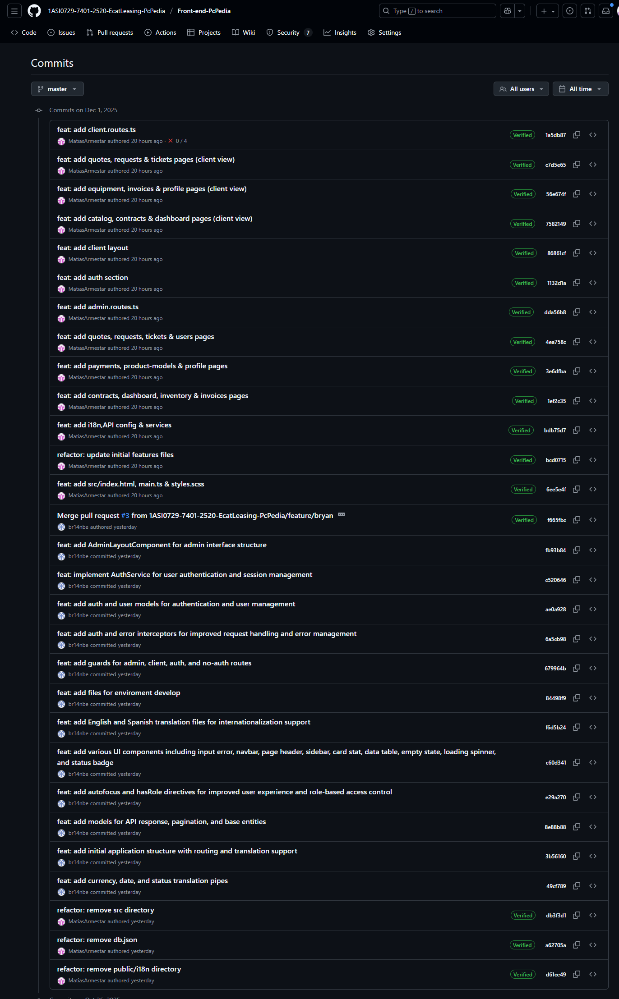  

<h4>Imagen desde repositorio Back</h4>

<h3>5.2.4.5. .Execution Evidence for Sprint Review</h3>

<h3>5.2.4.6.Services Documentation Evidence for Sprint Review</h3>

<h3>5.2.4.7.Software Deployment Evidence for Sprint Review</h3>

<h3>5.2.4.8.Team Collaboration Insights during Sprint</h3>

  

  

## 5.3. Validation Interviews
### 5.3.1. Diseño de Entrevistas
### 5.3.2. Registro de Entrevistas
### 5.3.3. Evaluaciones Según Heurísticas
## 5.4. Video About-the-Product

# Bibliografia

<ul>
  <li>Driessen, V. (2010). <em>A successful Git branching model</em>. Disponible en: <a href="https://nvie.com/posts/a-successful-git-branching-model/" target="_blank">https://nvie.com/posts/a-successful-git-branching-model/</a></li>
  <li>Cucumber. (s.f.). <em>Gherkin Reference</em>. Recuperado de: <a href="https://cucumber.io/docs/gherkin/" target="_blank">https://cucumber.io/docs/gherkin/</a></li>
  <li>Figma. (s.f.). <em>Figma: Collaborative Interface Design Tool</em>. Recuperado de: <a href="https://www.figma.com/" target="_blank">https://www.figma.com/</a></li>
  <li>Lucidchart. (s.f.). <em>Lucidchart: Diagramming & Visualization Software</em>. Recuperado de: <a href="https://www.lucidchart.com/" target="_blank">https://www.lucidchart.com/</a></li>
  <li>Mozilla Developer Network. (s.f.). <em>HTML, CSS y JavaScript</em>. Recuperado de: <a href="https://developer.mozilla.org/es/docs/Web" target="_blank">https://developer.mozilla.org/es/docs/Web</a></li>
  <li>GitHub. (s.f.). <em>GitHub: Where the world builds software</em>. Recuperado de: <a href="https://github.com/" target="_blank">https://github.com/</a></li>
  <li>Microsoft. (s.f.). <em>Visual Studio Code</em>. Recuperado de: <a href="https://code.visualstudio.com/" target="_blank">https://code.visualstudio.com/</a></li>
  <li>W3Schools. (s.f.). <em>HTML5 Syntax</em>. Recuperado de: <a href="https://www.w3schools.com/html/html5_syntax.asp" target="_blank">https://www.w3schools.com/html/html5_syntax.asp</a></li>
</ul>

# Anexos

<section id="anexos">
  <h3>1. Organización y Repositorios en GitHub</h3>
  
El proyecto PcPedia se encuentra alojado bajo la organización de GitHub del curso 1ASI0729-7401-2520-EcatLeasing-PcPedia. A continuación se detallan los repositorios principales utilizados:

  <ul>
    <li><strong>Repositorio de la Organización:</strong> 
      <a href="https://github.com/1ASI0729-7401-2520-EcatLeasing-PcPedia" target="_blank">
        https://github.com/1ASI0729-7401-2520-EcatLeasing-PcPedia
      </a>
    </li>
    <li><strong>Repositorio del Informe Final:</strong> 
      <a href="https://github.com/1ASI0729-7401-2520-EcatLeasing-PcPedia/Report-PcPedia" target="_blank">
        https://github.com/1ASI0729-7401-2520-EcatLeasing-PcPedia/Report-PcPedia
      </a>
    </li>
    <li><strong>Repositorio de la Landing Page:</strong> 
      <a href="https://github.com/1ASI0729-7401-2520-EcatLeasing-PcPedia/Landing-Page-PcPedia" target="_blank">
        https://github.com/1ASI0729-7401-2520-EcatLeasing-PcPedia/Landing-Page-PcPedia
      </a>
    </li>
    <li><strong>Repositorio de el Frontend:</strong> 
      <a href="https://github.com/1ASI0729-7401-2520-EcatLeasing-PcPedia/Front-end-PcPedia" target="_blank">
        https://github.com/1ASI0729-7401-2520-EcatLeasing-PcPedia/Front-end-PcPedia
      </a>
    </li>
    <li><strong>Repositorio de el Backend:</strong> 
      <a href="https://github.com/1ASI0729-7401-2520-EcatLeasing-PcPedia/Back-end-PcPedia" target="_blank">
        https://github.com/1ASI0729-7401-2520-EcatLeasing-PcPedia/Back-end-PcPedia
      </a>
    </li>
  </ul>

  <h3>2. Despliegue de la Landing Page</h3>
  
La Landing Page fue desarrollada por Alessandro Ramiro Condori Lozano y desplegada utilizando GitHub Pages. Esta página sirve como presentación inicial del producto PcPedia.

  <ul>
    <li><strong>Despliegue de la Landing Page en producción:</strong> 
      <a href="https://1asi0729-7401-2520-ecatleasing-pcpedia.github.io/Landing-Page-PcPedia/" target="_blank">
        https://1asi0729-7401-2520-ecatleasing-pcpedia.github.io/Landing-Page-PcPedia/
      </a>
    </li>
    <li><strong>Link del Mock-up en Figma:</strong> 
      <a href="https://www.figma.com/design/oiLz93LcaZJmdmEKi6h46I/FIGMA-PCPEDIA?node-id=1-15&t=wvrVBChCM91tnOsZ-1" target="_blank">
        https://www.figma.com/design/oiLz93LcaZJmdmEKi6h46I/FIGMA-PCPEDIA
      </a>
    </li>
  </ul>
  <h3>3. Despliegue de el Frontend</h3>
  
El Frontend fue desplegado utilizando Netlify. Esta página permite a los usuarios interactuar con la interfaz de manera satisfactoria.

  <ul>
    <li><strong>Despliegue de el Frontend en producción:</strong> 
      <a href="https://dreamy-sunshine-e3be2b.netlify.app/" target="_blank">
          https://dreamy-sunshine-e3be2b.netlify.app/
      </a>
    </li>
  </ul>
  <h3>4. Despliegue de el Backend</h3>
  
El backend fue desplegado utilizando Render. Esta página contiene la lógica de negocio, el manejo de la base de datos y control de APIs.

  <ul>
    <li><strong>Despliegue de el Backend:</strong> 
      <a href="https://backendpcpedia.onrender.com/swagger-ui/index.html" target="_blank">
          https://backendpcpedia.onrender.com/swagger-ui/index.html
      </a>
    </li>
  </ul>
</section>

## Conclusiones y recomendaciones

Durante el desarrollo del proyecto PcPedia, el equipo logró consolidar una solución web funcional que integra un frontend moderno y un backend robusto, implementados sobre una arquitectura modular basada en Domain-Driven Design (DDD). A lo largo de los sprints se definieron los contextos funcionales principales, se desarrollaron flujos críticos del negocio y se garantizó la comunicación efectiva entre los módulos de autenticación, catálogo, contratos, tickets, pagos, facturación e inventario.

En este último sprint, el equipo alcanzó un hito fundamental: la integración completa del frontend con los servicios del backend, habilitando funcionalidades reales como login, gestión de sesión, visualización de activos, panel administrativo, consulta de contratos, manejo de incidencias y navegación fluida entre los distintos módulos. Asimismo, se realizó el despliegue exitoso tanto del frontend como del backend, lo que permite validar la operación del sistema en un entorno real.

El trabajo colaborativo permitió reforzar las buenas prácticas de desarrollo: mensajes de commit consistentes, estructura clara de branches, revisión cruzada de código y un uso adecuado de herramientas ágiles para el seguimiento del progreso. La modularidad del sistema y la separación por contextos facilitaron la mantenibilidad del proyecto y permitieron que distintos miembros del equipo contribuyeran en paralelo sin afectar la estabilidad del código.

Se recomienda, para etapas posteriores, ampliar la cobertura de pruebas automáticas, optimizar la experiencia de usuario mediante iteraciones basadas en feedback real, reforzar la seguridad de los módulos críticos y continuar con la documentación técnica y funcional del sistema. Los aprendizajes obtenidos en este proyecto fortalecen la capacidad del equipo para abordar nuevas funcionalidades y consolidan una base sólida para futuras mejoras y escalamiento de PcPedia como una plataforma integral de arrendamiento y gestión de equipos tecnológicos.

