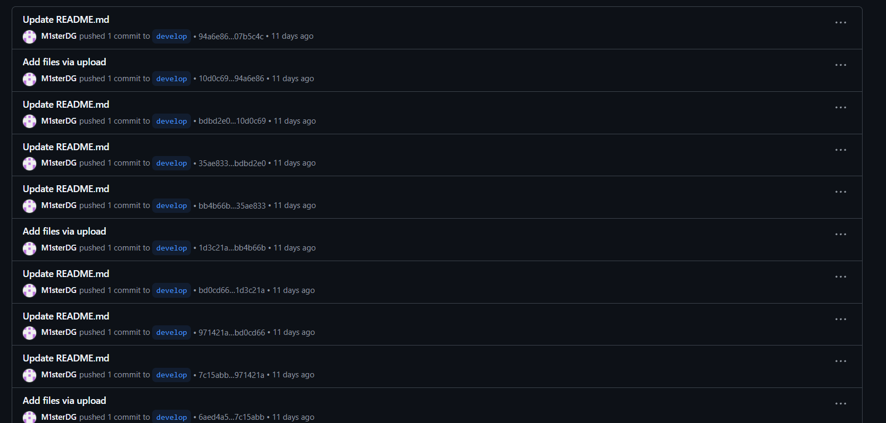
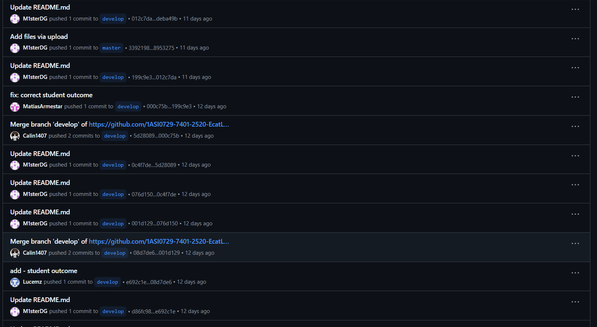
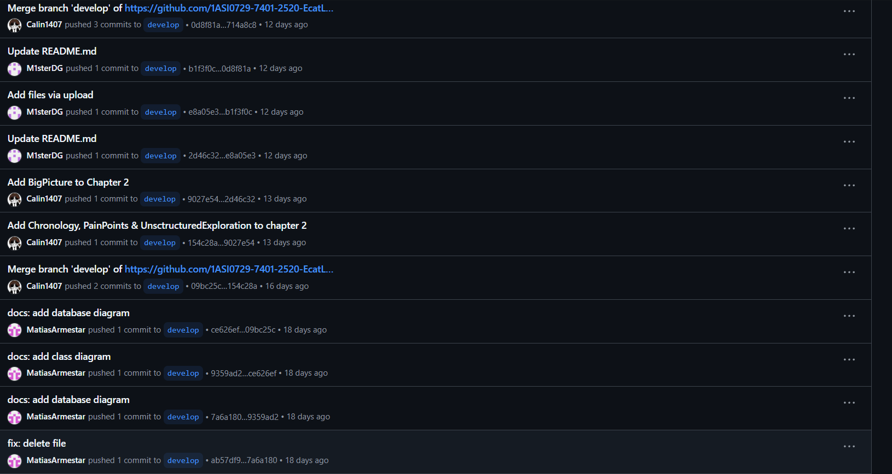
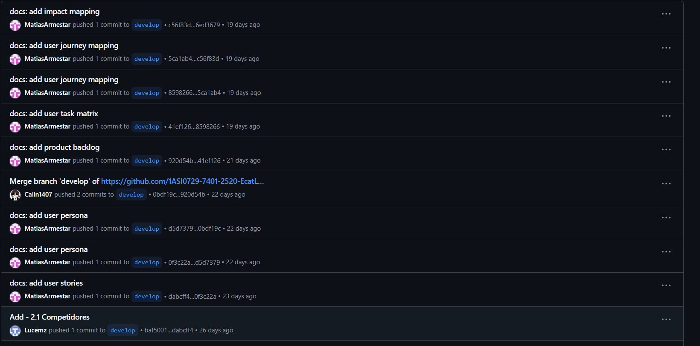
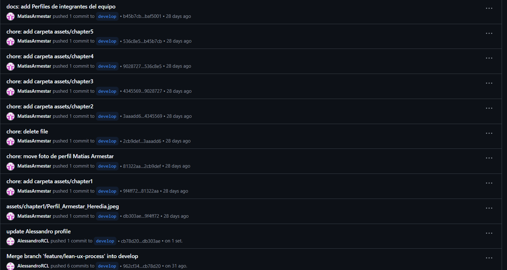
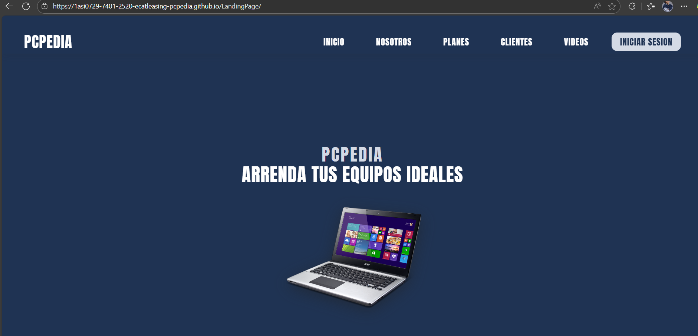
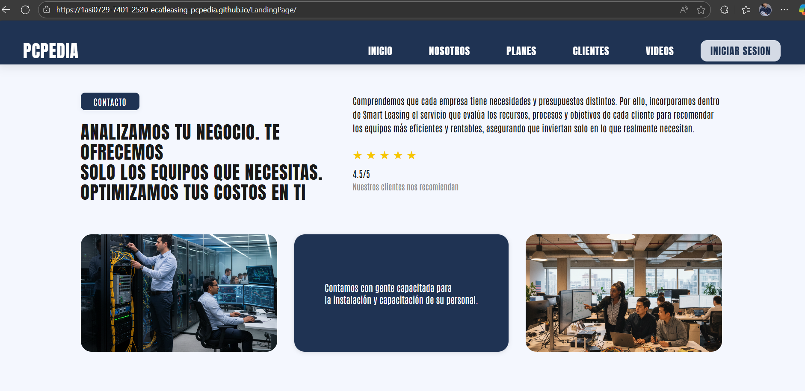
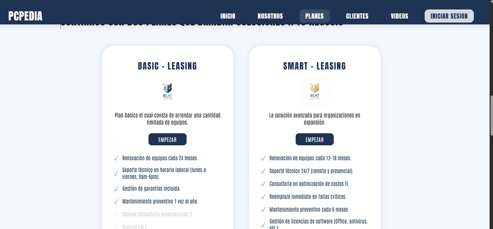
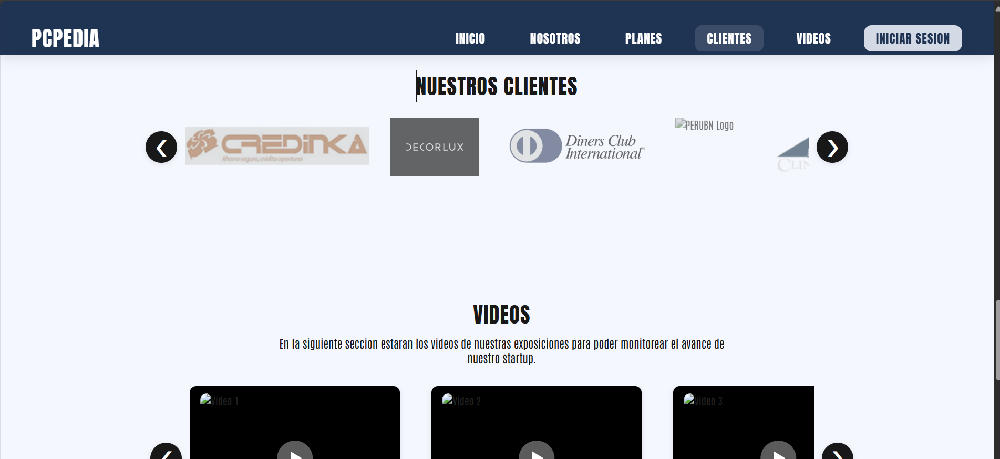

**Universidad Peruana de Ciencias Aplicadas**

**Carrera**: Ingeniería de Software

**Ciclo**: 2025-02

**Curso**: Desarrollo de Aplicaciones Open Source

**Sección**: 1ASI0729-7401-2520

**Profesor**: Mori Paiva, Hugo Allan

**Informe de Trabajo Final**

**Startup**: EcatLeasing

**Producto**: PcPedia

**Integrantes**:

Retuerto Rodríguez, Jorge Manuel - u202318612
Hernández Poma, Sebastián Eduardo - u20231c996
Condori Lozano, Alessandro Ramiro - u20211a118
Armestar Heredia, Matias Gabriel - u20221a553
Bendezu Navarro, Rubens Fitzgerald - u20231d390

**Agosto del 2025**

---

# Registro de Versiones del Informe

<table>
    <tr>
        <th colspan="3">Version</th>
        <th colspan="3">Fecha</th>
        <th colspan="10">Autores</th>
        <th colspan="5">Descripción de Modificaciones</th>
    <tr>
        <td colspan="3">1era</td>
        <td colspan="3">30/08/2025</td>
        <td colspan="10"></td>
        <td colspan="5"></td>
    </tr>
</table>

---

# Project Report Collaboration Insights

A continuación, se detalla el proceso de elaboración del informe para cada entrega, junto con capturas de pantalla que muestran los análisis de colaboración y commits en GitHub para el repositorio del informe:

**URL del Repositorio del Informe:** https://github.com/1ASI0729-7401-2520-EcatLeasing-PcPedia

**Entrega N°1: TB1**
 

Se han completado las tareas asignadas para la entrega TB1 en el repositorio de Github de la organización del equipo, accesible mediante el enlace: Informe-TB1-Web.

Para la creación del informe, se realizaron las siguientes actividades:

Cada miembro del equipo redactó y generó gráficos en formato Markdown según los puntos asignados, y luego se hicieron commits para registrar el progreso en el repositorio.

Se crearon los artefactos necesarios usando las herramientas recomendadas, y se obtuvieron los enlaces de las imágenes correspondientes a través de la funcionalidad de "Issues" en el repositorio del informe.

Se llevaron a cabo reuniones periódicas para coordinar el avance de los puntos del informe. Estas reuniones también se utilizaron para comunicar el progreso alcanzado durante el Sprint 1, enfocado en el desarrollo de la Landing Page del proyecto.

**Contributors Insights report:**

**Contributors Insights landing page:**

**Network Insights report:**

**Network Insights report:**  

---

# Student Outcome

El curso contribuye al cumplimiento del Student Outcome ABET: **ABET – EAC - Student Outcome 3**   Criterio: _Capacidad de comunicarse efectivamente con un rango de audiencias._

En el siguiente cuadro se describe las acciones realizadas y enunciados de conclusiones por parte del grupo, que permiten sustentar el haber alcanzado el logro del ABET – EAC - Student Outcome 3.

<table>
    <tr>
        <th colspan="3">Criterio especifico</th>
        <th colspan="10">Acciones realizadas</th>
        <th colspan="10">Conclusiones</th>
    <tr>
        <td colspan="3">Comunica oralmente sus ideas y/o resultados con objetividad a público de diferentes especialidades y niveles jerarquicos, en el marco del desarrollo de un proyecto en ingeniería.</td>
        <td colspan="10">"Nombre" tb1: </td>
        <td colspan="10">"conclusiones"</td>
    </tr>
    <tr>
        <td colspan="3">Comunica en forma escrita ideas y/o resultados con objetividad a público de diferentes especialidades y niveles jerarquicos, en el marco del desarrollo de un proyecto en ingeniería.</td>
        <td colspan="10">"Nombre" tb1: </td>
        <td colspan="10">"conclusiones"</td>
    </tr>

</table>

---

# Contenido

## Tabla de contenidos

### [Capítulo I: Introducción](#capítulo-i-introducción)

- [1.1. Startup Profile](#11-startup-profile)
  - [1.1.1 Descripción de la Startup](#111-descripción-de-la-startup)
  - [1.1.2 Perfiles de integrantes del equipo](#112-perfiles-de-integrantes-del-equipo)
- [1.2 Solution Profile](#12-solution-profile)
  - [1.2.1 Antecedentes y problemática](#121-antecedentes-y-problemática)
  - [1.2.2 Lean UX Process](#122-lean-ux-process)
    - [1.2.2.1. Lean UX Problem Statements](#1221-lean-ux-problem-statements)
    - [1.2.2.2. Lean UX Assumptions](#1222-lean-ux-assumptions)
    - [1.2.2.3. Lean UX Hypothesis Statements](#1223-lean-ux-hypothesis-statements)
    - [1.2.2.4. Lean UX Canvas](#1224-lean-ux-canvas)
- [1.3. Segmentos objetivo](#13-segmentos-objetivo)

### [Capítulo II: Requirements Elicitation & Analysis](#capítulo-ii-requirements-elicitation--analysis)

- [2.1. Competidores](#21-competidores)
  - [2.1.1. Análisis competitivo](#211-análisis-competitivo)
  - [2.1.2. Estrategias y tácticas frente a competidores](#212-estrategias-y-tácticas-frente-a-competidores)
- [2.2. Entrevistas](#22-entrevistas)
  - [2.2.1. Diseño de entrevistas](#211-análisis-competitivo)
  - [2.2.2. Registro de entrevistas](#222-registro-de-entrevistas)
  - [2.2.3. Análisis de entrevistas](#223-análisis-de-entrevistas)
- [2.3. Needfinding](#23-needfinding)
  - [2.3.1. User Personas](#231-user-personas)
  - [2.3.2. User Task Matrix](#232-user-task-matrix)
  - [2.3.3. User Journey Mapping](#233-user-journey-mapping)
  - [2.3.4. Empathy Mapping](#234-empathy-mapping)
- [2.4. Big Picture Event Storming](#24-big-picture-event-storming)
- [2.5. Ubiquitous Language](#25-ubiquitous-language)

### [Capítulo III: Requirements Specification](#capítulo-iii-requirements-specification)

- [3.1. User Stories](#31-user-stories)
- [3.2. Impact Mapping](#32-impact-mapping)
- [3.3. Product Backlog](#33-product-backlog)

### [Capítulo IV: Product Design](#capítulo-iv-product-design)

- [4.1. Style Guidelines](#41-style-guidelines)
  - [4.1.1. General Style Guidelines](#411-general-style-guidelines)
  - [4.1.2. Web Style Guidelines](#412-web-style-guidelines)
- [4.2. Information Architecture](#42-information-architecture)
  - [4.2.1. Organization Systems](#421-organization-systems)
  - [4.2.2. Labeling Systems](#422-labeling-systems)
  - [4.2.3. SEO Tags and Meta Tags](#423-seo-tags-and-meta-tags)
  - [4.2.4. Searching Systems](#424-searching-systems)
  - [4.2.5. Navigation Systems](#425-navigation-systems)
- [4.3. Landing Page UI Design](#43-landing-page-ui-design)
  - [4.3.1. Landing Page Wireframe](#431-landing-page-wireframe)
  - [4.3.2. Landing Page Mock-up](#432-landing-page-mock-up)
- [4.4. Web Applications UX/UI Design](#44-web-applications-uxui-design)
  - [4.4.1. Web Applications Wireframes](#441-web-applications-wireframes)
  - [4.4.2. Web Applications Wireflow Diagrams](#442-web-applications-wireflow-diagrams)
  - [4.4.3. Web Applications Mock-ups](#443-web-applications-mock-ups)
  - [4.4.4. Web Applications User Flow Diagrams](#444-web-applications-user-flow-diagrams)
- [4.5. Web Applications Prototyping](#45-web-applications-prototyping)
- [4.6. Domain-Driven Software Architecture](#46-domain-driven-software-architecture)
  - [4.6.1. Design-Level Event Storming](#461-design-level-event-storming)
  - [4.6.2. Software Architecture Context Diagram](#462-software-architecture-context-diagram)
  - [4.6.3. Software Architecture Container Diagrams](#463-software-architecture-container-diagrams)
  - [4.6.4. Software Architecture Components Diagrams](#464-software-architecture-components-diagrams)
- [4.7. Software Object-Oriented Design](#47-software-object-oriented-design)
  - [4.7.1. Class Diagrams](#471-class-diagrams)
- [4.8. Database Design](#48-database-design)
  - [4.8.1. Database Diagram](#481-database-diagram)

### [Capítulo V: Product Implementation, Validation & Deployment](#capítulo-v-product-implementation-validation--deployment)

- [5.1. Software Configuration Management](#51-software-configuration-management)
  - [5.1.1. Software Development Environment Configuration](#511-software-development-environment-configuration)
  - [5.1.2. Source Code Management](#512-source-code-management)
  - [5.1.3. Source Code Style Guide & Conventions](#513-source-code-style-guide--conventions)
  - [5.1.4. Software Deployment Configuration](#514-software-deployment-configuration)
- [5.2. Landing Page, Services & Applications Implementation](#52-landing-page-services--applications-implementation)
  - [5.2.1. Sprint 1](#521-sprint-1)
    - [5.2.1.1. Sprint Planning 1](#5211-sprint-planning-1)
    - [5.2.1.2. Sprint Backlog 1](#5212-aspect-leaders-and-collaborators)
    - [5.2.1.3. Development Evidence for Sprint Review](#5213-sprint-backlog-1)
    - [5.2.1.4. Testing Suite Evidence for Sprint Review](#5214-development-evidence-for-sprint-review)
    - [5.2.1.5. Execution Evidence for Sprint Review](#5215-execution-evidence-for-sprint-review)
    - [5.2.1.6. Services Documentation Evidence for Sprint Review](#5216-services-documentation-evidence-for-sprint-review)
    - [5.2.1.7. Software Deployment Evidence for Sprint Review](#5217-software-deployment-evidence-for-sprint-review)
    - [5.2.1.8. Team Collaboration Insights during Sprint](#5218-team-collaboration-insights-during-sprint)
- [5.3. Validation Interviews](#53-validation-interviews)
  - [5.3.1. Diseño de Entrevistas](#531-diseño-de-entrevistas)
  - [5.3.2. Registro de Entrevistas](#532-registro-de-entrevistas)
  - [5.3.3. Evaluaciones según heurísticas](#533-evaluaciones-según-heurísticas)
- [5.4. Video About-the-Product](#54-video-about-the-product)

### [Conclusiones](#conclusiones)

#### [Conclusiones y recomendaciones](#conclusiones-y-recomendaciones)

#### [Video About-the-Team](#video-about-the-team)

### [Biblioteca](#biblioteca)

### [Anexos](#anexos)

---

# Capítulo I: Introducción

## 1.1. Startup Profile

### 1.1.1 Descripción de la Startup

**Misión**:

**Visión**:

### 1.1.2 Perfiles de integrantes del equipo

<table>
    <tr>
        <th colspan="3"> "codigo"</th>
        <th colspan="10"> "nombre"</th>
    <tr>
        <td colspan="3"> "foto"</td>
        <td colspan="10">"Descripcion"</td>
    </tr>

</table>

## 1.2 Solution Profile

### 1.2.1 Antecedentes y problemática

Para realizar los antecedentes y problemáticas, se realizó con anticipación la técnica 5 ‘W’s & 2 ‘H’s:

**What**:

**When**:

**Where**:

**Who**:

**Why**:

**How**:

**How much**:

_Estadística de la problemática_

### 1.2.2 Lean UX Process

#### 1.2.2.1. Lean UX Problem Statements

**Problem Statement 1:**

**Problem Statement 2:**

#### 1.2.2.2. Lean UX Assumptions

**Business Outcomes:**

- **Creemos que mis usuarios necesitan**

- **Estas necesidades se pueden resolver**

- **Nuestros clientes iniciales son**

- **El valor #1 que un cliente requiere de nuestro servicio es**

- **El cliente también puede obtener estos beneficios adicionales**

- **Adquiriremos a nuestros clientes a través del**

- **Haremos dinero a través de**

- **Nuestra competencia de mercado serán**

- **Los venceremos debido a que**

- **Nuestros mayores riesgos son**

- **Resolveremos esto mediante**

- **Sabremos que hemos tenido éxito cuando uno de estos cambios en el comportamiento de nuestro cliente:**

- **Qué otras suposiciones tenemos que, de probarse falsas pueden causar que nuestro proyecto fracase:**

**User Outcomes**

**¿Quiénes serán nuestros usuarios?**

**¿Dónde encaja nuestro producto en su vida o trabajo?**

**¿Qué problemas tiene nuestro producto y cómo se pueden resolver?**

**Problemas:**

**Soluciones:**

**¿Cómo y cuándo es usado nuestro producto?**

**¿Qué características son importantes?**

**¿Cómo debe verse y comportarse nuestro producto?**

**Features**

#### 1.2.2.3. Lean UX Hypothesis Statements

- **Creemos que**

  **Sabremos que**

- **Creemos que**

  **Sabremos que**

- **Creemos que**

  **Sabremos que**

#### 1.2.2.4. Lean UX Canvas

## 1.3. Segmentos objetivo

## Capítulo II: Requirements Elicitation & Analysis

## 2.1. Competidores

## 2.1.1. Análisis competitivo

## 2.1.2. Estrategias y tácticas frente a competidores

## 2.2. Entrevistas

### 2.2.1. Diseño de entrevistas

### 2.2.2. Registro de entrevistas

### 2.2.3. Análisis de entrevistas

### 2.3. Needfinding

### 2.3.1. User Personas

### 2.3.2. User Task Matrix

### 2.3.3. User Journey Mapping

### 2.3.4. Empathy Mapping

### 2.4. Big Picture Event Storming

### 2.5. Ubiquitous Language

# Capítulo III: Requirements Specification

## 3.1. User Stories

## 3.2. Impact Mapping

## 3.3. Product Backlog

# Capítulo IV: Product Design

## 4.1. Style Guidelines

### 4.1.1. General Style Guidelines

### 4.1.2. Web Style Guidelines

## 4.2. Information Architecture

### 4.2.1. Organization Systems

### 4.2.2. Labeling Systems

### 4.2.3. SEO Tags and Meta Tags

### 4.2.4. Searching Systems

### 4.2.5. Navigation Systems

## 4.3. Landing Page UI Design

### 4.3.1. Landing Page Wireframe

### 4.3.2. Landing Page Mock-up.

## 4.4. Web Applications UX/UI Design

### 4.4.1. Web Applications Wireframes

### 4.4.2. Web Applications Wireflow Diagrams

### 4.4.3. Web Applications Mock-ups

### 4.4.4. Web Applications User Flow Diagrams

## 4.5. Web Applications Prototyping

## 4.6. Domain-Driven Software Architecture

### 4.6.1. Design-Level Event Storming

### 4.6.2. Software Architecture Context Diagram

### 4.6.3. Software Architecture Container Diagrams

### 4.6.4. Software Architecture Components Diagrams

## 4.7. Software Object-Oriented Design

### 4.7.1. Class Diagrams

## 4.8. Database Design

### 4.8.1. Database Diagram

# Capítulo V: Product Implementation, Validation & Deployment

## 5.1. Software Configuration Management

En esta sección se describen las herramientas y configuraciones utilizadas para gestionar el desarrollo del software, incluyendo el entorno de desarrollo, el control de versiones, las convenciones de estilo de código y la configuración del despliegue.

### 5.1.1. Software Development Environment Configuration

En esta sección, se incluirá los productos de software que se usaron en el proyecto. Los enlaces a cada una de las herramientas se encuentran disponibles en los anexos.

#### Product UX/UI Design:

* Figma: Herramienta de diseño colaborativo para crear prototipos, wireframes y diseños de interfaces de usuario.
* Canva: Plataforma de diseño colaborativo de funcion múltiple.
* Visual Paradigm: Herramienta de modelado UML y diseño de software.
* PlantText: Herramienta de modela UML.

#### Software Development:

* WebStorm: IDE para desarrollo web, soporta HTML, CSS, JavaScript y frameworks modernos.
* GitHub: Plataforma de alojamiento de código fuente y control de versiones utilizando Git.
* Visual Studio Code: Editor utilizado únicamente para la exportación del reporte de formato markdown a PDF.

#### Software Deployment:

* GitHub Pages: Servicio de alojamiento web estático proporcionado por GitHub, ideal para desplegar sitios web y documentación.

### 5.1.2. Source Code Management

Para la gestion del código fuente se utilizó GitHub, una plataforma de alojamiento de código fuente y control de versiones utilizando Git. Se creó un repositorio en la organización de GitHub, donde se almacenó todo el código fuente del proyecto.

El repositorio se estructuró de la siguiente manera:

* Organización en Github: https://github.com/1ASI0729-7401-2520-EcatLeasing-PcPedia
* Repositorio del informe final: https://github.com/1ASI0729-7401-2520-EcatLeasing-PcPedia/Report-PcPedia
* Repositorio de la Landing Page: https://github.com/1ASI0729-7401-2520-EcatLeasing-PcPedia/LandingPage

#### Conventional Commits

* `feat`: Para nuevas características o funcionalidades.
* `fix`: Para correcciones de errores.
* `docs`: Para cambios en la documentación.
* `refactor`: Para cambios en el código que no agregan ni corrigen funcionalidades.
* `add`: Para la adición de archivos, recursos o contenido nuevo (ej. imágenes, configs, assets).
* `update`: Para modificaciones o mejoras sobre algo ya existente (ej. actualizar imágenes, texto, librerías, dependencias).
* `chore`: Estructuración de contenido

### 5.1.3. Source Code Style Guide & Conventions

Se optó por seguir las siguientes guías y convenciones de estilo de código para asegurar la calidad y consistencia del código fuente, priorizando el uso del **inglés** cómo una buena práctica.

#### HTML:

* Archivos HTML deben tener la extensión `.html`.
* Se incluye `alt` en todas las imágenes.
* Usar comillas dobles para atributos.
* Usar etiquetas semánticas (`<header>`, `<nav>`, `<main>`, `<footer>`, etc.).
* Indentación de 2 espacios.

#### CSS:

* Archivos CSS deben tener la extensión `.css`.
* Usar guiones para nombres de clases y IDs (e.g., `.main-header`).
* Se agrupan estilos relacionados y se separan con comentarios.

#### JavaScript y TypeScript:

* Archivos JS deben tener la extensión `.js` y TS `.ts`.
* Usar camelCase para nombres de variables y funciones.
* Usar `PascalCase` para nombres de clases y componentes: `MyComponent`, `UserProfile`.
* Usar `const` y `let` en lugar de `var`.
* Usar funciones flecha y nombres explícitos.
* Los archivos deben tener una unica responsabilidad (Single Responsibility Principle).

### 5.1.4. Software Deployment Configuration

En esta sección se describen las configuraciones y herramientas utilizadas para el despliegue del software desarrollado. El objetivo es asegurar que el proceso de despliegue sea eficiente, automatizado y confiable.

#### Despliegue de la Landing Page:

La **Landing Page** fue desarrollada utilizando tecnologías web estándar como HTML, CSS y JavaScript. Y fue desplegada utilizando **GitHub Pages**, un servicio de alojamiento web estático proporcionado por GitHub.

**Repositorio de la Landing Page**: https://github.com/1ASI0729-7401-2520-EcatLeasing-PcPedia/LandingPage

**Landing Page desplegada**: https://1asi0729-7401-2520-ecatleasing-pcpedia.github.io/LandingPage/

## 5.2. Landing Page, Services & Applications Implementation

### 5.2.1. Sprint 1

#### 5.2.1.1. Sprint Planning 1

<strong>Fecha:</strong> 10 de abril de 2025

<strong>Hora:</strong> 3:30 PM

<strong>Ubicación:</strong> Modalidad remota

<strong>Preparado por:</strong> Sebastián Hernández

<strong>Asistentes:</strong> Rubens Bendezu, Alessandro Ramiro, Jorge Retuerto, Matías Armestar, Sebastián Hernández

<strong>Objetivo del Sprint:</strong> 
El objetivo principal de este sprint es desarrollar la Landing Page (versión 1) con HTML y CSS, a partir del diseño preliminar realizado en Figma. Esta página servirá como el punto de entrada principal para la presentación de la startup. Además, se desarrollarán los wireframes de la app web y la landing page.

<strong>Sprint Velocity:</strong> 15

<strong>Sumatoria de Story Points:</strong> 15

#### 5.2.1.2. Aspect Leaders and Collaborators

<table>
  <thead>
    <tr>
      <th>Integrante</th>
      <th>Tareas Principales Realizadas</th>
    </tr>
  </thead>
  <tbody>
    <tr>
      <td><strong>Rubens Bendezu Navarro</strong></td>
      <td>Punto 4.1-4.2 (Style Guidelines & Information Architecture), Análisis de Competidores, Plan de Estrategia</td>
    </tr>
    <tr>
      <td><strong>Alessandro Ramiro</strong></td>
      <td>Mockup de la Landing Page, Desarrollo de la Landing Page Versión 1</td>
    </tr>
    <tr>
      <td><strong>Sebastián Hernández </strong></td>
      <td>Wireframes de la Landing Page y App Web, Mockup de la App Web (Versión 1), Introducción sobre el negocio, Entrevistas</td>
    </tr>
    <tr>
      <td><strong>Jorge Retuerto Rodríguez</strong></td>
      <td>Punto 2.4, 4.6.1 - 4.6.4 (Domain-Driven Design), Punto 4.7 (Software Object-Oriented Design)</td>
    </tr>
    <tr>
      <td><strong>Matías Armestar</strong></td>
      <td>Historias de Usuario (User Stories), User Personas, User Journey, Empathy Mapping</td>
    </tr>
  </tbody>
</table>

<!-- Aspect Leaders and Collaborators - Sprint 1 (Tabla) -->
<section id="sprint1-aspect-leaders">
  
  
Distribución de responsabilidades durante el Sprint 1, indicando líderes de aspecto y sus colaboradores según las tareas asignadas:

  
  <table>
    <thead>
      <tr>
        <th>Miembro del Equipo</th>
        <th>Rol / Aspecto</th>
        <th>Responsabilidades</th>
      </tr>
    </thead>
    <tbody>
      <tr>
        <td>Rubens Fitzgerald Bendezu Navarro</td>
        <td>Aspect Leader</td>
        <td>Style Guidelines, Information Architecture, Análisis de Competidores y Plan de Estrategia. Definición de estándares visuales, estructuración de información y evaluación de competencia.</td>
      </tr>
      <tr>
        <td>Alessandro Ramiro Condori Lozano</td>
        <td>Aspect Leader</td>
        <td>Mock-up y Landing Page versión 1. Diseño visual de la Landing Page, asegurando coherencia con la identidad del proyecto.</td>
      </tr>
      <tr>
        <td>Sebastián Eduardo Hernández Poma</td>
        <td>Aspect Leader</td>
        <td>Wireframes de Landing y App Web, Mock-up versión 1 de la App Web, Entrevistas y Introducción del Negocio. Documentación y diseño de la interfaz de usuario y estructura inicial del proyecto.</td>
      </tr>
      <tr>
        <td>Jorge Manuel Retuerto Rodríguez</td>
        <td>Aspect Leader</td>
        <td>Design-Level Event Storming, Diagramas de Arquitectura (Context, Container, Component), Software Object-Oriented Design. Modelado del sistema y documentación técnica de arquitectura y diseño orientado a objetos.</td>
      </tr>
      <tr>
        <td>Matías Gabriel Armestar Heredia</td>
        <td>Aspect Leader</td>
        <td>Historias de Usuario y Product Backlog. Definición, documentación y organización de las historias de usuario para planificación y trazabilidad del proyecto.</td>
      </tr>
    </tbody>
  </table>
</section>

<!-- Aspect Leaders and Collaborators - Sprint 1 -->
<section id="sprint1-aspect-leaders">
  
Distribución de responsabilidades durante el Sprint 1 según las tareas asignadas:

  <table>
    <thead>
      <tr>
        <th>Integrante</th>
        <th>GitHub</th>
        <th>UX/UI</th>
        <th>Landing</th>
        <th>Deploy</th>
        <th>Documentación</th>
      </tr>
    </thead>
    <tbody>
      <tr>
        <td>Sebastián Eduardo Hernández Poma</td>
        <td>C</td>
        <td>C</td>
        <td>C</td>
        <td>-</td>
        <td>C</td>
      </tr>
      <tr>
        <td>Rubens Fitzgerald Bendezu Navarro</td>
        <td>C</td>
        <td>-</td>
        <td>-</td>
        <td>-</td>
        <td>C</td>
      </tr>
      <tr>
        <td>Alessandro Ramiro Condori Lozano</td>
        <td>C</td>
        <td>-</td>
        <td>C</td>
        <td>C</td>
        <td>-</td>
      </tr>
      <tr>
        <td>Jorge Manuel Retuerto Rodríguez</td>
        <td>C</td>
        <td>-</td>
        <td>-</td>
        <td>-</td>
        <td>C</td>
      </tr>
      <tr>
        <td>Matías Gabriel Armestar Heredia</td>
        <td>C</td>
        <td>C</td>
        <td>-</td>
        <td>-</td>
        <td>C</td>
      </tr>
    </tbody>
  </table>
</section>

#### 5.2.1.3. Sprint Backlog 1

<table>
  <thead>
    <tr>
      <th>Tarea ID</th>
      <th>Título</th>
      <th>Estimación (Horas)</th>
      <th>Asignado a</th>
      <th>Estado</th>
    </tr>
  </thead>
  <tbody>
    <tr>
      <td>UT01</td>
      <td>Crear wireframes de la Landing Page</td>
      <td>4</td>
      <td>Sebastián Hernández</td>
      <td>Done</td>
    </tr>
    <tr>
      <td>UT02</td>
      <td>Crear wireframes de la App Web</td>
      <td>6</td>
      <td>Sebastián Hernández</td>
      <td>Done</td>
    </tr>
    <tr>
      <td>UT03</td>
      <td>Crear mockup de la App Web (Versión 1)</td>
      <td>5</td>
      <td>Sebastián Hernández</td>
      <td>Done</td>
    </tr>
    <tr>
      <td>UT04</td>
      <td>Crear mockup de la Landing Page (Versión 1)</td>
      <td>4</td>
      <td>Alessandro Ramiro</td>
      <td>Done</td>
    </tr>
    <tr>
      <td>UT05</td>
      <td>Desarrollo de la Landing Page (HTML/CSS)</td>
      <td>8</td>
      <td>Alessandro Ramiro</td>
      <td>Done</td>
    </tr>
    <tr>
      <td>UT06</td>
      <td>Análisis de Competidores y Plan de Estrategia</td>
      <td>6</td>
      <td>Rubens Bendezu</td>
      <td>Done</td>
    </tr>
    <tr>
      <td>UT07</td>
      <td>Redacción de Introducción sobre el negocio</td>
      <td>3</td>
      <td>Sebastián Hernández</td>
      <td>Done</td>
    </tr>
    <tr>
      <td>UT08</td>
      <td>Realizar entrevistas</td>
      <td>7</td>
      <td>Sebastián Hernández</td>
      <td>Done</td>
    </tr>
    <tr>
      <td>UT09</td>
      <td>Desarrollo del punto 4.1 (Style Guidelines)</td>
      <td>5</td>
      <td>Rubens Bendezu</td>
      <td>Done</td>
    </tr>
    <tr>
      <td>UT10</td>
      <td>Desarrollo del punto 4.2 (Information Architecture)</td>
      <td>5</td>
      <td>Rubens Bendezu</td>
      <td>Done</td>
    </tr>
    <tr>
      <td>UT11</td>
      <td>Desarrollo del punto 2.4 (Big Picture Event Storming)</td>
      <td>5</td>
      <td>Jorge Retuerto</td>
      <td>Done</td>
    </tr>
  </tbody>
</table>

#### 5.2.1.4. Development Evidence for Sprint Review

<strong>Repositorio:</strong> GitHub - EcatLeasing/PcPedia

<strong>Rama:</strong> develop

<!-- Sección Landing -->
<section>
  <h2>Elaboración de Landing</h2>
  
</section>

<!-- Sección Reportes -->
<section>
  <h2>Reportes</h2>
  

    
    
    
    
    
    
    
  

</section>

#### 5.2.1.5. Execution Evidence for Sprint Review

El avance del sprint se evidencia en el repositorio de GitHub donde se subieron los siguientes archivos:

<ul>
  <li><strong>Landing Page (Versión 1)</strong>: HTML y CSS desplegados en <a href="https://1asi0729-7401-2520-ecatleasing-pcpedia.github.io/LandingPage/">GitHub Pages</a>.</li>
  <li><strong>Wireframes y Mockups</strong>: Los wireframes de la landing page y la app web, junto con los mockups, están documentados en el repositorio.</li>
</ul>

<!-- Sección Demostración de ejecución de la Landing -->
<section>
  <h2>Demostración de ejecución de la Landing</h2>
  

    
    
    
    
  

</section>

#### 5.2.1.6. Services Documentation Evidence for Sprint Review

No se implementaron servicios backend en este sprint, ya que el enfoque estuvo en el desarrollo de la interfaz visual.

#### 5.2.1.7. Software Deployment Evidence for Sprint Review

La Landing Page fue desplegada en GitHub Pages, y está accesible a través del siguiente enlace: <a href="https://1asi0729-7401-2520-ecatleasing-pcpedia.github.io/LandingPage/">Enlace a la Landing Page</a>

#### 5.2.1.8. Team Collaboration Insights during Sprint

Durante este sprint, se mantuvo una comunicación constante entre los miembros del equipo mediante reuniones semanales. Se utilizó <strong>GitHub</strong> para la gestión del código fuente y el seguimiento de tareas, y <strong>Trello</strong> para organizar el avance del sprint. Las tareas fueron gestionadas y completadas según las estimaciones, y la colaboración entre los miembros del equipo fue eficiente.

## 5.3. Validation Interviews

### 5.3.1. Diseño de Entrevistas

### 5.3.2. Registro de Entrevistas

### 5.3.3. Evaluaciones según heurísticas

## 5.4. Video About-the-Product

# Conclusiones

## Conclusiones y recomendaciones

Durante el Sprint 1 del proyecto PcPedia, se lograron avances significativos en el diseño de la landing page, wireframes y mockups de la aplicación web, así como en la definición de la arquitectura de información, guías de estilo y análisis de competidores. Esto permitió establecer una base sólida y coherente para el desarrollo del producto, alineada con las necesidades de los usuarios y los objetivos estratégicos de la startup EcatLeasing. Se recomienda continuar con la validación temprana de la interfaz mediante pruebas de usabilidad, integrar retroalimentación constante del equipo y de usuarios, priorizar funcionalidades críticas como registro de usuarios, panel de administración y comparador de equipos, mantener la documentación actualizada en GitHub y utilizar herramientas ágiles para seguimiento de tareas, asegurando una coordinación efectiva y la calidad técnica del desarrollo en los siguientes sprints.

# Bibliografia

<ul>
  <li>Beck, K., & Andres, C. (2005). <em>Extreme Programming Explained: Embrace Change</em> (2nd ed.). Addison-Wesley Professional.</li>
  <li>Driessen, V. (2010). <em>A successful Git branching model</em>. Disponible en: <a href="https://nvie.com/posts/a-successful-git-branching-model/" target="_blank">https://nvie.com/posts/a-successful-git-branching-model/</a></li>
  <li>Cucumber. (s.f.). <em>Gherkin Reference</em>. Recuperado de: <a href="https://cucumber.io/docs/gherkin/" target="_blank">https://cucumber.io/docs/gherkin/</a></li>
  <li>Figma. (s.f.). <em>Figma: Collaborative Interface Design Tool</em>. Recuperado de: <a href="https://www.figma.com/" target="_blank">https://www.figma.com/</a></li>
  <li>Lucidchart. (s.f.). <em>Lucidchart: Diagramming & Visualization Software</em>. Recuperado de: <a href="https://www.lucidchart.com/" target="_blank">https://www.lucidchart.com/</a></li>
  <li>Mozilla Developer Network. (s.f.). <em>HTML, CSS y JavaScript</em>. Recuperado de: <a href="https://developer.mozilla.org/es/docs/Web" target="_blank">https://developer.mozilla.org/es/docs/Web</a></li>
  <li>GitHub. (s.f.). <em>GitHub: Where the world builds software</em>. Recuperado de: <a href="https://github.com/" target="_blank">https://github.com/</a></li>
  <li>Microsoft. (s.f.). <em>Visual Studio Code</em>. Recuperado de: <a href="https://code.visualstudio.com/" target="_blank">https://code.visualstudio.com/</a></li>
  <li>W3Schools. (s.f.). <em>HTML5 Syntax</em>. Recuperado de: <a href="https://www.w3schools.com/html/html5_syntax.asp" target="_blank">https://www.w3schools.com/html/html5_syntax.asp</a></li>
</ul>

# Anexos

<!-- Anexos del Proyecto PcPedia - Sprint 1 -->
<section id="anexos">
  <h2>Anexos</h2>

  <h3>1. Organización y Repositorios en GitHub</h3>
  
El proyecto PcPedia se encuentra alojado bajo la organización de GitHub del curso 1ASI0729-7401-2520-EcatLeasing-PcPedia. A continuación se detallan los repositorios principales utilizados:

  <ul>
    <li><strong>Repositorio de la Organización:</strong> 
      <a href="https://github.com/1ASI0729-7401-2520-EcatLeasing-PcPedia" target="_blank">
        https://github.com/1ASI0729-7401-2520-EcatLeasing-PcPedia
      </a>
    </li>
    <li><strong>Repositorio del Informe Final:</strong> 
      <a href="https://github.com/1ASI0729-7401-2520-EcatLeasing-PcPedia/Report-PcPedia" target="_blank">
        https://github.com/1ASI0729-7401-2520-EcatLeasing-PcPedia/report
      </a>
    </li>
    <li><strong>Repositorio de la Landing Page:</strong> 
      <a href="https://github.com/1ASI0729-7401-2520-EcatLeasing-PcPedia/LandingPage" target="_blank">
        https://github.com/1ASI0729-7401-2520-EcatLeasing-PcPedia/LandingPage
      </a>
    </li>
  </ul>

  <h3>2. Despliegue de la Landing Page</h3>
  
La Landing Page fue desarrollada por Alessandro Ramiro Condori Lozano y desplegada utilizando GitHub Pages. Esta página sirve como presentación inicial del producto PcPedia y permite a los usuarios interactuar con la interfaz de manera funcional.

  <ul>
    <li><strong>Link de la Landing Page en producción:</strong> 
      <a href="https://1asi0729-7401-2520-ecatleasing-pcpedia.github.io/LandingPage/" target="_blank">
        https://1asi0729-7401-2520-ecatleasing-pcpedia.github.io/LandingPage/
      </a>
    </li>
    <li><strong>Link del Mock-up en Figma:</strong> 
      <a href="https://www.figma.com/design/oiLz93LcaZJmdmEKi6h46I/FIGMA-PCPEDIA?node-id=1-15&t=wvrVBChCM91tnOsZ-1" target="_blank">
        https://www.figma.com/design/oiLz93LcaZJmdmEKi6h46I/FIGMA-PCPEDIA
      </a>
    </li>
 
</section>

